# Estandarización de Roles y Permisos — Eurekant LLC

> **Versión:** 1.11.0 (conceptual — sin SQL)
> **Fecha:** 13/Jun/26
> **Estado:** Borrador para validación interna
> **Alcance:** Todos los proyectos de software desarrollados por Eurekant

---

## Índice

1. [Propósito y alcance](#1-propósito-y-alcance)
   - [1.1 Un estándar, dos documentos](#11-un-estándar-dos-documentos)
2. [Principios de diseño](#2-principios-de-diseño)
3. [Glosario](#3-glosario)
4. [Modelo de tenancy: Usuario → Empresa → Sucursal](#4-modelo-de-tenancy-usuario--empresa--sucursal)
   - [4.1 Reglas del modelo de tenancy](#41-reglas-del-modelo-de-tenancy)
   - [4.2 Usuarios finales: la otra cara del sistema](#42-usuarios-finales-la-otra-cara-del-sistema)
5. [Modelo de roles y permisos](#5-modelo-de-roles-y-permisos)
   - [5.1 Cómo se compone el acceso](#51-cómo-se-compone-el-acceso)
   - [5.2 Roles por defecto: `admin` y el concepto de Owner](#52-roles-por-defecto-admin-y-el-concepto-de-owner)
   - [5.3 Ciclo de vida de los roles](#53-ciclo-de-vida-de-los-roles)
6. [Modelo de entidades (conceptual)](#6-modelo-de-entidades-conceptual)
   - [6.1 Notas por entidad](#61-notas-por-entidad)
7. [Flujos de incorporación de usuarios](#7-flujos-de-incorporación-de-usuarios)
   - [7.1 Visión global: los caminos de entrada del staff](#71-visión-global-los-caminos-de-entrada-del-staff)
   - [7.2 Bloque común: verificación de email por OTP](#72-bloque-común-verificación-de-email-por-otp)
   - [7.3 Camino A — Registro por cuenta propia e *initial setup*](#73-camino-a--registro-por-cuenta-propia-e-initial-setup)
   - [7.4 Caminos B y C — Invitación: creación y envío](#74-caminos-b-y-c--invitación-creación-y-envío)
   - [7.5 Ciclo de vida de una invitación](#75-ciclo-de-vida-de-una-invitación)
   - [7.6 Camino B — Registro por invitación (usuario nuevo)](#76-camino-b--registro-por-invitación-usuario-nuevo)
   - [7.7 Camino C — Aceptación o rechazo (usuario existente)](#77-camino-c--aceptación-o-rechazo-usuario-existente)
   - [7.8 Transferencia de ownership](#78-transferencia-de-ownership)
   - [7.9 Camino D — Registro del usuario final](#79-camino-d--registro-del-usuario-final)
8. [Contexto activo: en qué empresa, sucursal y rol estoy parado](#8-contexto-activo-en-qué-empresa-sucursal-y-rol-estoy-parado)
   - [8.1 Política de sesiones y renovación de tokens](#81-política-de-sesiones-y-renovación-de-tokens)
   - [8.2 Rate limiting y anti-automatización](#82-rate-limiting-y-anti-automatización)
9. [RLS: aislamiento de datos sin filtros en el código](#9-rls-aislamiento-de-datos-sin-filtros-en-el-código)
   - [9.1 El principio](#91-el-principio)
   - [9.2 Quién accede: las tres familias de acceso](#92-quién-accede-las-tres-familias-de-acceso)
   - [9.3 Cómo funcionará (conceptual, el detalle va en la v2)](#93-cómo-funcionará-conceptual-el-detalle-va-en-la-v2)
   - [9.4 Tablas operativas y la columna de tenant: análisis de normalización](#94-tablas-operativas-y-la-columna-de-tenant-análisis-de-normalización)
   - [9.5 Qué ve cada capa](#95-qué-ve-cada-capa)
10. [Superadmin: la capa del dueño del software](#10-superadmin-la-capa-del-dueño-del-software)
    - [10.1 Concepto](#101-concepto)
    - [10.2 Parametrización del sistema (`SYSTEM_SETTINGS`): globales y overrides](#102-parametrización-del-sistema-system_settings-globales-y-overrides)
11. [Reglas de negocio e integridad (resumen normativo)](#11-reglas-de-negocio-e-integridad-resumen-normativo)
12. [Casos borde y puntos de fuga analizados](#12-casos-borde-y-puntos-de-fuga-analizados)
13. [Decisiones de diseño y preguntas abiertas](#13-decisiones-de-diseño-y-preguntas-abiertas)
    - [13.1 Decisiones confirmadas](#131-decisiones-confirmadas)
    - [13.2 Preguntas abiertas (a definir antes de la v2)](#132-preguntas-abiertas-a-definir-antes-de-la-v2)
    - [13.3 Temas diferidos a la v2](#133-temas-diferidos-a-la-v2)
14. [Inspiración y referencias](#14-inspiración-y-referencias)
15. [Próximos pasos](#15-próximos-pasos)
16. [Historial de cambios](#16-historial-de-cambios)
17. [Aprobaciones y auditorías](#17-aprobaciones-y-auditorías)
    - [17.1 Aprobaciones](#171-aprobaciones)
    - [17.2 Auditorías y revisiones](#172-auditorías-y-revisiones)
- [Anexo A — Checklist de implementación](#anexo-a--checklist-de-implementación)

---

## 1. Propósito y alcance

> ⚠️ **Principio rector: ante la duda, se pregunta — nunca se asume.**
> Si algo de este documento no queda claro o parece incompleto, **no se asume un comportamiento ni se toma una decisión apurada**: se consulta con la dirección (Franco) antes de avanzar. Una mala suposición en esta capa es el error más caro de corregir — es como construir un edificio y descubrir tarde que faltó prever el ascensor: agregarlo después obliga a romper lo ya hecho, y se paga multiplicado en tiempo y dinero. Frenar y preguntar siempre cuesta menos que rehacer un cimiento.

Este documento define el **modelo estándar de multi-tenancy, roles y permisos** que debe implementarse en **todos los proyectos de Eurekant**, sin importar el rubro o la finalidad del software.

El objetivo es que cualquier desarrollador del equipo pueda abrir cualquier proyecto de la empresa y encontrar **la misma estructura, los mismos nombres de tablas y los mismos flujos**, reduciendo la curva de aprendizaje, los errores de seguridad y el costo de mantenimiento.

Este documento es **puramente conceptual**: define entidades, relaciones, flujos y reglas de negocio, sin una línea de SQL. Una vez validado, se generará el **documento técnico (v2)** con el código SQL definitivo (tablas, constraints, funciones, triggers y políticas RLS), siguiendo la [Naming Convention Guide](https://app.clickup.com/9002039309/v/dc/8c90e0d-10194/8c90e0d-6114) de Eurekant. Son dos documentos separados a propósito (ver [§1.1](#11-un-estándar-dos-documentos)).

**Agnóstico del lado del cliente, fijo del lado del backend.** El estándar define la capa de datos y los flujos sobre **Supabase/Postgres**, y funciona igual sin importar el lenguaje o framework de la aplicación (Flutter, web, etc.): cualquier cliente consume el mismo modelo. Cuando el documento menciona Flutter o `supabase_flutter`, lo hace a modo de ejemplo por ser la plataforma principal actual de Eurekant — las mismas capacidades existen en todos los SDKs oficiales de Supabase (decisión [24](#131-decisiones-confirmadas)).

> 💡 **Ejemplo práctico — ¿por qué estandarizar?**
> Eurekant desarrolla un sistema de turnos para una clínica y un sistema de stock para una distribuidora. Son rubros totalmente distintos, pero ambos necesitan: usuarios, empresas, sucursales, roles, invitaciones y aislamiento de datos. Si ambos usan este estándar, un desarrollador que pasa del proyecto "clínica" al proyecto "distribuidora" ya sabe cómo funciona el 40% del sistema antes de leer una línea de código.

### 1.1 Un estándar, dos documentos

El estándar completo se compone de **dos documentos separados**:

| Documento | Contenido | Audiencia | Quién aprueba los cambios |
|---|---|---|---|
| **Este documento (conceptual)** | El *qué* y el *porqué*: modelo, flujos, reglas de negocio, decisiones de diseño. Sin SQL. | Todas: dirección, PM, diseño y desarrollo. | CEO + equipo ([§17](#17-aprobaciones-y-auditorías)). |
| **Documento técnico (v2)** | El *cómo exactamente*: DDL en SQL — tablas, constraints, índices, funciones, triggers y políticas RLS. | Solo desarrollo. | Líder técnico. |

Las razones de la separación:

1. **Audiencias y ritmos de cambio distintos.** Un PM o una diseñadora necesitan entender los flujos y las reglas, no cómo están armadas las tablas; incluso un desarrollador suele querer primero la lógica a alto nivel. Además, este documento cambia cuando cambia una regla de negocio (poco frecuente, lo aprueba la dirección), mientras que el técnico cambiará con cada migración o ajuste de implementación (frecuente, lo aprueba el líder técnico). Mezclados, cada cambio de un índice obligaría a revisar a quienes no les aporta nada, y las reglas de negocio quedarían enterradas entre SQL.
2. **Una sola fuente de verdad por tema.** Las reglas y su porqué viven únicamente acá; el documento técnico las implementa y las **cita** (ej: "estas FKs compuestas implementan [BR-16](#11-reglas-de-negocio-e-integridad-resumen-normativo)"), nunca las re-explica. Si ambos documentos explicaran lo mismo con sus propias palabras, tarde o temprano se contradicen.
3. **Trazabilidad verificable.** El documento técnico incluirá una tabla de mapeo —cada BR y cada decisión confirmada → los objetos de base de datos que la implementan— y declarará qué versión de este documento implementa, para poder auditar que ninguna regla quedó solo en el papel.

> 💡 **Ejemplo práctico — la analogía del plano**
> Es la lógica de un proyecto de arquitectura. Este documento es el **render más la memoria descriptiva**: cuántos ambientes tiene la casa, por qué la cocina da al patio. Lo entienden el cliente, la municipalidad y el constructor. El documento técnico es el **plano de estructura e instalaciones**: el calibre de las varillas y por dónde van los caños — solo lo leen los que construyen. Nadie le pide al cliente que apruebe el diámetro de una cañería, y el constructor no re-decide cuántos dormitorios hay: eso ya lo fijó la memoria descriptiva.

---

## 2. Principios de diseño

1. **Multi-tenant siempre.** Todo sistema soporta múltiples empresas y múltiples sucursales por empresa, **aunque el cliente actual no lo necesite**. Si el software se vende a un solo cliente con una sola sucursal, internamente igual existen `COMPANIES` y `BRANCHES` con un único registro. Esto garantiza escalabilidad sin migraciones traumáticas.
2. **Aislamiento por RLS, no por filtros.** El código de aplicación **nunca** filtra por empresa/sucursal en sus queries. La base de datos (Row Level Security) devuelve únicamente los datos a los que quien consulta tiene acceso: por su contexto activo (staff), por identidad propia (usuario final) o por catálogo público ([§9.2](#92-quién-accede-las-tres-familias-de-acceso)).
3. **Roles a nivel empresa, asignaciones a nivel sucursal.** Un rol se define una vez por empresa y se reutiliza en todas sus sucursales. La asignación concreta de un usuario es siempre `usuario + rol + sucursal`.
4. **Permisos granulares.** Un rol no es una etiqueta mágica que el código interpreta: es un **conjunto de permisos** tomados de un catálogo definido por cada sistema. Este es el modelo **RBAC** (*Role-Based Access Control*, control de acceso basado en roles): los permisos nunca se asignan directamente a los usuarios, sino a roles, y los usuarios obtienen sus permisos al recibir roles. En este estándar, los permisos efectivos en cada momento son únicamente los del rol del contexto activo, nunca la suma de todos los roles del usuario (ver [§8](#8-contexto-activo-en-qué-empresa-sucursal-y-rol-estoy-parado) y [BR-15](#11-reglas-de-negocio-e-integridad-resumen-normativo)). Es el modelo clásico que usan Slack, Notion o AWS.
5. **Identidad global única.** Una persona tiene **una sola cuenta** (un email) y con ella puede pertenecer a N empresas y N sucursales con distintos roles — y, como usuario final, ser cliente de N negocios ([§4.2](#42-usuarios-finales-la-otra-cara-del-sistema)).
6. **Nada se borra, se desactiva.** Usuarios, roles y vínculos se desactivan (soft delete) para preservar el historial y la auditoría.
7. **El superadmin vive fuera del modelo de empresas.** Es la capa de los dueños del software, con su propio panel y su propia parametrización global.

> 💡 **Ejemplo práctico — principio 1 (multi-tenant aunque no haga falta)**
> Un cliente pide un sistema interno solo para su ferretería. Se desarrolla igual con el modelo completo: el *initial setup* crea la empresa "Ferretería López" y la sucursal "Principal". Dos años después el cliente abre una segunda sucursal y quiere vender el sistema a un colega. **No hay que tocar la arquitectura**: solo se crea otra sucursal y otra empresa.

---

## 3. Glosario

| Término | Definición |
|---|---|
| **Usuario** | Identidad global de una persona (email único). Existe una sola vez en todo el sistema. |
| **Empresa (Company)** | Tenant principal. Unidad de aislamiento de datos y dueña de los roles. |
| **Tenant / Multi-tenancy** | *Tenant* = «inquilino»: cada **empresa** es un tenant, una unidad de datos aislada que convive con muchas otras en la misma base sin verse entre sí. *Multi-tenancy* es esa arquitectura de «un sistema, muchos inquilinos» (ver [§2](#2-principios-de-diseño) y [§9](#9-rls-aislamiento-de-datos-sin-filtros-en-el-código)). |
| **Sucursal (Branch)** | Subdivisión operativa de una empresa. Toda empresa tiene al menos una. |
| **Rol** | Conjunto de permisos, definido a nivel empresa, reutilizable en todas sus sucursales (ver [§5](#5-modelo-de-roles-y-permisos)). |
| **Permiso** | Capacidad atómica de hacer algo (ej: `products.create`). Catálogo fijo por sistema (ver [§5.1](#51-cómo-se-compone-el-acceso)). |
| **Asignación (User Role)** | Vínculo `usuario + rol + sucursal`. Es la unidad central del modelo (ver [§5.1](#51-cómo-se-compone-el-acceso)). |
| **RBAC** | *Role-Based Access Control* (control de acceso basado en roles): los permisos no se asignan a las personas sino a los roles, y las personas los obtienen al recibir un rol (ver principio 4 y [§5](#5-modelo-de-roles-y-permisos)). |
| **Owner** | El dueño único de la empresa (inicialmente, quien la creó). Es admin, pero además es el dueño; la condición es transferible con confirmación del receptor ([§7.8](#78-transferencia-de-ownership)). Diferencias con admin en [§5.2](#52-roles-por-defecto-admin-y-el-concepto-de-owner). |
| **Admin** | Rol por defecto, inmutable, con todos los permisos de la empresa. Puede haber varios **usuarios** con este rol en la misma empresa (ver [§5.2](#52-roles-por-defecto-admin-y-el-concepto-de-owner)). |
| **Superadmin** | Dueño del software (Eurekant o el cliente que lo comercializa). Vista global del sistema (ver [§10](#10-superadmin-la-capa-del-dueño-del-software)). |
| **Contexto activo** | La asignación con la que el usuario está operando en este momento: `empresa + sucursal + rol` (ver [§8](#8-contexto-activo-en-qué-empresa-sucursal-y-rol-estoy-parado)). Extiende el *tenant context* de la literatura, incorporando además el rol. |
| **JWT / Claims** | *JSON Web Token*: el token de sesión firmado que la aplicación adjunta en cada petición después del login. Los *claims* son los datos que viajan dentro del token (quién es el usuario, cuándo expira la sesión y, en este modelo, el contexto activo con los permisos de su rol). Al estar firmado, no puede alterarse sin invalidarlo (ver [§8](#8-contexto-activo-en-qué-empresa-sucursal-y-rol-estoy-parado)). |
| **Refresh token** | Credencial de larga vida que acompaña al JWT: cuando el JWT vence, el SDK la canjea automáticamente por un par nuevo (JWT + refresh token). Es de un solo uso, no vence por tiempo, y es lo que mantiene la sesión iniciada (ver [§8.1](#81-política-de-sesiones-y-renovación-de-tokens)). |
| **OTP** | *One-Time Password* (contraseña de un solo uso): código de 6 dígitos enviado por email para verificar la propiedad de la casilla durante el registro. (ver [§7.2](#72-bloque-común-verificación-de-email-por-otp)). |
| **Enumeración de cuentas** | Ataque que consiste en probar emails ajenos en pantallas públicas (registro, invitaciones) para descubrir quién tiene cuenta en el sistema, a partir de diferencias en la respuesta. Se previene respondiendo siempre lo mismo y revelando información solo a quien verificó la casilla (ver [§7.3](#73-camino-a--registro-por-cuenta-propia-e-initial-setup) y [§12](#12-casos-borde-y-puntos-de-fuga-analizados)). |
| **Initial setup** | Función interna que popula los datos iniciales al crear una empresa (ver [§7.3](#73-camino-a--registro-por-cuenta-propia-e-initial-setup)). |
| **Soft delete** | «Borrado suave»: en lugar de eliminar un registro, se le pone una fecha de baja (`deactivated_at`; nulo = activo). El dato deja de operar pero queda para el historial y la auditoría (ver principio 6, [BR-06](#11-reglas-de-negocio-e-integridad-resumen-normativo) y [BR-08](#11-reglas-de-negocio-e-integridad-resumen-normativo)). |
| **Tabla operativa** | Toda tabla que guarda datos del dominio de negocio de cada sistema (productos, ventas, turnos, stock, cajas, etc.). Se contrapone a las tablas del modelo estándar (`USERS`, `COMPANIES`, `ROLES`, …) y a los catálogos globales sin tenant (`PERMISSIONS`, `SYSTEM_SETTINGS`). Siempre lleva columna de tenant (ver [§9.4](#94-tablas-operativas-y-la-columna-de-tenant-análisis-de-normalización) y [BR-11](#11-reglas-de-negocio-e-integridad-resumen-normativo)). |
| **RLS (Row Level Security)** | «Seguridad a nivel de fila»: mecanismo de la base de datos (Postgres) que decide qué filas puede ver o escribir cada quien, sin que el código tenga que filtrar. Es la línea central de aislamiento entre empresas (ver [§9](#9-rls-aislamiento-de-datos-sin-filtros-en-el-código)). |
| **Dato semilla (seed)** | Datos que el propio sistema carga al instalarse o desplegarse —no los crea ningún usuario—, como el catálogo de permisos (ver [§5.1](#51-cómo-se-compone-el-acceso) y [§6.1](#61-notas-por-entidad)). |
| **UUID** | Identificador único universal: una tira larga e irrepetible (ej: `a3f1c2…`) que nombra cada fila sin depender de un número correlativo. Es el tipo de las claves (`*_id`) del modelo (ver [§6](#6-modelo-de-entidades-conceptual)). |
| **BlurHash / ThumbHash** | Cadena corta (~25 caracteres) que codifica una miniatura borrosa de una imagen; se muestra al instante mientras carga la foto real, sin salto de layout. Se guarda junto a la URL (campo `photo_blur_hash`). Son las dos variantes vigentes; la elección va a la v2 (ver [§6](#6-modelo-de-entidades-conceptual)). |
| **Rate limiting** | Límite a la cantidad de veces que una operación puede ejecutarse en una ventana de tiempo (contado por IP, por email o por proyecto, según la operación). Primera defensa contra bots, fuerza bruta y abuso de los endpoints públicos (ver [§8.2](#82-rate-limiting-y-anti-automatización)). |
| **CAPTCHA** | Desafío que distingue personas de bots en los endpoints públicos. Estándar de Eurekant: Cloudflare Turnstile, integrado nativamente en Supabase e invisible para el usuario en la gran mayoría de los casos (ver [§8.2](#82-rate-limiting-y-anti-automatización)). |
| **Override (de parámetro)** | Valor específico de una empresa o sucursal que reemplaza al valor global de un parámetro del sistema; gana siempre el más específico (ver [§10.2](#102-parametrización-del-sistema-system_settings-globales-y-overrides)). |
| **BR (Business Rule)** | Regla de negocio obligatoria del estándar ([BR-01](#11-reglas-de-negocio-e-integridad-resumen-normativo)…[BR-21](#11-reglas-de-negocio-e-integridad-resumen-normativo), ver [§11](#11-reglas-de-negocio-e-integridad-resumen-normativo)). Mismo prefijo que usan los SRS de Eurekant. |
| **Staff** | Las personas que **operan** el sistema: dueños, administradores, gerentes, empleados. Tienen roles y permisos y entran por los caminos A/B/C ([§7](#7-flujos-de-incorporación-de-usuarios)). Se contrapone al *usuario final*, que consume. Es término de uso estándar en la industria (ej: Shopify *staff accounts*, Django `is_staff`). |
| **Usuario final** | Persona que **consume** lo que los negocios ofrecen (turnos, pedidos, puntos) en lugar de operarlos. No es staff: no tiene roles ni permisos; su cuenta nace libre y su acceso es de identidad propia (ver [§4.2](#42-usuarios-finales-la-otra-cara-del-sistema)). |
| **Ficha de cliente (`COMPANY_CUSTOMERS`)** | El registro de una persona como cliente de un negocio concreto, exista o no su cuenta en la app; si tiene cuenta, la ficha la referencia (ver [§4.2](#42-usuarios-finales-la-otra-cara-del-sistema) y [§7.9](#79-camino-d--registro-del-usuario-final)). |
| **Catálogo público** | El listado de perfiles de las empresas que cualquier usuario autenticado puede leer sin tener vínculo previo con ellas. Es una de las tres familias de acceso (ver [§4.2](#42-usuarios-finales-la-otra-cara-del-sistema) y [§9.2](#92-quién-accede-las-tres-familias-de-acceso)). |
| **Comunicado (`ANNOUNCEMENTS`)** | Aviso del sistema hacia los usuarios —mantenimiento programado, incidente, novedad— con título, cuerpo, tipo, ventana de vigencia y destinatarios. Se publica sin que el usuario actualice la app (ver [§6](#6-modelo-de-entidades-conceptual) y [§10.2](#102-parametrización-del-sistema-system_settings-globales-y-overrides)). |

---

## 4. Modelo de tenancy: Usuario → Empresa → Sucursal

La jerarquía base de todo sistema Eurekant:

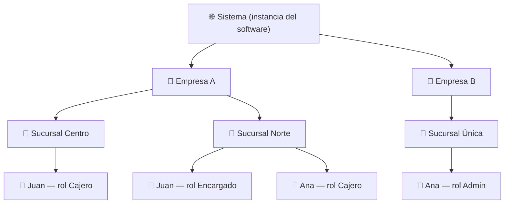

Puntos clave del diagrama:

- **Juan** tiene **dos roles distintos en dos sucursales** de la Empresa A. Esto es válido y esperado.
- **Ana** pertenece a **dos empresas distintas** con la misma cuenta. También es válido.
- Los roles "Cajero" y "Encargado" de la Empresa A **no existen** en la Empresa B; cada empresa define los suyos (excepto `admin`, que existe en todas).

> 💡 **Ejemplo práctico — multi-rol y multi-empresa**
> María es contadora. El estudio contable donde trabaja usa un sistema de Eurekant, y además dos de sus clientes (una pizzería y una farmacia) usan el mismo software. María tiene **una sola cuenta** con su email. Dentro del sistema: en "Estudio Contable Pérez" es *Admin*; en "Pizzería Don Carlo" tiene el rol *Contador externo* en la sucursal Centro; y en "Farmacia Vital" tiene el rol *Auditor* en las 3 sucursales. Cuando entra al sistema, elige en qué empresa, sucursal y rol va a trabajar (ver [§8](#8-contexto-activo-en-qué-empresa-sucursal-y-rol-estoy-parado), contexto activo).

### 4.1 Reglas del modelo de tenancy

- Toda empresa nace con **exactamente una sucursal** (creada por el *initial setup*). Aunque el negocio no use el concepto de "sucursal", existe una llamada "Principal" (u otro nombre por defecto definido por el sistema).
- Una sucursal pertenece a **una y solo una** empresa. No hay sucursales compartidas.
- Los datos operativos del sistema (productos, ventas, turnos, etc.) siempre cuelgan de la empresa, y cuando aplica, también de la sucursal.

### 4.2 Usuarios finales: la otra cara del sistema

Todo lo anterior describe al **staff**: las personas que *operan* el sistema (dueños, gerentes, cajeros, profesionales). Pero muchos sistemas tienen además **usuarios finales**: las personas que *consumen* lo que el negocio ofrece — el paciente que saca turnos, el comensal que junta puntos. La analogía del teatro: el actor y el espectador son ambos personas con cuenta, pero el actor tiene **credencial de backstage** (un rol que define qué puede operar) y el espectador tiene **su entrada** (un vínculo de cliente que define qué consume). El estándar los distingue por el tipo de vínculo, nunca por un "rol de usuario final" ([BR-18](#11-reglas-de-negocio-e-integridad-resumen-normativo)).

El modelo del usuario final tiene cuatro piezas:

1. **La cuenta es global y nace libre.** El usuario final se registra desde la app (camino D, [§7.9](#79-camino-d--registro-del-usuario-final)) y eso crea solo su cuenta en `USERS` — sin empresa, sin rol, sin vínculo con ningún negocio. Puede no consumir nunca; su cuenta existe igual.
2. **Explorar no requiere vínculo.** Ver los negocios del sistema es una lectura del **catálogo público** (perfiles de las empresas listadas), disponible para cualquier usuario autenticado sin relación previa. Es una familia propia de políticas RLS ([§9.2](#92-quién-accede-las-tres-familias-de-acceso)); cada sistema decide si su catálogo es abierto.
3. **La ficha del cliente existe en cada negocio, con o sin cuenta.** `COMPANY_CUSTOMERS` es la ficha de una persona en un negocio concreto: nombre, documento, contacto — y un **casillero opcional** con la referencia a su cuenta. El mozo registra al cliente de mostrador (casillero vacío); el adulto mayor sin smartphone opera igual; quien llega por la app nace con el casillero completo. Una persona tiene 0..N fichas: una por negocio donde realmente es cliente.
4. **El vínculo entre una ficha y una cuenta nace de dos formas.** Al **usar la app** (la ficha se crea ya vinculada) o al **vincular una ficha que el negocio ya había cargado** — esto último siempre con prueba y aceptación del usuario ([§7.9](#79-camino-d--registro-del-usuario-final)): con el email verificado alcanza (el vínculo se ofrece en el momento); por coincidencia de documento, solo con prueba fuerte.

| Sombrero | Tabla de vínculo | Qué define | Superficie |
|---|---|---|---|
| Usuario final | `COMPANY_CUSTOMERS` (ficha con cuenta vinculada) | Qué consume: sus turnos, pedidos, puntos — solo lo propio | App de clientes |
| Staff | `USER_ROLES` (`usuario + rol + sucursal`) | Qué opera y dónde | Back-office |
| Superadmin | `SUPERADMINS` | Vista global del sistema | Panel superadmin |

Una misma cuenta puede llevar los tres sombreros a la vez; cada superficie consulta su propia tabla de vínculo.

**Privacidad entre negocios.** Cada negocio ve solo sus propias fichas y sus propios datos operativos; los vínculos del usuario con otros negocios son invisibles para terceros. El usuario, en cambio, ve todo lo suyo de todos sus negocios desde su cuenta. Importa en gastronomía; es crítico en salud.

> 💡 **Ejemplo práctico — el dueño con tres sombreros**
> El dueño de un grupo de clínicas dentales franquicia su software: cada franquiciado es una empresa (tenant) del sistema. Esa persona tiene **una sola cuenta** con tres filas: en `SUPERADMINS` (comercializa el software y administra los tenants, [§10](#10-superadmin-la-capa-del-dueño-del-software)), en `USER_ROLES` como Owner/admin de su propia empresa, y una ficha vinculada en `COMPANY_CUSTOMERS` — porque también se atiende como paciente y saca turnos desde la app. El panel superadmin, el back-office y la app de pacientes le muestran cada uno su mundo, sin mezclarse.

---

## 5. Modelo de roles y permisos

### 5.1 Cómo se compone el acceso

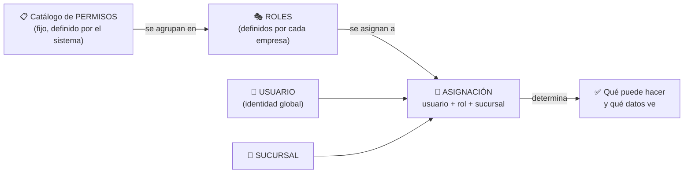

**Catálogo de permisos.** Cada sistema define su catálogo de permisos atómicos con un código estandarizado `modulo.accion`. Por ejemplo: `products.create`, `products.read`, `products.update`, `products.delete`, `users.invite`, `roles.manage`, `reports.view`, `sales.refund`. El catálogo **no es editable por las empresas**: lo define el equipo de desarrollo y se carga como dato semilla. Es la frontera entre lo que el software *puede* hacer y lo que cada rol *permite* hacer.

**Por qué el formato `modulo.accion`.** Es la convención de la industria (los *scopes* de OAuth, los permisos de Google Cloud IAM como `storage.objects.create`) y aporta cuatro ventajas concretas:
1. **Namespacing** — `create` solo no dice nada, `products.create` es inequívoco y evita colisiones entre módulos;
2. **Agrupación automática** — la pantalla de edición de roles agrupa los checkboxes por módulo (todo lo que empieza con `sales.` va junto) sin necesidad de estructura extra;
3. **Legibilidad en código y logs** — un error `permission denied: sales.refund` se entiende al instante;
4. **Consistencia entre proyectos** — las acciones usan siempre el mismo vocabulario (`create`, `read`, `update`, `delete`, más verbos específicos como `refund` o `invite`), así el catálogo de cualquier sistema Eurekant se lee igual.

**Roles.** Un rol pertenece a una empresa y agrupa N permisos del catálogo. El usuario con permiso `roles.manage` (típicamente el admin) puede crear, modificar y eliminar roles de su empresa marcando/desmarcando permisos.

**Asignación.** La unidad central del modelo: `usuario + rol + sucursal`. Reglas:

- Un usuario puede tener **distintos roles en distintas sucursales** de la misma empresa.
- Un usuario también puede tener **más de un rol en la misma sucursal**; en ese caso los permisos **no se combinan**: el usuario opera con un rol a la vez según su contexto activo (ver [§8](#8-contexto-activo-en-qué-empresa-sucursal-y-rol-estoy-parado) y [BR-15](#11-reglas-de-negocio-e-integridad-resumen-normativo)).
- La sucursal de la asignación **debe pertenecer a la misma empresa** que el rol (regla de integridad obligatoria, ver [§11](#11-reglas-de-negocio-e-integridad-resumen-normativo)).
- Para dar acceso a todas las sucursales, se crea una asignación por sucursal (la UI puede ofrecer un atajo "aplicar a todas las sucursales", pero internamente son N asignaciones).

> 💡 **Ejemplo práctico — armado de un rol**
> La Pizzería Don Carlo crea el rol **"Cajero"** con los permisos: `sales.create`, `sales.read`, `products.read`. Luego crea **"Encargado"** con todo lo del cajero más `sales.refund`, `products.update` y `reports.view`. Cuando contratan a Juan para la sucursal Centro, le asignan *Cajero en Centro*. Seis meses después lo ascienden en la sucursal Norte: se agrega la asignación *Encargado en Norte*, sin tocar la de Centro. Si la pizzería abre una tercera sucursal, los roles "Cajero" y "Encargado" **ya existen** y están listos para usarse: no hay que recrearlos.

### 5.2 Roles por defecto: `admin` y el concepto de Owner

- Al crear una empresa, el *initial setup* crea automáticamente el rol **`admin`**, marcado como rol por defecto (`is_default = true`).
- El rol `admin` **no se puede modificar ni eliminar**: siempre tiene todos los permisos del catálogo, incluidos los permisos nuevos que se agreguen en futuras versiones del software (regla: admin = unión de todo el catálogo, evaluada dinámicamente, no una lista congelada).
- Puede haber **varios usuarios admin** en una empresa: el admin puede asignar el rol admin a otros.
- El usuario que creó la empresa queda marcado como **Owner** (campo en la empresa que apunta a su usuario). El Owner es único, es admin como cualquier otro, pero:
  - No puede ser desactivado ni removido de la empresa por otros admins.
  - Es el único que puede iniciar la transferencia de la propiedad, que requiere la aceptación explícita del receptor (ver [§7.8](#78-transferencia-de-ownership)).
- **Regla Owner-admin:** el Owner siempre tiene el rol admin y nadie —**ni él mismo**— puede quitárselo; la única salida es transferir primero el ownership ([§7.8](#78-transferencia-de-ownership)): tras la transferencia conserva el rol admin, pero ya como un admin común, renunciable como cualquier otro. Como consecuencia, una empresa **nunca puede quedar sin administrador** (siempre está el Owner como respaldo), y los demás admins sí pueden renunciar a su rol o ser removidos sin restricción.
- Cada sistema puede definir **roles plantilla adicionales** en su *initial setup* (ej: "Vendedor", "Supervisor") que, a diferencia de `admin`, **sí** son editables y eliminables por la empresa. Nacen como sugerencia, no como imposición.

> 💡 **Ejemplo práctico — owner vs admin**
> Carlos crea la cuenta de "Pizzería Don Carlo" → es Owner y admin. Luego le da rol admin a su socio Diego. Diego puede hacer todo lo que hace Carlos (crear roles, invitar gente, ver reportes), pero **no puede** sacarle el acceso a Carlos ni transferir la empresa. Si Carlos vende el negocio, él mismo inicia la transferencia del ownership desde la configuración — y Diego tiene que aceptarla ([§7.8](#78-transferencia-de-ownership)).

### 5.3 Ciclo de vida de los roles

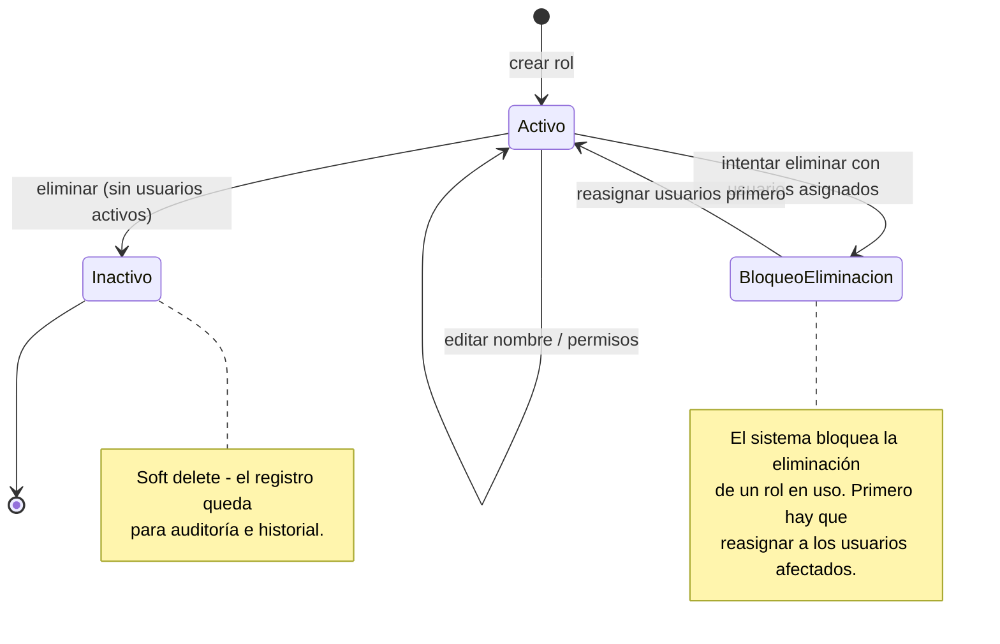

- **No se puede eliminar un rol con usuarios activos asignados.** El sistema informa cuántos usuarios lo usan y exige reasignarlos primero. Esto evita usuarios "huérfanos" sin acceso de un día para el otro.
- La eliminación es siempre **soft delete**: el rol queda inactivo pero su registro persiste (los reportes históricos pueden seguir mostrando "venta cargada por Juan, rol Cajero" aunque el rol ya no exista).
- El rol `admin` nunca entra en este flujo: no es editable ni eliminable.

---

## 6. Modelo de entidades (conceptual)

Entidades nombradas según la [Naming Convention Guide](https://app.clickup.com/9002039309/v/dc/8c90e0d-10194/8c90e0d-6114): tablas en `UPPERCASE`, columnas en `lowercase` con prefijo descriptivo de su tabla, FKs con el mismo nombre que la PK referenciada.

```mermaid
erDiagram
    USERS ||--o{ USER_ROLES : "tiene asignaciones"
    COMPANIES ||--o{ BRANCHES : "posee"
    COMPANIES ||--o{ ROLES : "define"
    COMPANIES ||--o{ INVITATIONS : "emite"
    USERS ||--o{ COMPANIES : "es owner de"
    ROLES ||--o{ USER_ROLES : "se asigna en"
    BRANCHES ||--o{ USER_ROLES : "alcanza a"
    ROLES ||--o{ ROLE_PERMISSIONS : "agrupa"
    PERMISSIONS ||--o{ ROLE_PERMISSIONS : "compone"
    ROLES ||--o{ INVITATIONS : "propone"
    BRANCHES ||--o{ INVITATIONS : "destina"
    USER_ROLES ||--o{ INVITATIONS : "invita"
    COMPANIES ||--o{ OWNERSHIP_TRANSFERS : "transfiere ownership"
    USERS ||--o{ OWNERSHIP_TRANSFERS : "ofrece (saliente)"
    USERS ||--o{ OWNERSHIP_TRANSFERS : "recibe la oferta"
    COMPANIES ||--o{ COMPANY_CUSTOMERS : "tiene clientes"
    COMPANIES |o--o{ ANNOUNCEMENTS : "emite (o global)"
    USERS |o--o{ COMPANY_CUSTOMERS : "vincula su cuenta (opcional)"
    USER_ROLES |o--o{ COMPANY_CUSTOMERS : "registra (staff)"
    USERS ||--o| SUPERADMINS : "puede ser"
    SUPERADMINS ||--o{ SYSTEM_SETTINGS : "actualiza"

    USERS {
        uuid user_id PK
        citext user_email UK "global, única"
        citext first_name
        citext last_name
        varchar photo_url "nullable"
        varchar photo_blur_hash "nullable"
        timestamptz deactivated_at "NULL = activo"
        timestamptz last_seen
        uuid created_by FK "nullable - autorregistro/sistema"
        uuid updated_by FK "nullable"
        timestamptz created_at
        timestamptz updated_at
    }
    COMPANIES {
        uuid company_id PK
        citext company_name
        uuid owner_id FK "USERS - dueño único"
        varchar photo_url "nullable - logo"
        varchar photo_blur_hash "nullable"
        timestamptz deactivated_at "NULL = activo"
        uuid created_by FK "nullable - initial setup"
        uuid updated_by FK "nullable"
        timestamptz created_at
        timestamptz updated_at
    }
    BRANCHES {
        uuid branch_id PK
        uuid company_id FK
        citext branch_name "única por empresa"
        varchar photo_url "nullable"
        varchar photo_blur_hash "nullable"
        timestamptz deactivated_at "NULL = activo"
        uuid created_by FK "USER_ROLES"
        uuid updated_by FK "USER_ROLES"
        timestamptz created_at
        timestamptz updated_at
    }
    ROLES {
        uuid role_id PK
        uuid company_id FK
        citext role_name "única por empresa"
        varchar descriptions "nullable"
        boolean is_default "true = admin, inmutable"
        uuid created_by FK "USER_ROLES - quién lo creó"
        uuid updated_by FK "USER_ROLES - última edición"
        timestamptz updated_at
        timestamptz deactivated_at "NULL = activo"
        timestamptz created_at
    }
    PERMISSIONS {
        uuid permission_id PK
        varchar permission_code UK "ej products.create"
        varchar permission_module "ej products"
        varchar descriptions
        timestamptz deactivated_at "NULL = activo"
        uuid created_by FK "nullable - semilla/sistema"
        uuid updated_by FK "nullable"
        timestamptz created_at
        timestamptz updated_at
    }
    ROLE_PERMISSIONS {
        uuid role_permission_id PK
        uuid role_id FK
        uuid permission_id FK
        uuid created_by FK "USER_ROLES"
        uuid updated_by FK "USER_ROLES"
        timestamptz created_at
        timestamptz updated_at
    }
    USER_ROLES {
        uuid user_role_id PK
        uuid user_id FK
        uuid role_id FK
        uuid branch_id FK "misma empresa que el rol"
        timestamptz deactivated_at "NULL = activo"
        uuid created_by FK "USER_ROLES"
        uuid updated_by FK "USER_ROLES"
        timestamptz created_at
        timestamptz updated_at
    }
    INVITATIONS {
        uuid invitation_id PK
        uuid company_id FK
        uuid branch_id FK
        uuid role_id FK
        citext invitation_email
        citext first_name "precargado en camino B - nullable"
        citext last_name "precargado en camino B - nullable"
        uuid created_by FK "USER_ROLES - quién invitó"
        varchar invitation_status "pending-accepted-rejected-expired-revoked"
        timestamptz expires_at
        uuid updated_by FK "USER_ROLES"
        timestamptz created_at
        timestamptz updated_at
    }
    OWNERSHIP_TRANSFERS {
        uuid ownership_transfer_id PK
        uuid company_id FK
        uuid from_user_id FK "USERS - owner saliente"
        uuid to_user_id FK "USERS - receptor"
        varchar transfer_status "pending-accepted-rejected-expired-revoked"
        timestamptz expires_at
        uuid created_by FK "USER_ROLES - quién inició"
        uuid updated_by FK "USER_ROLES"
        timestamptz created_at
        timestamptz updated_at
    }
    COMPANY_CUSTOMERS {
        uuid company_customer_id PK
        uuid company_id FK
        uuid user_id FK "USERS - nullable: vacio si no tiene cuenta"
        citext first_name
        citext last_name
        varchar document_type "nullable - ej DNI"
        varchar document_number "nullable"
        citext customer_email "nullable"
        varchar customer_phone "nullable"
        uuid created_by FK "USER_ROLES - nullable si se autoregistro"
        uuid updated_by FK "USER_ROLES - nullable"
        timestamptz updated_at
        timestamptz deactivated_at "NULL = activo"
        timestamptz created_at
    }
    SUPERADMINS {
        uuid superadmin_id PK
        uuid user_id FK "única - un user es o no superadmin"
        timestamptz deactivated_at "NULL = activo"
        uuid created_by FK "nullable - SUPERADMINS/sistema"
        uuid updated_by FK "nullable"
        timestamptz created_at
        timestamptz updated_at
    }
    SYSTEM_SETTINGS {
        uuid system_setting_id PK
        varchar setting_key UK "ej mercadopago.commission"
        jsonb setting_value
        varchar descriptions
        uuid created_by FK "SUPERADMINS"
        uuid updated_by FK "SUPERADMINS"
        timestamptz created_at
        timestamptz updated_at
    }
    ANNOUNCEMENTS {
        uuid announcement_id PK
        uuid company_id FK "nullable: NULL = comunicado global"
        varchar title
        varchar body
        varchar announcement_type "info-maintenance-incident"
        varchar audience "staff-end_users-all"
        timestamptz active_from
        timestamptz active_to "nullable"
        boolean is_dismissible
        uuid created_by FK "USER_ROLES o SUPERADMINS"
        uuid updated_by FK "USER_ROLES o SUPERADMINS"
        timestamptz deactivated_at "NULL = activo"
        timestamptz created_at
        timestamptz updated_at
    }
```

> **Auditoría y baja, en todas las tablas.** Toda tabla del modelo lleva el **cuádruple de auditoría** —`created_at`, `updated_at`, `created_by`, `updated_by` ([BR-20](#11-reglas-de-negocio-e-integridad-resumen-normativo))— y, donde aplica baja lógica, `deactivated_at` ([BR-21](#11-reglas-de-negocio-e-integridad-resumen-normativo); nulo = activo). Las fechas las maneja la base; el «quién» (`created_by`/`updated_by`) sigue la convención de [BR-14](#11-reglas-de-negocio-e-integridad-resumen-normativo): `USER_ROLES` (staff), ficha de cliente (usuario final) o `SUPERADMINS`, o nulo si lo hizo el sistema (semillas, *initial setup*) o un autorregistro.

### 6.1 Notas por entidad

**`USERS`** — Identidad global. Una fila por persona, vinculada al sistema de autenticación (en Supabase, referencia a `auth.users`). No contiene información de empresa: la pertenencia como staff se expresa a través de `USER_ROLES`; el vínculo como cliente, a través de `COMPANY_CUSTOMERS` ([§4.2](#42-usuarios-finales-la-otra-cara-del-sistema)). El email es único y case-insensitive (`CITEXT`).

**`COMPANIES`** — El tenant. `owner_id` marca al dueño único (ver [§5.2](#52-roles-por-defecto-admin-y-el-concepto-de-owner)). Todas las tablas operativas de cada sistema (productos, ventas, etc.) llevan `company_id` ([BR-11](#11-reglas-de-negocio-e-integridad-resumen-normativo), ver [§9.4](#94-tablas-operativas-y-la-columna-de-tenant-análisis-de-normalización)), porque es la columna sobre la que pivota el RLS.

**`BRANCHES`** — Siempre existe al menos una por empresa. Las tablas operativas que tienen alcance de sucursal (ej: stock, cajas) referencian `branch_id`.

**`ROLES`** — Pertenecen a la empresa, no a la sucursal: se definen una vez y se usan en todas las sucursales. `is_default = true` identifica al rol `admin` (protegido contra edición/eliminación). `role_name` es único dentro de cada empresa (dos empresas distintas pueden tener cada una su rol "Cajero").

**`PERMISSIONS`** — Catálogo global del sistema (sin `company_id`). Se carga como dato semilla en cada deploy/migración. `permission_code` sigue el formato `modulo.accion`.

**`ROLE_PERMISSIONS`** — Tabla puente rol ↔ permiso. Única por combinación (un rol no puede tener el mismo permiso dos veces). El rol `admin` no necesita filas aquí: sus permisos son "todo el catálogo" por definición (evita tener que actualizarlo cuando se agregan permisos nuevos).

> **¿Por qué una tabla puente y no columnas booleanas en `ROLES`?** La relación rol ↔ permiso es muchos-a-muchos: un rol tiene N permisos y un mismo permiso está en N roles. Modelarlo como columnas (`order_c`, `order_u`, `menu_d`, …) implica que agregar un permiso nuevo requiere un `ALTER TABLE` + migración + tocar la UI, que la tabla `ROLES` sea estructuralmente distinta en cada proyecto (se rompe el estándar) y que la verificación de permisos no pueda ser una función genérica reutilizable. Con la tabla puente, agregar un permiso es un INSERT en el catálogo (la UI de roles lo muestra sola), las tablas son **idénticas en todos los proyectos** (solo cambia el contenido del catálogo) y `fn_has_permission('orders.create')` sirve igual en todos los sistemas. El costo de los joins se absorbe materializando los permisos del rol activo en los claims del JWT al armar el contexto activo ([§8](#8-contexto-activo-en-qué-empresa-sucursal-y-rol-estoy-parado)): se calculan al establecer o cambiar el contexto, no en cada query.

**`USER_ROLES`** — El corazón del modelo. Combinación única de `user_id + role_id + branch_id`. Regla de integridad crítica: **la sucursal y el rol deben pertenecer a la misma empresa** (se validará con trigger/función en la v2). Es también la tabla que otras tablas referencian en campos de auditoría como `created_by` (según la convención de nombres, apuntando a `user_role_id`, lo que registra no solo *quién* sino *con qué rol y en qué sucursal* hizo la acción). Esto aplica a las acciones del staff: las filas creadas por usuarios finales registran su autoría contra la ficha de cliente ([BR-14](#11-reglas-de-negocio-e-integridad-resumen-normativo), [§4.2](#42-usuarios-finales-la-otra-cara-del-sistema)).

**`INVITATIONS`** — Registro del flujo de invitación (ver [§7.4](#74-caminos-b-y-c--invitación-creación-y-envío)): refleja el **estado actual** de cada invitación (una fila por invitación, para siempre, en cualquier estado), con el rol y la sucursal propuestos y los datos precargados de la persona. El paso a paso —creación, reenvío, aceptación, rechazo, revocación, con quién y cuándo— vive en el log de auditoría (decisiones [17](#131-decisiones-confirmadas) y [25](#131-decisiones-confirmadas)).

**`OWNERSHIP_TRANSFERS`** — Registro del flujo de transferencia de ownership ([§7.8](#78-transferencia-de-ownership)): la oferta del Owner saliente al receptor, con el mismo ciclo de vida que una invitación. Solo puede existir una pendiente por empresa ([BR-17](#11-reglas-de-negocio-e-integridad-resumen-normativo)).

**`COMPANY_CUSTOMERS`** — La ficha del cliente en cada negocio ([§4.2](#42-usuarios-finales-la-otra-cara-del-sistema)): una fila por persona por empresa, exista o no su cuenta en la app. `user_id` es el casillero opcional de la cuenta (única por `empresa + cuenta` cuando está completo) y su vinculación exige prueba ([§7.9](#79-camino-d--registro-del-usuario-final), [BR-18](#11-reglas-de-negocio-e-integridad-resumen-normativo)); `created_by` registra qué staff la creó (vacío si la persona se autoregistró por la app). Las tablas de dominio de cada sistema (historias clínicas, puntos de fidelización) la referencian — mismo patrón núcleo estándar + extensión específica del *initial setup*.

**`SUPERADMINS`** — Lista blanca de usuarios con acceso global (ver [§10](#10-superadmin-la-capa-del-dueño-del-software)). Deliberadamente fuera del modelo de roles de empresa.

**`SYSTEM_SETTINGS`** — Parametrización del software, editable desde el panel superadmin. En la v2 se acompaña de un catálogo con metadatos por parámetro y tablas de override por empresa y sucursal — una cascada donde gana el valor más específico (ver [§10.2](#102-parametrización-del-sistema-system_settings-globales-y-overrides)).

**`ANNOUNCEMENTS`** — Comunicados del sistema hacia los usuarios (mantenimiento, incidentes, novedades): título, cuerpo, tipo, ventana de vigencia (`active_from`/`active_to`) y destinatarios. `company_id` nulo = comunicado global del superadmin; con valor = comunicado de una empresa para su gente. Se publican sin que el usuario actualice la app (ver [§10.2](#102-parametrización-del-sistema-system_settings-globales-y-overrides)). El detalle fino de segmentación y alcance queda diferido ([§13.3](#133-temas-diferidos-a-la-v2)).

> 💡 **Ejemplo práctico — `created_by` apuntando a `USER_ROLES`**
> En el sistema de la pizzería, la tabla `ORDERS` tiene `created_by` → `USER_ROLES.user_role_id`. Cuando se audita una venta sospechosa, no solo se sabe que la hizo Juan: se sabe que la hizo **Juan actuando como Cajero en la sucursal Centro**, aunque hoy Juan ya sea Encargado. El contexto histórico queda congelado.

---

## 7. Flujos de incorporación de usuarios

Todo miembro del **staff** entra al sistema por **uno de tres caminos**: se registra por cuenta propia (y crea su propia empresa), o es invitado a una empresa existente — con o sin cuenta previa. Los tres comparten los mismos bloques (verificación de email, creación de cuenta, creación de asignación), por eso se documentan juntos: primero la visión global y los bloques comunes, después cada camino en detalle. El **usuario final** ([§4.2](#42-usuarios-finales-la-otra-cara-del-sistema)) tiene su propio camino de entrada — el **D** ([§7.9](#79-camino-d--registro-del-usuario-final)) —, el más simple: crea solo la cuenta, sin empresa ni roles.

### 7.1 Visión global: los caminos de entrada del staff

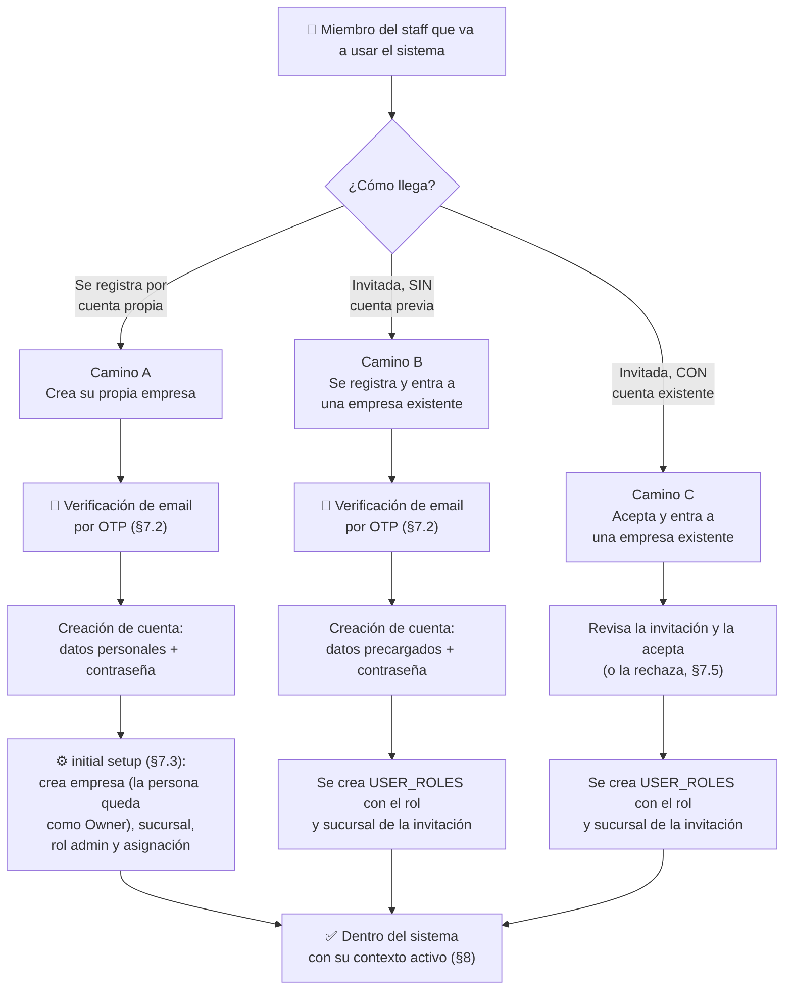

El diagrama muestra el **happy path** de cada flujo. Las variantes — cuenta ya existente o invitación pendiente en el camino A ([§7.3](#73-camino-a--registro-por-cuenta-propia-e-initial-setup)), rechazo de la invitación en los caminos B y C ([§7.5](#75-ciclo-de-vida-de-una-invitación)) — se detallan en cada subsección; y la creación efectiva de la cuenta del camino A ocurre dentro de la transacción del *initial setup* (paso 1, [§7.3](#73-camino-a--registro-por-cuenta-propia-e-initial-setup)).

Qué bloques usa cada camino:

| Bloque | Camino A — Registro propio | Camino B — Invitación (sin cuenta) | Camino C — Invitación (con cuenta) | Camino D — Usuario final ([§7.9](#79-camino-d--registro-del-usuario-final)) |
|---|---|---|---|---|
| Invitación previa ([§7.4](#74-caminos-b-y-c--invitación-creación-y-envío)) | — | ✔ | ✔ | — |
| Verificación de email por OTP ([§7.2](#72-bloque-común-verificación-de-email-por-otp)) | ✔ | ✔ | — (ya verificó su email al crear su cuenta) | ✔ |
| Creación de cuenta (datos + contraseña) | ✔ (se omite si ya tenía cuenta, [§7.3](#73-camino-a--registro-por-cuenta-propia-e-initial-setup)) | ✔ (datos precargados por el invitador) | — | ✔ (se omite si ya tenía cuenta, [§7.9](#79-camino-d--registro-del-usuario-final)) |
| *Initial setup* ([§7.3](#73-camino-a--registro-por-cuenta-propia-e-initial-setup)) | ✔ | — | — | — |
| Creación de asignación (`USER_ROLES`) | ✔ (rol `admin`, y la persona queda como **Owner** de la empresa) | ✔ (rol de la invitación) | ✔ (rol de la invitación) | — (no tiene roles, [§4.2](#42-usuarios-finales-la-otra-cara-del-sistema)) |
| Vinculación de fichas de cliente ([§7.9](#79-camino-d--registro-del-usuario-final)) | — | — | — | ✔ (por email verificado o documento) |

La clave para entender los caminos del staff: **el camino A es el único que crea una empresa**; B y C entran a una existente. Y el camino B es, en esencia, "el camino A sin *initial setup* y con los datos precargados por quien invitó". El camino D no toca empresas: crea solo la cuenta del usuario final ([§7.9](#79-camino-d--registro-del-usuario-final)).

### 7.2 Bloque común: verificación de email por OTP

En los caminos A, B y D, antes de crear la cuenta, el sistema envía un **OTP** (*One-Time Password*, contraseña de un solo uso): un código numérico de **6 dígitos** que llega al email ingresado y que la persona debe tipear en la pantalla de registro.

Para evitar confusiones, conviene ser explícito sobre qué es y qué no es:

- ✅ **Es** una prueba de propiedad de la casilla: tipear el código demuestra que la persona puede leer ese email, y nada más.
- ❌ **No es** un código de referido, de descuento ni de activación comercial.
- ❌ **No es** la contraseña de la cuenta: la contraseña se crea después, en un paso separado del registro.
- ❌ **No es** un segundo factor de autenticación (2FA): no se vuelve a pedir en los logins futuros.

Reglas del bloque:

- El código tiene **vencimiento corto** y puede reenviarse (cada reenvío invalida el anterior, con una espera mínima entre reenvíos — ver [§8.2](#82-rate-limiting-y-anti-automatización)).
- Los **intentos son limitados** (protección contra fuerza bruta y contra enumeración de cuentas; los límites concretos, en [§8.2](#82-rate-limiting-y-anti-automatización)).
- Es **exactamente el mismo bloque** en los caminos A, B y D; en el camino B se agrega una validación extra: el email verificado debe **coincidir con el email de la invitación** (ver [§7.6](#76-camino-b--registro-por-invitación-usuario-nuevo)).
- El camino C no lo necesita: ese usuario ya verificó su email cuando creó su cuenta.

### 7.3 Camino A — Registro por cuenta propia e *initial setup*

Cuando una persona se registra **por cuenta propia** (sin invitación), se asume que está creando una empresa nueva y será su administrador y owner.

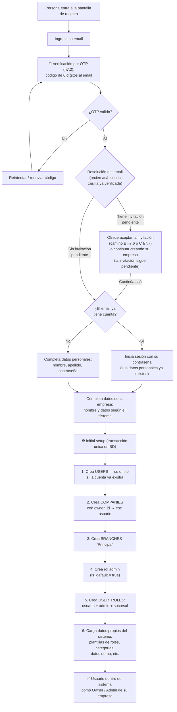

Características del *initial setup*:

- Los pasos se ejecutan **en ese orden** porque cada uno depende del anterior: la empresa necesita al usuario para `owner_id`, la sucursal y el rol necesitan a la empresa, la asignación necesita usuario + rol + sucursal, y los datos propios del sistema (categorías, plantillas, demos) necesitan que la empresa y la sucursal **ya existan**.
- Es una **función única en la base de datos** que se ejecuta como transacción: o se crea todo, o no se crea nada. Nunca puede quedar una empresa sin sucursal, sin rol admin o sin asignación.
- Su **núcleo es estándar** en todos los proyectos (pasos 1–5: usuario, empresa, sucursal, admin, asignación). Su **cola es específica** de cada sistema (paso 6): cada software agrega ahí su carga inicial (categorías de ejemplo, configuración por defecto, datos de demo, roles plantilla).
- La verificación del email por OTP ([§7.2](#72-bloque-común-verificación-de-email-por-otp)) es **obligatoria también en el registro propio**, no solo en el flujo de invitación.

Resolución del email después del OTP:

- **El OTP se envía siempre y la respuesta pública es idéntica**, exista o no la cuenta. La "respuesta pública" es todo lo que puede observar alguien que **no** tiene acceso a la casilla: los mensajes en pantalla, las respuestas de la API e incluso los tiempos de respuesta. La existencia de una cuenta o de una invitación pendiente se revela **únicamente después de validar el OTP**, es decir, solo a quien ya demostró ser dueño de la casilla. Así la pantalla de registro no sirve para la enumeración de cuentas (mismo criterio que en [§7.4](#74-caminos-b-y-c--invitación-creación-y-envío); ver [§12](#12-casos-borde-y-puntos-de-fuga-analizados)).
- **Usuario existente que crea otra empresa.** Si el email ya tiene cuenta, la persona inicia sesión con su contraseña dentro del mismo flujo y pasa directo a los datos de la empresa: el *initial setup* omite el paso 1 y la empresa nueva queda con su usuario existente como Owner (un usuario puede ser owner de N empresas). Esto ocurre **siempre desde la pantalla de registro, nunca desde adentro de la app**: dentro del software la persona opera en el contexto de una empresa —que puede ser ajena—, y un botón "crear mi propia empresa" ahí sería confuso (ej: un contador externo trabajando en el sistema de su cliente no debería ver esa opción).
- **Invitación pendiente detectada.** Se ofrece aceptarla en ese momento (sigue por el camino B o C, según tenga cuenta o no) o continuar con el registro propio; en ese caso la invitación queda pendiente y puede aceptarse más adelante. Si la acepta en ese momento, el bloque OTP **no se repite**: la casilla ya quedó verificada en este mismo flujo. No son opciones excluyentes: la persona puede terminar siendo Owner de su empresa **y** miembro de la empresa que la invitó.
- **Requisito de UI — transparencia en dos momentos.** Antes del OTP, un único mensaje corto: la pantalla avisa que el email se va a verificar para continuar, **sin enumerar los casos especiales** (la gran mayoría son usuarios nuevos; listar situaciones que no les aplican es ruido). Ej: *"Ingresá tu email: te enviaremos un código de 6 dígitos para verificarlo y continuar."* Después del OTP, **cada caso detectado tiene su propia pantalla** con un mensaje específico (tabla siguiente). Esta transparencia es hacia quien tipea, sobre su propio email —no revela nada de otras cuentas— y evita que la resolución post-OTP se sienta como una traba inesperada.

Pantallas de la resolución post-OTP, según el caso detectado:

| Caso detectado tras el OTP | Pantalla y mensaje (ejemplo) |
|---|---|
| Email nuevo | Continúa el flujo normal, sin avisos extra. |
| Ya tiene cuenta | *"Este email ya tiene una cuenta. Ingresá tu contraseña y vas a poder crear tu nueva empresa con tu cuenta ya existente."* |
| Tiene invitación pendiente (sin cuenta) | *"Tenés una invitación pendiente de **Pizzería Don Carlo** como **Cajero**. Podés aceptarla ([§7.6](#76-camino-b--registro-por-invitación-usuario-nuevo)) o continuar creando tu propia empresa — la invitación te queda pendiente para después."* |
| Ya tiene cuenta **y** además invitación pendiente | Primero la oferta de la invitación (igual que arriba); elija lo que elija, después inicia sesión con su contraseña: aceptar sigue por el camino C ([§7.7](#77-camino-c--aceptación-o-rechazo-usuario-existente)), continuar crea la empresa nueva con su cuenta ya existente. |

> 💡 **Ejemplo práctico — por qué la respuesta debe ser idéntica**
> Un atacante quiere saber si `gerente@clinicavital.com` usa el sistema. Va a la pantalla de registro y escribe ese email. Si el sistema respondiera "este email ya está registrado", el atacante acaba de confirmar su objetivo sin necesitar ninguna contraseña: ya sabe a quién dirigir un phishing. Con la respuesta idéntica, escriba el email que escriba, siempre observa lo mismo ("te enviamos un código") — y como no puede leer la casilla del gerente, no pasa de ahí. La información solo aparece para quien tipea el código correcto: el dueño real del email.

> **Nota — por qué el criterio estricto y no el aviso inmediato de "ya tenés cuenta".** Parte de la industria (Google, GitHub, Microsoft) revela la existencia de la cuenta en el registro y lo compensa con mitigaciones (rate limiting, CAPTCHA). Acá se mantiene el criterio estricto que recomienda OWASP —el mismo patrón *email-first* de Slack y Notion— por tres razones: el OTP es obligatorio de todas formas, así que la regla **no agrega fricción**; Supabase lo implementa de fábrica (con confirmación de email activada, registrarse con un email existente no revela nada); y los sistemas de Eurekant pueden manejar rubros sensibles (ej: salud), donde la existencia de una cuenta ya es un dato. El estándar de rate limiting y anti-automatización que acompaña a este criterio está definido en [§8.2](#82-rate-limiting-y-anti-automatización).

> 💡 **Ejemplo práctico — initial setup específico por sistema**
> En el sistema de turnos para clínicas, el *initial setup* además crea: los roles plantilla "Recepcionista" y "Profesional", una agenda de ejemplo y los horarios de atención por defecto. En el sistema de stock, crea: el rol plantilla "Depósito", una categoría "General" y un producto de ejemplo. El núcleo (empresa, sucursal, admin) es idéntico en ambos.

### 7.4 Caminos B y C — Invitación: creación y envío

Quien tenga el permiso `users.invite` puede invitar personas a una sucursal de su empresa. El sistema distingue los dos escenarios **al inicio**, según el email ingresado, y cada uno sigue su propio carril hasta el final:

Notas:

- En ambos escenarios el resultado intermedio es el mismo: una fila en `INVITATIONS` con empresa, sucursal, rol, email y quién invita. Lo que cambia es lo que pasa después de la pantalla de confirmación: en el camino B la persona se registra (o rechaza); en el camino C acepta (o rechaza). En **ningún caso** la invitación se acepta automáticamente: la persona siempre ve el detalle y decide ([§7.5](#75-ciclo-de-vida-de-una-invitación)).
- La **verificación de existencia** del email debe hacerse de forma segura: el sistema responde internamente si existe o no para ajustar el formulario, pero **no debe exponer** a cualquier usuario una API que permita enumerar qué emails tienen cuenta (punto de fuga clásico, ver [§12](#12-casos-borde-y-puntos-de-fuga-analizados)).
- Para el usuario existente **no se piden datos personales** porque ya existen en su cuenta; solo se elige sucursal y rol.
- **Invitar a varias personas** es simplemente crear N invitaciones, una fila cada una: no existe estructura especial de "lote" en el modelo. Si algún sistema necesita una pantalla de invitación masiva (ej: importar un CSV), es funcionalidad de producto sobre este mismo mecanismo (decisión [18](#131-decisiones-confirmadas)).

### 7.5 Ciclo de vida de una invitación

Antes de ver los dos desenlaces (caminos B y C), los estados por los que puede pasar una invitación — el mismo ciclo de vida que después reutilizan las transferencias de ownership ([§7.8](#78-transferencia-de-ownership)):

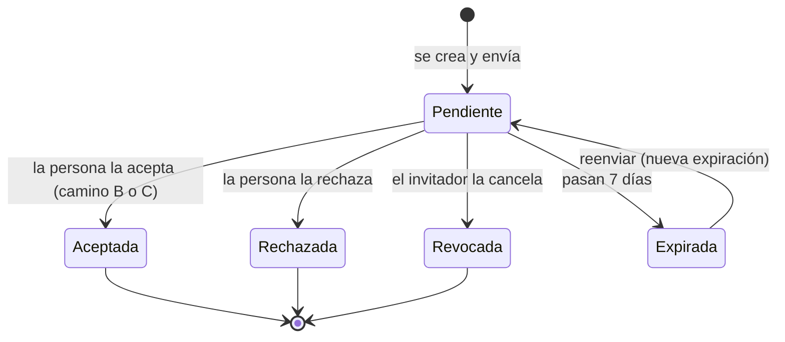

Reglas:

- **Expiración:** 7 días (valor parametrizable desde `SYSTEM_SETTINGS`). Una invitación expirada puede reenviarse, lo que renueva la fecha.
- **Revocación:** quien tenga `users.invite` puede revocar una invitación pendiente (ej: se equivocó de email o la persona ya no se incorpora). Una invitación revocada o aceptada no puede reutilizarse.
- **Rechazo:** la persona invitada puede **rechazar** la invitación desde la pantalla de confirmación, en ambos caminos (B y C); el invitador recibe la notificación. El rechazo es terminal y la invitación no puede reutilizarse: si fue un error o la persona cambia de opinión, se crea una nueva.
- **Unicidad:** solo puede existir **una invitación pendiente por email + empresa**. Si se quiere cambiar el rol o la sucursal antes de que la acepte, se revoca y se crea una nueva.
- **Validaciones al crear:** no se puede invitar a un email que ya tiene asignación activa en esa misma sucursal con ese mismo rol; y el rol y la sucursal de la invitación deben pertenecer a la empresa del invitador.
- **Validaciones al aceptar:** si entre el envío y la aceptación el rol o la sucursal fueron desactivados, la invitación se considera inválida y se informa a la persona (y al invitador) para que se genere una nueva.
- **Auditoría:** la fila de `INVITATIONS` refleja el estado actual; cada evento del ciclo —creación, reenvío, aceptación, rechazo, revocación— queda registrado en el log de auditoría con quién y cuándo (decisiones [17](#131-decisiones-confirmadas) y [25](#131-decisiones-confirmadas)).

> 💡 **Ejemplo práctico — invitación con typo**
> El admin invita a `jaun@gmail.com` en lugar de `juan@gmail.com`. Se da cuenta al día siguiente: revoca la invitación pendiente y crea una nueva con el email correcto. Si el dueño real de `jaun@gmail.com` intentara usar el link viejo, vería "invitación revocada" y no podría acceder a nada.

### 7.6 Camino B — Registro por invitación (usuario nuevo)

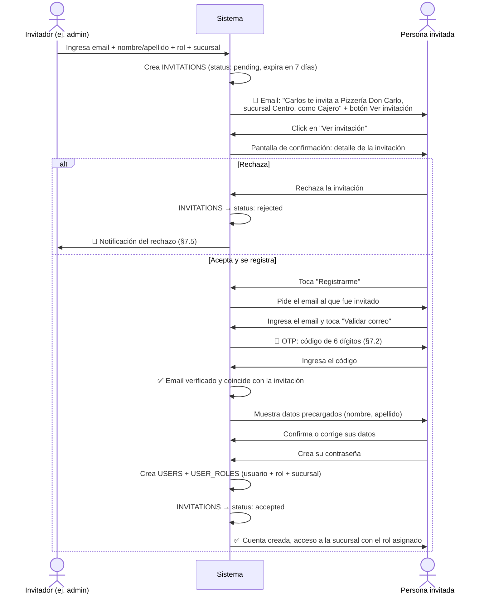

Detalles importantes:

- El registro por invitación es **el mismo flujo** que el registro por cuenta propia (camino A), con tres diferencias: (a) llega por email en vez de iniciarse solo, (b) los datos personales vienen **precargados** por quien invitó y la persona puede corregirlos, y (c) **no se ejecuta el initial setup** ni se piden datos de empresa — la persona entra a una empresa existente, no crea una.
- El email que la persona verifica con el OTP **debe coincidir** con el email de la invitación. Si no coincide, no se vincula la invitación.
- La persona invitada es la dueña final de sus datos: lo que el invitador escribió (nombre, apellido) es solo una sugerencia editable.
- La pantalla a la que lleva el email muestra el detalle de la invitación y también permite **rechazarla** sin registrarse (estado Rechazada, [§7.5](#75-ciclo-de-vida-de-una-invitación)); el registro continúa solo si la persona acepta.
- Si el email **ya tiene cuenta** al momento de abrir la invitación (la persona se registró por cuenta propia entre el envío y el click), el sistema lo detecta y el flujo se convierte en el camino C: login y aceptación, sin nuevo registro ([§7.7](#77-camino-c--aceptación-o-rechazo-usuario-existente)).

### 7.7 Camino C — Aceptación o rechazo (usuario existente)

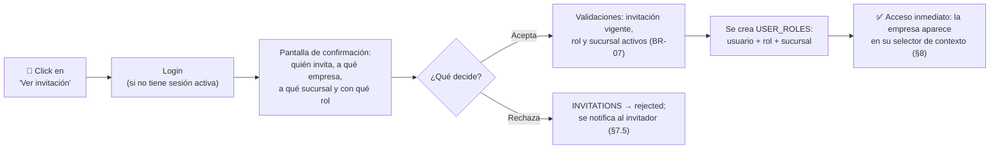

- **Nada se acepta automáticamente:** el click del email no crea ninguna asignación — lleva a una pantalla de confirmación con el detalle completo de la invitación, y ahí la persona decide aceptar o rechazar.
- No hay OTP ni formulario de datos: la persona ya verificó su email al crear su cuenta y sus datos personales ya existen. Solo necesita login si no tenía sesión abierta.
- **Si acepta:** el sistema valida que la invitación siga vigente y que el rol y la sucursal sigan activos ([BR-07](#11-reglas-de-negocio-e-integridad-resumen-normativo)); se crea la asignación `USER_ROLES` y la nueva empresa/sucursal aparece de inmediato en su selector de contexto ([§8](#8-contexto-activo-en-qué-empresa-sucursal-y-rol-estoy-parado)), sin cerrar sesión. Si algo fue desactivado en el medio, la invitación se invalida y se notifica a ambas partes.
- **Si rechaza:** la invitación pasa a estado Rechazada y se notifica al invitador ([§7.5](#75-ciclo-de-vida-de-una-invitación)). Si fue un error, el invitador crea una nueva.

### 7.8 Transferencia de ownership

No es un camino de entrada —el receptor ya es usuario activo de la empresa—, pero se documenta en esta sección porque reutiliza el mismo patrón que las invitaciones: una oferta pendiente, una pantalla de confirmación y el mismo ciclo de vida ([§7.5](#75-ciclo-de-vida-de-una-invitación)). Nada cambia de manos sin la firma del receptor.

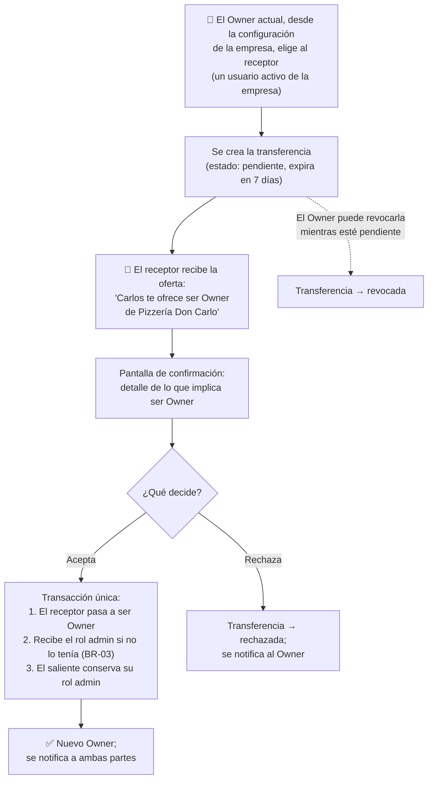

Reglas ([BR-17](#11-reglas-de-negocio-e-integridad-resumen-normativo)):

- **El receptor debe ser un usuario activo de la empresa.** Para transferir a alguien de afuera, primero se lo invita (caminos B/C) y, una vez dentro, se le transfiere. Así no hace falta un flujo híbrido "invitación + transferencia".
- **Confirmación obligatoria del receptor:** ser Owner implica responsabilidades (es el respaldo administrativo de la empresa, [BR-03](#11-reglas-de-negocio-e-integridad-resumen-normativo)), y nadie las recibe sin aceptarlas. Misma filosofía que la decisión [11](#131-decisiones-confirmadas): nada se acepta en nombre de otro.
- **Una sola transferencia de ownership pendiente por empresa.** Si el Owner ofreciera el título a dos personas y ambas aceptaran, ¿quién es el dueño? Para que ese conflicto sea imposible, la oferta vigente debe resolverse (aceptada, rechazada, expirada o revocada) antes de poder iniciar otra.
- **El Owner saliente conserva el rol admin:** deja de ser el dueño pero no pierde el acceso; queda como un admin común — renunciable o removible como cualquier otro ([BR-03](#11-reglas-de-negocio-e-integridad-resumen-normativo)). El nuevo Owner decide si ajusta sus roles después.
- **Mismo ciclo de vida que una invitación** ([§7.5](#75-ciclo-de-vida-de-una-invitación)): pendiente → aceptada / rechazada / expirada / revocada. Expira a los 7 días (parametrizable) y el Owner puede revocarla mientras esté pendiente. Única diferencia: una transferencia expirada **no se reenvía** — el Owner inicia una nueva. ¿Por qué la asimetría? El reenvío de invitaciones existe para no recargar datos (rol, sucursal, datos personales precargados) y re-disparar un email perdido; la transferencia solo tiene dos datos —empresa y receptor—, así que "reenviar" y "crear una nueva" serían el mismo botón. Y que cada oferta sea un registro nuevo y cerrado deja una auditoría inequívoca para un acto tan consecuente: *"ofreció el 10/Jun, expiró; volvió a ofrecer el 20/Jun, aceptada"*.
- **Atomicidad:** la aceptación se ejecuta como transacción única en la base — cambio de Owner y rol admin del receptor, todo o nada (como el *initial setup*, [§7.3](#73-camino-a--registro-por-cuenta-propia-e-initial-setup)).

> 💡 **Ejemplo práctico — la venta de la pizzería**
> Carlos vende Pizzería Don Carlo a su socio Diego. Desde la configuración inicia la transferencia; Diego recibe el aviso y la acepta: ahora Diego es Owner (ya era admin, así que sus roles no cambian) y Carlos sigue siendo admin — útil durante la transición. Tres meses después Carlos renuncia a su rol admin y queda fuera de la empresa: ahora que no es Owner, [BR-03](#11-reglas-de-negocio-e-integridad-resumen-normativo) ya no lo protege ni lo retiene. Si en cambio Diego hubiera dejado pasar los 7 días sin responder, la transferencia expiraba y Carlos seguía siendo el dueño — el título nunca queda en el aire.

### 7.9 Camino D — Registro del usuario final

El camino de entrada de los usuarios finales ([§4.2](#42-usuarios-finales-la-otra-cara-del-sistema)). Es el más simple de los cuatro: crea **solo la cuenta** — sin empresa, sin roles, sin *initial setup* — y resuelve la vinculación con las fichas de cliente que ya existieran a nombre de la persona.

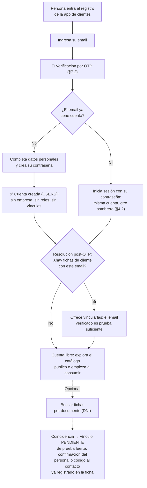

Reglas ([BR-18](#11-reglas-de-negocio-e-integridad-resumen-normativo)):

- **La cuenta nace libre.** Cero vínculos es un estado válido y permanente: el usuario puede explorar el catálogo público sin ser cliente de nadie.
- **Si el email ya tiene cuenta, no se duplica nada** ([BR-09](#11-reglas-de-negocio-e-integridad-resumen-normativo)): la persona inicia sesión dentro del mismo flujo —la misma resolución post-OTP del camino A ([§7.3](#73-camino-a--registro-por-cuenta-propia-e-initial-setup))— y sigue directo a la vinculación de fichas. Es el caso del staff que se descarga la app de clientes: una cuenta, otro sombrero ([§4.2](#42-usuarios-finales-la-otra-cara-del-sistema)).
- **Vinculación por email verificado → inmediata.** Si una ficha ya tenía ese email, el OTP del registro demuestra la propiedad de la casilla y el vínculo se ofrece en el momento — la misma lógica de resolución post-OTP del camino A ([§7.3](#73-camino-a--registro-por-cuenta-propia-e-initial-setup)).
- **La coincidencia por documento nunca vincula sola.** El documento no es un secreto: cualquiera puede conocer el DNI de otra persona. La coincidencia encuentra la ficha pero **no muestra sus datos ni la vincula**; a lo sumo revela lo imprescindible para elegir la prueba — el contacto **enmascarado** al que viajará el código —, el mismo criterio de los flujos de recuperación de cuenta de la industria. El vínculo queda pendiente de una **prueba fuerte**: confirmación del personal en la próxima visita (con la persona y su documento enfrente) o un código enviado al teléfono/email que la ficha ya tenía registrado; en los sistemas que exigen solo la prueba presencial, la respuesta puede ser totalmente genérica. Misma filosofía que la decisión [13](#131-decisiones-confirmadas): los datos aparecen solo ante una prueba real de identidad.
- **Qué prueba exige cada sistema es parametrizable** (ficha de [§10.2](#102-parametrización-del-sistema-system_settings-globales-y-overrides)): gastronomía puede aceptar el código por teléfono (el riesgo son puntos de fidelización); salud exige confirmación presencial (el riesgo es la historia clínica).
- **El contacto que carga el staff es provisional ([BR-19](#11-reglas-de-negocio-e-integridad-resumen-normativo)).** El email o teléfono que un empleado escribe en una ficha sirve para operar, pero **no es prueba de identidad**: no vincula la ficha a ninguna cuenta por sí solo. El sistema marca para revisión las anomalías —un contacto que coincide con el del propio empleado, o uno repetido en muchas fichas—, con la misma lógica del umbral de invitaciones ([§8.2](#82-rate-limiting-y-anti-automatización)). Y cuando el verdadero dueño verifica después su propio email o teléfono, ese **reemplaza** al provisional: el empleado no puede quedarse con la ficha del cliente.
- **Los consumos nuevos por la app** crean la ficha ya vinculada: el vínculo nace del uso, sin paso extra.
- **Todo evento de vinculación** (propuesta, confirmación, rechazo) queda en el log de auditoría (decisión [17](#131-decisiones-confirmadas)).
- **Fichas duplicadas** (la misma persona cargada dos veces por el staff): se resuelven con una herramienta de **fusión** del negocio; su detalle se define en la v2.
- **El mismo email puede después ser invitado como staff** (caminos B/C): es la misma cuenta con otro sombrero ([§4.2](#42-usuarios-finales-la-otra-cara-del-sistema)); nada se duplica.

> 💡 **Ejemplo práctico — los puntos del mostrador**
> María almuerza en La Parrilla del Puerto. No tiene la app, pero quiere los puntos: el mozo la registra en dos toques — nombre, DNI y teléfono (el mozo no conoce la lógica interna; para él es solo "registrar cliente"). Seis meses y varios almuerzos después, María se descarga la app y se registra con su email — que la ficha no tenía. El sistema no encuentra nada por email, así que María busca por DNI: *"Encontramos registros a tu nombre: confirmá el vínculo en tu próxima visita, o pedí un código al teléfono terminado en 21"*. María pide el código, tipea el SMS que llega al teléfono que el mozo había cargado, y sus puntos acumulados aparecen en la app. Un desconocido que tipeara el DNI de María vería la misma pantalla genérica — pero si pidiera el código, viaja al teléfono de María, no al suyo: sin ese teléfono en la mano no hay vínculo, ni puntos a la vista, ni forma de saber en qué negocios tiene fichas. Y los intentos están limitados, como todo en [§8.2](#82-rate-limiting-y-anti-automatización).

> 💡 **Ejemplo práctico — el mozo que pone su propio teléfono**
> El otro riesgo viene de adentro: un mozo, por vagancia o mala fe, carga *su* teléfono en las fichas de los clientes para acumularse los puntos. Tres barreras lo frenan ([BR-19](#11-reglas-de-negocio-e-integridad-resumen-normativo)): (1) ese mismo teléfono repetido en decenas de fichas **dispara la alerta de anomalía** ([§8.2](#82-rate-limiting-y-anti-automatización)) y queda para revisión; (2) el contacto que cargó es **provisional** — cuando la clienta real se registra y verifica su propio número, reemplaza al del mozo; y (3) canjear los puntos exige **prueba fuerte** (confirmación presencial con documento, [BR-18](#11-reglas-de-negocio-e-integridad-resumen-normativo)), que el mozo no controla. El contacto tipeado por el staff nunca es, por sí solo, una llave.

---

## 8. Contexto activo: en qué empresa, sucursal y rol estoy parado

Como un usuario puede tener N asignaciones, el sistema necesita saber **cuál está usando ahora**. Ese es el **contexto activo**: la asignación con la que el usuario está operando — `empresa + sucursal + rol`.

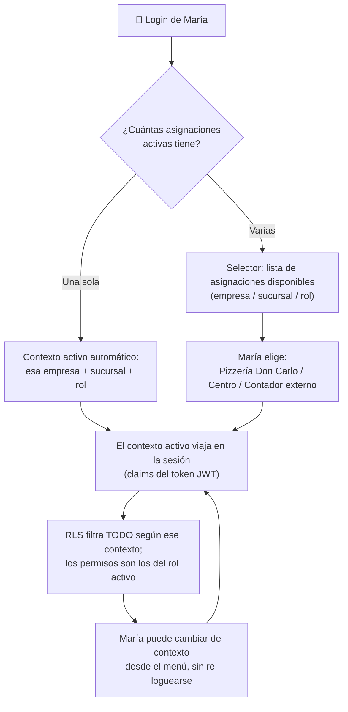

Reglas:

- Si el usuario tiene **una sola** asignación activa, el contexto se establece solo, sin pantalla intermedia (el caso más común: empleados de una sola empresa no deben enterarse de que el sistema es multi-tenant).
- El selector muestra cada asignación como `empresa / sucursal / rol`. Si el usuario tiene **más de un rol en la misma sucursal**, cada uno aparece como una entrada separada: **los permisos no se combinan** — el usuario opera con un rol a la vez y sus permisos efectivos son exactamente los del rol activo ([BR-15](#11-reglas-de-negocio-e-integridad-resumen-normativo)). Para usar otro de sus roles, cambia de contexto.
- El contexto activo (y los permisos del rol activo) se materializa en los **claims del token de sesión (JWT)**, para que el RLS pueda evaluarlo sin subconsultas costosas. Este es el patrón recomendado por Supabase y la industria.
- Cambiar de contexto refresca el token con los nuevos claims (`refreshSession()`, ver [§8.1](#81-política-de-sesiones-y-renovación-de-tokens)). No requiere cerrar sesión.
- El sistema recuerda el último contexto usado para preseleccionarlo en el próximo login.

> 💡 **Ejemplo práctico — el token como credencial de evento**
> El JWT funciona como la credencial impresa de un congreso. Al acreditarse (login + elección de contexto), la persona recibe una credencial con sus datos a la vista: quién es, empresa, sucursal, rol y sus permisos — los *claims*. El guardia de cada puerta (cada política RLS) mira la credencial y decide al instante, sin llamar a la oficina central (sin consultar las tablas de roles) cada vez. Y la credencial está firmada: si alguien intenta agregarse un permiso a mano, la firma deja de coincidir y el sistema la rechaza.
>
> **¿Cómo funciona esa firma?** El token tiene tres partes: `cabecera.datos.firma`. Los datos (los claims) **no están cifrados** — cualquiera con el token puede leerlos. Lo que los protege es la firma: el servidor la calcula pasando el contenido exacto del token por una función matemática junto con una **clave secreta que nunca sale del servidor**. Cualquier cambio en los datos, por mínimo que sea, produce una firma completamente distinta. Si alguien edita los claims, el contenido ya no coincide con la firma y la base rechaza el token entero — y el atacante no puede recalcular la firma correcta porque no tiene la clave. Como un cheque: cualquiera lee el monto, pero alterarlo se nota, y no se puede volver a firmar con la firma de otro.

> 💡 **Ejemplo práctico — multi-rol sin combinación de permisos**
> En el sistema de turnos de la clínica, la Dra. Paredes tiene dos roles en la misma sucursal: **Profesional** (atiende turnos y carga evoluciones en las historias clínicas de sus pacientes) y **Directora médica** (ve reportes, aprueba reintegros y accede a historias clínicas de otros profesionales). Atendiendo pacientes opera como Profesional: no ve reportes ni historias ajenas, aunque "tenga" el otro rol. Para la revisión mensual cambia su contexto a Directora médica. La ventaja es doble: **separación de funciones** — sus tareas cotidianas no cargan privilegios elevados, el mismo principio por el que un administrador de sistemas no usa root para el día a día — y **auditoría inequívoca** ([BR-14](#11-reglas-de-negocio-e-integridad-resumen-normativo)): si aprueba un reintegro o corrige una historia clínica ajena, el registro (`created_by`/`updated_by` → `USER_ROLES`) muestra que lo hizo actuando como Directora médica, no como Profesional.

### 8.1 Política de sesiones y renovación de tokens

El JWT corto y la sesión larga son **dos cosas distintas que se resuelven con mecanismos distintos**. El error histórico (heredado de la época de FlutterFlow, cuya autenticación custom cerraba la sesión al vencer el token sin dar ventana de refresh) era estirar la vida del JWT a 7 días para que la sesión durara. Con los SDKs oficiales de Supabase eso no es necesario (en Flutter, `supabase_flutter`; en web, `supabase-js`): el SDK renueva el token automáticamente, y la duración de la sesión la gobiernan los **refresh tokens**.

| Parámetro | Valor estándar | Dónde se configura |
|---|---|---|
| Vida del JWT (access token) | **3600 s (1 hora)** — el default de Supabase. Sistemas sensibles pueden bajarlo (hasta 15–30 min); nunca menos de 5 min. **Nunca se sube para alargar sesiones.** | Configuración del proyecto Supabase |
| Renovación del JWT | **Automática** (`autoRefreshToken`, activo por defecto): el SDK chequea la sesión cada 10 s y refresca ~30 s antes del vencimiento; al reabrir la app recupera la sesión aunque el JWT haya vencido; reintenta ante fallas de red sin cerrar la sesión. | SDK oficial de Supabase de cada plataforma (sin código propio) |
| Vida de la sesión | **Indefinida mientras la app se use**: los refresh tokens no vencen por tiempo, son de un solo uso y rotan en cada canje. | Automático (Supabase + SDK) |
| Tope de sesión (opcional, por proyecto) | *Inactivity timeout* o *time-boxed sessions* (ej: "14 días sin uso → re-login"). Es configuración del proyecto, **no lógica de la app**. ⚠️ Requiere plan Pro o superior de Supabase (decisión [20](#131-decisiones-confirmadas), [§13.1](#131-decisiones-confirmadas)). | Configuración Supabase (Auth) |
| Cambio de contexto activo | `refreshSession()`: reemite el JWT al instante con los claims del nuevo contexto. | App, al cambiar de contexto |

Reglas y detalles:

- **El JWT nunca se estira para alargar la sesión.** Un JWT no se puede revocar una vez emitido: estirarlo de 1 hora a 7 días multiplica por 168 la ventana de revocación ([§9.3](#93-cómo-funcionará-conceptual-el-detalle-va-en-la-v2)) y congela permisos viejos durante una semana. La sesión larga la dan los refresh tokens, que sí son revocables.
- **El robo de refresh tokens está cubierto por la rotación.** Si un refresh token ya canjeado se vuelve a usar (señal de robo), Supabase considera comprometida la sesión y la termina **entera**, revocando todos sus tokens (*reuse detection*, con una ventana de gracia de 10 segundos para tolerar reintentos de red).
- **No contamina la base.** Los tokens viven en el schema `auth`, administrado por Supabase. Cada renovación crea una fila nueva y conserva la anterior marcada como revocada (la necesita la *reuse detection*), pero la limpieza es automática: los tokens revocados se purgan ~24 h después y las sesiones vencidas, ~72 h después. En régimen, una sesión activa mantiene ~25 filas pequeñas — despreciable. (En self-hosted la limpieza viene desactivada: habilitar `GOTRUE_DB_CLEANUP_ENABLED=true`.)
- **La librería de FlutterFlow queda retirada** para proyectos Flutter nativos: `DatetimeToRefreshToken`, `TokenRefreshWindowSeconds` y `SessionLifetimeSeconds` están cubiertos por el SDK (ventana de refresh integrada, persistencia y recuperación de sesión al reabrir la app) y por la configuración de Supabase (topes de sesión).

> 💡 **Ejemplo práctico — el cliente que pide "sesión de 14 días"**
> Un cliente quiere que sus usuarios no tengan que loguearse de nuevo durante 14 días. No se toca el JWT (sigue en 1 hora): se configura el *inactivity timeout* del proyecto en 14 días. El empleado que abre la app todos los días **no se desloguea nunca** — cada uso renueva la sesión. El que no la abre en 14 días vuelve a iniciar sesión. Y la ventana de revocación sigue siendo de 1 hora: si lo desvinculan, sus permisos mueren dentro de la hora, no a los 14 días.

### 8.2 Rate limiting y anti-automatización

Los endpoints públicos (registro con OTP, login, invitaciones) son la puerta de calle del sistema: cualquiera puede tocar el timbre. El **rate limiting** funciona como el molinete del subte: al ritmo de una persona normal se pasa sin notarlo, pero quien intenta pasar cien veces por minuto se encuentra con la traba ("demasiados intentos, esperá un momento"). El estándar tiene tres capas y una regla transversal.

**Capa 1 — Límites nativos de Supabase.** Vienen activados de fábrica; el estándar fija sus valores. Cada límite declara *qué* se cuenta, en *qué ventana* de tiempo y *por quién* se cuenta:

| Operación | Valor estándar | Qué se cuenta, exactamente |
|---|---|---|
| Envío de emails | **30 emails por hora, en total para todo el proyecto** (valor inicial; se sube desde el panel a medida que crece el volumen) | Todos los correos que el sistema manda —códigos OTP, invitaciones, recuperaciones— de todas las empresas juntas: es el grifo global de salida de correo. **Requiere SMTP propio**: el SMTP integrado de Supabase envía solo 2 emails/hora y únicamente a las casillas del equipo del proyecto — con él, el registro de clientes reales directamente no funciona. SMTP propio es obligatorio en producción (disponible en todos los planes). |
| Solicitud de código OTP | **Máx. 30 solicitudes cada 5 minutos desde una misma IP** (default de Supabase) + **1 reenvío por minuto al mismo email** | Las veces que se pide "enviame el código". El tope por IP frena bots: un usuario real pide 1 o 2 códigos; treinta pedidos en cinco minutos desde el mismo lugar son un script. Es 30 y no 3 porque una IP puede ser compartida (toda una oficina sale a internet con la misma). El tope por email evita el spam a una casilla ajena; la UI muestra el botón "reenviar" con cuenta regresiva de 60 segundos. |
| Verificación del código OTP | **Máx. 5 intentos por código** (regla de aplicación); además Supabase corta a las 360 verificaciones por hora desde una misma IP | Las veces que se tipea un código. Uno de 6 dígitos tiene un millón de combinaciones: sin tope de intentos, un bot lo adivina probando; con 5, el código se invalida y hay que pedir uno nuevo — cuya emisión también está limitada (fila anterior). Los dos contadores son independientes porque protegen de ataques distintos: spam/costo de envío vs. adivinación del código. |
| Renovación de tokens | **Máx. 1800 renovaciones por hora desde una misma IP** (default de Supabase) | Los canjes de refresh token ([§8.1](#81-política-de-sesiones-y-renovación-de-tokens)). El SDK renueva ~1 vez por hora por sesión: el límite no afecta el uso real ni siquiera de una oficina entera detrás de la misma IP. |

**Capa 2 — CAPTCHA en registro y login.** Supabase trae integración nativa con **Cloudflare Turnstile**, el proveedor estándar de Eurekant: gratuito y, en la gran mayoría de los casos, invisible — verifica que hay una persona sin pedirle nada (sin "marcá los semáforos"). Se activa desde el panel de Supabase y los SDKs oficiales lo soportan con el parámetro `captchaToken` en el registro y el login (en Flutter, `supabase_flutter`). Es la capa que detiene a los bots puros antes de que consuman intentos, y la capa confiable para el login con contraseña (existe un [reporte abierto](https://github.com/supabase/supabase/issues/41947) de que el límite configurable de logins no siempre se aplica).

**Capa 3 — Reglas de aplicación para invitaciones.** El riesgo acá no es el robo de datos sino el **spam saliente**: un usuario malicioso que envía cientos de invitaciones arruina la reputación del dominio de email — los proveedores empiezan a marcar como spam todo lo que el sistema manda, incluido lo legítimo. Estándar: tope duro de invitaciones por emisor por día, definido como parámetro del sistema (ej: `invitations.max_per_user_per_day`, default 50, ajustable por empresa vía override si un cliente lo necesita — [§10.2](#102-parametrización-del-sistema-system_settings-globales-y-overrides)), y a partir de 10 invitaciones diarias el emisor se marca para revisión (umbral de la práctica documentada de la industria); el emisor siempre tiene email verificado (lo garantiza el flujo de registro); y la apertura de invitaciones se limita igual que la verificación de OTP, porque el token del link es un secreto adivinable.

**Regla transversal — nunca bloqueo permanente de cuentas.** Es la posición de OWASP: un bloqueo duro por intentos fallidos se convierte en arma — quien conoce el email de la víctima puede dejarla fuera de su propia cuenta a propósito (denegación de servicio dirigida). La escalera correcta: frenar el ritmo (los límites de arriba) → esperas crecientes → CAPTCHA → bloqueo *temporal*; y la recuperación de contraseña queda siempre disponible.

> Nota de planes: **nada de esta sección requiere plan Pro** — los límites son configurables y el CAPTCHA está disponible en todos los planes de Supabase, incluido Free. El único requisito es técnico, no comercial: SMTP propio para producción.

---

## 9. RLS: aislamiento de datos sin filtros en el código

### 9.1 El principio

**El código de aplicación nunca filtra por empresa o sucursal.** Cuando el frontend o el backend consulta una tabla, escribe la query "ingenua" (`select * from PRODUCTS`) y la base de datos, mediante Row Level Security, devuelve **solo** las filas que quien consulta puede ver — según su familia de acceso: staff, identidad propia o catálogo público ([§9.2](#92-quién-accede-las-tres-familias-de-acceso)). El ejemplo siguiente muestra la familia staff.

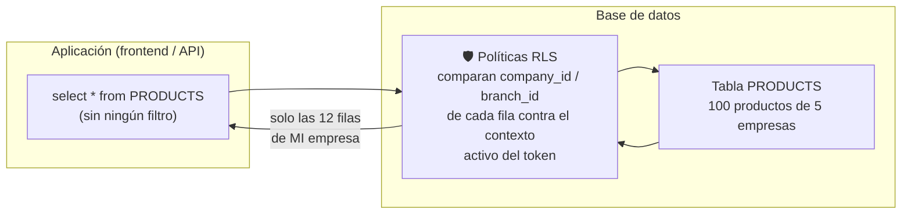

> 💡 **Ejemplo práctico — el caso de los 100 productos**
> En la tabla `PRODUCTS` hay 100 productos de 5 empresas distintas. Juan (Cajero de la Pizzería, sucursal Centro) consulta la tabla **sin ningún filtro** y recibe exactamente los 12 productos de la pizzería. No hay forma de que reciba otros: aunque un desarrollador se olvide de todo, aunque la query venga de un script externo con el token de Juan, el RLS está en la base y es la última línea de defensa. El clásico bug de "me olvidé el `where company_id = ...`" **deja de existir como categoría de bug**.

### 9.2 Quién accede: las tres familias de acceso

No todos acceden igual. El RLS decide **quién puede ver o escribir cada fila** según a cuál de tres familias pertenece quien consulta. Cada tabla declara qué familias le aplican; el detalle de las políticas va en la v2.

| Familia | Quién | Cómo se decide el acceso | Ejemplo |
|---|---|---|---|
| **Staff** (contexto activo) | Operadores con rol ([§5](#5-modelo-de-roles-y-permisos), [§8](#8-contexto-activo-en-qué-empresa-sucursal-y-rol-estoy-parado)) | Por el contexto activo en los claims del JWT: empresa + sucursal + rol + permisos | El cajero ve los productos de su empresa |
| **Identidad propia** | Usuario final ([§4.2](#42-usuarios-finales-la-otra-cara-del-sistema)) | Por las filas atadas a su ficha de cliente — sin claims de contexto ni permisos | El paciente ve sus turnos, no los de otros |
| **Catálogo público** | Cualquier usuario autenticado | Lectura de los perfiles de las empresas listadas, sin relación previa | El comensal explora los negocios de la app |

Todo lo que sigue ([§9.3](#93-cómo-funcionará-conceptual-el-detalle-va-en-la-v2) en adelante: claims, índices, los cuatro verbos, el *trade-off*) detalla la familia **staff**, la más rica; las otras dos se mencionan donde difieren (ej: de dónde sale el tenant al escribir, [BR-16](#11-reglas-de-negocio-e-integridad-resumen-normativo)).

### 9.3 Cómo funcionará (conceptual, el detalle va en la v2)

- Toda tabla operativa lleva `company_id` (y `branch_id` cuando su alcance es por sucursal). Estas columnas estarán **indexadas** siempre — es el principal factor de performance del RLS. (Qué es una tabla operativa y por qué lleva estas columnas: ver [§9.4](#94-tablas-operativas-y-la-columna-de-tenant-análisis-de-normalización).)
- Las políticas comparan esas columnas contra el **contexto activo en los claims del JWT** (empresa, sucursal, rol y sus permisos), evitando subconsultas pesadas en cada fila.
- El RLS cubre los cuatro verbos: lectura (qué filas veo), inserción (no puedo insertar filas de otra empresa — cláusula de verificación), actualización y borrado.
- Los **permisos** también se evalúan en la base cuando corresponde: por ejemplo, insertar en `PRODUCTS` exige el permiso `products.create` en el contexto activo, no solo pertenecer a la empresa. Habrá funciones auxiliares estándar (`fn_has_permission`, etc.) reutilizables en todos los proyectos.
- **Alcance empresa vs. sucursal según la tabla:** hay tablas donde todos los miembros de la empresa ven lo mismo (ej: catálogo de productos) y tablas donde solo se ve lo de la propia sucursal (ej: cajas, stock). Cada sistema define el alcance de cada tabla; el estándar provee ambos patrones de política.
- **Trade-off conocido:** el token es una **foto** de los permisos, tomada al armar el contexto activo. Se gana velocidad (la base no consulta las tablas de roles en cada query) a cambio de inmediatez: un cambio de rol o de permisos no se refleja en los tokens ya emitidos hasta que expiran y se renuevan (hasta 1 hora con el valor estándar, ver [§8.1](#81-política-de-sesiones-y-renovación-de-tokens)). Por eso los tokens son de **vida corta**, y las acciones críticas (desactivar un usuario, suspender una empresa) se complementan con verificación en base, que aplica al instante. Es la decisión estándar de la industria (Supabase, Auth0, Firebase): la alternativa — verificar todo en base en cada query — elimina esa ventana de minutos al costo del rendimiento de todo el sistema, todo el tiempo. La política completa de duración y renovación de tokens está en [§8.1](#81-política-de-sesiones-y-renovación-de-tokens).

> 💡 **Ejemplo práctico — el cajero desvinculado**
> Despiden a un cajero a las 10:00 y el admin lo desactiva al instante. Su token vigente puede seguir siendo válido hasta las 11:00 (vida estándar de 1 hora, [§8.1](#81-política-de-sesiones-y-renovación-de-tokens)): durante esa ventana, su "credencial" todavía dice *Cajero de la sucursal Centro*. Para las operaciones comunes esa ventana es tolerable y se cierra sola. Para lo crítico no se espera: la baja del usuario también se verifica en base ([BR-08](#11-reglas-de-negocio-e-integridad-resumen-normativo): pierde acceso de inmediato), igual que la suspensión de una empresa (`COMPANIES.deactivated_at` corta el acceso vía RLS al instante).

### 9.4 Tablas operativas y la columna de tenant: análisis de normalización

**Qué es una tabla operativa.** Toda tabla que guarda datos del dominio de negocio de cada sistema: productos, ventas, turnos, stock, cajas, pacientes, etc. Es la tercera categoría de tablas del estándar:

| Grupo | Ejemplos | ¿Lleva columna de tenant? |
|---|---|---|
| Tablas del modelo estándar | `USERS`, `COMPANIES`, `BRANCHES`, `ROLES`, `USER_ROLES`, `INVITATIONS`, `COMPANY_CUSTOMERS` | Según su rol en el modelo (definido en [§6](#6-modelo-de-entidades-conceptual)) |
| Catálogos globales | `PERMISSIONS`, `SYSTEM_SETTINGS` | No: son datos del sistema, no de las empresas |
| **Tablas operativas** | `PRODUCTS`, `ORDERS`, turnos, stock, cajas… | **Sí, siempre** ([BR-11](#11-reglas-de-negocio-e-integridad-resumen-normativo)): `company_id`, más `branch_id` si su alcance es por sucursal |

**La decisión de diseño.** [BR-11](#11-reglas-de-negocio-e-integridad-resumen-normativo) exige `company_id` en toda tabla operativa **incluso cuando el tenant es derivable transitivamente** a través de sus relaciones (ej: una row de la tabla de ventas podría llegar a la empresa vía `ORDER_ITEMS` → `ORDERS` → `company_id`). Esto es **desnormalización deliberada**, y el análisis que la justifica queda documentado acá.

*A favor de la columna redundante:*

- **RLS directo y rápido.** La política compara una columna de la propia fila contra los claims del JWT. Sin la columna, la política necesita joins o subconsultas **por cada fila evaluada** — el principal asesino de performance del RLS en Postgres — y además cada tabla termina con una política distinta según su distancia a `COMPANIES`.
- **Estándar uniforme.** Misma política, mismo índice y mismo patrón en todas las tablas de todos los proyectos, que es justamente el objetivo de este documento. Las políticas heterogéneas son más difíciles de auditar.
- **Queries y código más simples.** Sin cadenas de 2, 3 o 4 joins solo para saber a qué empresa o sucursal pertenece una fila.
- **Defensa en profundidad.** Cada fila se autodescribe: un bug en un join nunca puede "filtrar" datos de otro tenant.

*En contra:*

- **Espacio:** un UUID son 16 bytes por fila, más su índice. Real pero despreciable frente al costo de las alternativas.
- **Riesgo de inconsistencia:** una fila podría quedar marcada con una empresa mientras sus relaciones apuntan a datos de otra. Es la única contra seria, y se elimina de forma declarativa (ver más abajo, [BR-16](#11-reglas-de-negocio-e-integridad-resumen-normativo)).

**Por qué la objeción de normalización pesa menos acá.** Las anomalías que la normalización previene son de **actualización**: datos redundantes que divergen cuando uno cambia y el otro no. Pero el `company_id` de una fila operativa es **inmutable** — una venta jamás se muda de empresa. Lo mismo aplica a `branch_id`: en las filas operativas también se trata como inmutable; un traslado entre sucursales (ej: stock) se modela como un movimiento nuevo — baja en una, alta en la otra — y no como un UPDATE de la columna, lo que además preserva el historial (principio 6). Eliminado el riesgo de actualización, lo único que queda es el riesgo de **inserción incorrecta**, que se resuelve con constraints:

**Prevención de inconsistencias ([BR-16](#11-reglas-de-negocio-e-integridad-resumen-normativo)).** La consistencia del tenant no depende de la disciplina del programador sino de tres capas que la base de datos impone sola:

1. **FKs compuestas.** La tabla padre declara una unicidad que incluye el tenant (ej: `UNIQUE (company_id, order_id)` en `ORDERS`) y la tabla hija referencia con FK compuesta: `FOREIGN KEY (company_id, order_id) REFERENCES ORDERS (company_id, order_id)`. Con esto es **estructuralmente imposible** insertar una fila que mezcle tenants: si el `company_id` de la hija no coincide con el del padre, la FK no matchea y Postgres rechaza la operación.
2. **La columna nunca la escribe la aplicación.** `company_id` (y `branch_id`) se completan con un `DEFAULT` que lee el contexto activo de los claims del JWT. El código de aplicación no pasa el valor, igual que no filtra por él (principio 2).
3. **RLS en escritura (`WITH CHECK`).** Aunque alguien intentara forzar el valor, la política de inserción/actualización rechaza cualquier fila cuyo tenant no coincida con el contexto activo del token.

Las tres capas, tal como están descriptas, corresponden a la familia **staff** (contexto activo). En la familia de **identidad propia** ([§9.2](#92-quién-accede-las-tres-familias-de-acceso)) el mecanismo es análogo con otra referencia: el usuario final no tiene claims de contexto, así que el tenant de una fila nueva (un pedido, una reserva) sale de la **operación misma** — la empresa de la ficha o del perfil del catálogo sobre el que está actuando — y el `WITH CHECK` exige que la fila quede atada a una ficha vinculada a su propia cuenta ([BR-18](#11-reglas-de-negocio-e-integridad-resumen-normativo)). El detalle de ambas variantes va en la v2.

> 💡 **Ejemplo práctico — el INSERT imposible**
> Un desarrollador comete el error que más preocupa: estando en el contexto de la Empresa A, arma un renglón de venta que referencia un producto de la Empresa B. Capa 1: la FK compuesta `(company_id, product_id)` no encuentra ese producto en la Empresa A → INSERT rechazado. Y aunque esa FK no existiera, la capa 2 hace que el `company_id` salga del token (no del código), y la capa 3 rechaza cualquier fila que no sea del contexto activo. El error pasa de ser "un bug silencioso que mezcla datos de clientes" a ser **un error de constraint visible en desarrollo**.

### 9.5 Qué ve cada capa

| Capa | Responsabilidad sobre el acceso |
|---|---|
| **Frontend** | Solo UX: oculta botones que el rol no puede usar. **Nunca** es seguridad. |
| **API / backend** | Lógica de negocio (validaciones, flujos). No filtra por tenant. |
| **Base de datos (RLS)** | Fuente única de verdad del aislamiento. Filtra y bloquea siempre. |

---

## 10. Superadmin: la capa del dueño del software

### 10.1 Concepto

El **superadmin** no es un rol de empresa: es una capa completamente separada para los dueños del software (Eurekant o el cliente que comercializa el sistema). Vive en su propia tabla (`SUPERADMINS`), tiene su propio panel (back-office) y **no aparece como miembro de ninguna empresa**.

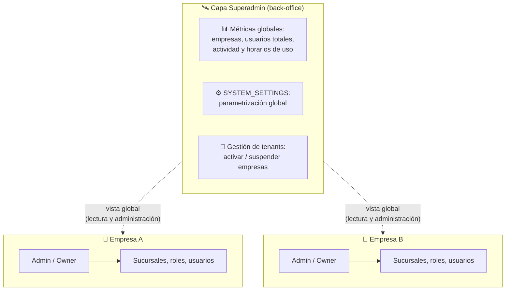

Capacidades del superadmin (lista inicial, ampliable por sistema):

- **Métricas y monitoreo:** cantidad de empresas y su estado, usuarios totales y activos, métricas de uso, horarios de mayor actividad, crecimiento.
- **Gestión de tenants:** ver, activar y suspender empresas (ej: por falta de pago).
- **Parametrización del sistema:** todo lo configurable del software se configura acá — valores globales y overrides por empresa o sucursal (ver [§10.2](#102-parametrización-del-sistema-system_settings-globales-y-overrides)).
- El RLS lo trata con **políticas especiales explícitas**: el superadmin ve los datos globales y agregados que su panel necesita. Importante: el acceso superadmin **no es un bypass silencioso**, sino políticas deliberadas y auditables.

### 10.2 Parametrización del sistema (`SYSTEM_SETTINGS`): globales y overrides

Todo valor del sistema que pueda cambiar sin redeploy se guarda como parámetro, editable desde el panel superadmin: comisiones (ej: `mercadopago.commission`), días de expiración de invitaciones (`invitations.expiration_days`), límites, textos legales, banderas de funcionalidades, etc.

**Catálogo con metadatos, no solo clave-valor.** Cada parámetro tiene una ficha que declara: el tipo de dato y su rango válido (nadie puede guardar "banana" donde iba un número), el valor por defecto, **hasta qué nivel admite override**, **quién puede editarlo** y si sus cambios exigen **doble aprobación**. Por defecto todo se edita solo desde el panel superadmin; si la ficha lo habilita, un admin de empresa podría editar el override de su propia empresa desde la app (nunca el valor global). No es solo la lista de precios: es la lista de precios más las reglas de quién puede hacer descuentos y sobre qué productos — la comisión es negociable por cliente; los parámetros de seguridad (ej: los intentos máximos de OTP, [§8.2](#82-rate-limiting-y-anti-automatización)) se marcan como solo-globales y no los pisa nadie.

**Cascada global → empresa → sucursal.** Un parámetro tiene su valor general y, donde se haya negociado o configurado, un valor específico: **gana siempre el más específico**. La lectura pasa por una única función (`fn_get_setting` en la v2): ningún código consulta las tablas de settings directamente — como preguntar en recepción en vez de revolver el archivo; si mañana la cascada cambia, se ajusta un solo lugar.

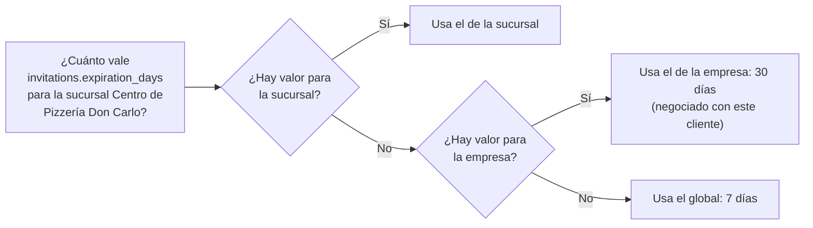

Por qué este diseño escala bien:

- **Parámetro nuevo** = una fila más en el catálogo — sin cambiar tablas, sin redeploy.
- **Empresa nueva** = cero configuración: hereda todos los valores globales automáticamente.
- **Los overrides son escasos por naturaleza:** 1.000 empresas × 50 parámetros no genera 50.000 filas — solo existen las excepciones realmente negociadas.
- **Todo cambio queda auditado, con motivo obligatorio:** el log registra quién, cuándo, valor anterior, valor nuevo y un **comentario obligatorio** explicando el porqué (decisiones [17](#131-decisiones-confirmadas) y [22](#131-decisiones-confirmadas)). *"Comisión: 6,4% → 6,8%"* es un dato; con *"MP actualizó su tarifa, comunicado del 12/Jul"* es una explicación que alguien va a agradecer años después.
- **Doble aprobación para parámetros críticos (opcional):** la ficha puede exigir que el cambio quede pendiente hasta que un **segundo superadmin** lo confirme — pensado para los parámetros que mueven dinero, como las comisiones. La bandera viene apagada por defecto, porque muchos proyectos operan con un solo superadmin (decisión [22](#131-decisiones-confirmadas)).

> 💡 **Ejemplo práctico — comisiones de Mercado Pago**
> El sistema de la pizzería cobra las ventas online con Mercado Pago. MP cambia su comisión del 6,4% al 6,8%. Sin este modelo, habría que tocar código y redeployar. Con `SYSTEM_SETTINGS`, el superadmin entra al back-office, edita `mercadopago.commission` y el cambio aplica al instante en todos los cálculos. Queda registrado quién lo cambió y cuándo.

> 💡 **Ejemplo práctico — métricas de uso**
> Eurekant quiere saber si conviene programar los mantenimientos a la madrugada. El panel superadmin muestra que el 80% de la actividad ocurre entre 9 y 21 hs, y que los domingos el uso cae al 5%. Decisión tomada con datos, sin tocar la base a mano.

**Keys conocidas del estándar.** Más allá de los parámetros propios de cada sistema, el estándar reserva un conjunto de keys que toda app Eurekant lee para operar sin redeploy:

| Key | Para qué |
|---|---|
| `app.min_supported_version.{android,ios,web}` | Versión mínima soportada por plataforma: por debajo, **update forzado** (pantalla bloqueante). |
| `app.latest_version.{android,ios,web}` | Última versión disponible: si la del usuario es menor pero ≥ la mínima, **aviso suave** de actualización. |
| `app.store_url.android` · `app.store_url.ios` · `app.web_url` | Enlaces a Play Store, App Store y web. |
| `support.whatsapp` · `support.email` | Canales de soporte. |
| `legal.terms_url` · `legal.privacy_url` · `legal.data_deletion_url` | Términos y condiciones, política de privacidad y solicitud de eliminación de datos. |
| `system.maintenance_mode` | Interruptor de mantenimiento: deja la app en solo-lectura o bloqueada, con un mensaje. Distinto del comunicado, que solo informa. |

Son globales por defecto, pero la misma cascada permite override por empresa (ej: cada negocio con su propio WhatsApp de soporte). Los **avisos con contenido y vigencia** —«mantenimiento de 2 a 4 AM», «estamos revisando un problema»— no son una key sino una entidad propia, los **comunicados** (`ANNOUNCEMENTS`, [§6](#6-modelo-de-entidades-conceptual)): tienen título, cuerpo, tipo, ventana y destinatarios.

---

## 11. Reglas de negocio e integridad (resumen normativo)

Estas reglas son **obligatorias** en todos los proyectos. Usan el prefijo **BR** (*Business Rule*), la misma convención que los SRS de Eurekant. En la v2, cada una se implementará con constraints, triggers o funciones.

| # | Regla |
|---|---|
| [BR-01](#11-reglas-de-negocio-e-integridad-resumen-normativo) | Toda empresa tiene al menos una sucursal, siempre (la crea el *initial setup*). |
| [BR-02](#11-reglas-de-negocio-e-integridad-resumen-normativo) | El rol `admin` existe en toda empresa, tiene todos los permisos del catálogo (evaluación dinámica) y no puede modificarse ni eliminarse. |
| [BR-03](#11-reglas-de-negocio-e-integridad-resumen-normativo) | **Regla Owner-admin:** toda empresa tiene exactamente un Owner, que siempre tiene el rol admin. Nadie —ni él mismo— puede quitarle el rol ni desactivarlo; la única salida es transferir primero la propiedad ([BR-17](#11-reglas-de-negocio-e-integridad-resumen-normativo), [§7.8](#78-transferencia-de-ownership)), tras lo cual conserva el rol admin como un admin común. Como consecuencia, una empresa nunca queda sin administrador; los demás admins sí pueden renunciar o ser removidos. |
| [BR-04](#11-reglas-de-negocio-e-integridad-resumen-normativo) | En `USER_ROLES`, la sucursal y el rol deben pertenecer a la **misma empresa**. |
| [BR-05](#11-reglas-de-negocio-e-integridad-resumen-normativo) | La combinación `usuario + rol + sucursal` es única (no se duplica una asignación). |
| [BR-06](#11-reglas-de-negocio-e-integridad-resumen-normativo) | No se puede eliminar un rol con asignaciones activas; primero se reasignan los usuarios. Toda eliminación es soft delete. |
| [BR-07](#11-reglas-de-negocio-e-integridad-resumen-normativo) | Una invitación pendiente es única por `email + empresa`; expira (parametrizable, default 7 días); es revocable por el invitador y **rechazable por la persona invitada** (siempre media una pantalla de confirmación, nunca se acepta automáticamente); y al aceptarse valida que el rol y la sucursal sigan activos. |
| [BR-08](#11-reglas-de-negocio-e-integridad-resumen-normativo) | La baja de un usuario de una empresa es soft delete: pierde acceso de inmediato, el historial queda intacto y puede reactivarse. |
| [BR-09](#11-reglas-de-negocio-e-integridad-resumen-normativo) | El email de un usuario es único y case-insensitive a nivel global del sistema. |
| [BR-10](#11-reglas-de-negocio-e-integridad-resumen-normativo) | Los nombres de rol y de sucursal son únicos **dentro de su empresa** (case-insensitive). |
| [BR-11](#11-reglas-de-negocio-e-integridad-resumen-normativo) | Toda tabla operativa lleva `company_id` (y `branch_id` si su alcance es por sucursal), con RLS activo e índices sobre esas columnas. Sin excepciones (análisis y justificación en [§9.4](#94-tablas-operativas-y-la-columna-de-tenant-análisis-de-normalización)). |
| [BR-12](#11-reglas-de-negocio-e-integridad-resumen-normativo) | El catálogo `PERMISSIONS` solo lo modifica el equipo de desarrollo (datos semilla); las empresas no lo editan. |
| [BR-13](#11-reglas-de-negocio-e-integridad-resumen-normativo) | El acceso superadmin se define en políticas explícitas y auditables, nunca como bypass genérico. |
| [BR-14](#11-reglas-de-negocio-e-integridad-resumen-normativo) | Los campos de auditoría (`created_by`, `updated_by`) referencian `USER_ROLES`, no `USERS`, para congelar el contexto (quién, con qué rol, en qué sucursal). Aplica a las acciones del staff; en las filas originadas por usuarios finales —que no tienen asignaciones ([BR-18](#11-reglas-de-negocio-e-integridad-resumen-normativo))— la autoría se registra contra su ficha de cliente (`COMPANY_CUSTOMERS`); y las acciones propias del superadmin (ej: parámetros del sistema, comunicados globales) contra `SUPERADMINS`. |
| [BR-15](#11-reglas-de-negocio-e-integridad-resumen-normativo) | Un usuario puede tener varios roles en la misma sucursal, pero los permisos **nunca se combinan**: se opera bajo un único rol a la vez — el contexto activo incluye el rol (ver [§8](#8-contexto-activo-en-qué-empresa-sucursal-y-rol-estoy-parado)). |
| [BR-16](#11-reglas-de-negocio-e-integridad-resumen-normativo) | **Prevención de inconsistencia de tenant:** las relaciones entre tablas operativas usan FKs compuestas que incluyen el tenant; `company_id`/`branch_id` nunca los escribe la aplicación; y toda política RLS de inserción/actualización incluye `WITH CHECK`. En la familia staff, el tenant se completa por defecto desde los claims del contexto activo y el `WITH CHECK` valida contra esos claims; en las escrituras de usuarios finales (identidad propia, [§9.2](#92-quién-accede-las-tres-familias-de-acceso)) el tenant sale de la operación misma —la empresa de la ficha o del perfil del catálogo sobre el que actúan— y el `WITH CHECK` valida que la fila quede atada a una ficha vinculada a su cuenta ([BR-18](#11-reglas-de-negocio-e-integridad-resumen-normativo)). Ver [§9.4](#94-tablas-operativas-y-la-columna-de-tenant-análisis-de-normalización). |
| [BR-17](#11-reglas-de-negocio-e-integridad-resumen-normativo) | **Transferencia de ownership con confirmación:** requiere la aceptación explícita del receptor, que debe ser un usuario activo de la empresa (al aceptar recibe el rol admin si no lo tenía). Solo puede existir una transferencia pendiente por empresa; es revocable mientras esté pendiente y expira (parametrizable, default 7 días; una expirada no se reenvía — se inicia una nueva). El Owner saliente conserva el rol admin. La aceptación es una transacción única ([§7.8](#78-transferencia-de-ownership)). |
| [BR-18](#11-reglas-de-negocio-e-integridad-resumen-normativo) | **El usuario final no es un rol:** no tiene filas en `ROLES`/`USER_ROLES` ni permisos del catálogo; su relación con cada negocio es una ficha de cliente (`COMPANY_CUSTOMERS`, única por `empresa + cuenta` cuando hay cuenta vinculada) y su acceso a datos es de identidad propia. La vinculación de una ficha a una cuenta exige prueba y aceptación del usuario: el email verificado basta como prueba (el vínculo se ofrece en el momento); la coincidencia por documento exige además una prueba fuerte parametrizable y nunca vincula por sí sola ni revela los datos de la ficha — solo el contacto enmascarado necesario para la prueba ([§4.2](#42-usuarios-finales-la-otra-cara-del-sistema), [§7.9](#79-camino-d--registro-del-usuario-final)). |
| [BR-19](#11-reglas-de-negocio-e-integridad-resumen-normativo) | **Contacto provisional cargado por el staff:** el email o teléfono que un operador registra en una ficha de cliente es provisional y no verificado — no vincula la ficha a ninguna cuenta por sí solo. El sistema marca anomalías (contacto del propio operador o repetido en muchas fichas) para revisión; el contacto verificado por el dueño real lo reemplaza; los canjes de valor y la vinculación exigen prueba fuerte ([BR-18](#11-reglas-de-negocio-e-integridad-resumen-normativo), [§7.9](#79-camino-d--registro-del-usuario-final)). |
| [BR-20](#11-reglas-de-negocio-e-integridad-resumen-normativo) | **Cuádruple de auditoría:** toda tabla lleva `created_at`, `updated_at`, `created_by` y `updated_by`. Las fechas las maneja la base (default + trigger); `created_by`/`updated_by` apuntan al actor según [BR-14](#11-reglas-de-negocio-e-integridad-resumen-normativo) (`USER_ROLES`, ficha de cliente o `SUPERADMINS`), o quedan nulos si el autor es el sistema o un autorregistro. |
| [BR-21](#11-reglas-de-negocio-e-integridad-resumen-normativo) | **Baja lógica por timestamp:** el soft delete se expresa con `deactivated_at` (nulo = activo; con fecha = desactivado), no con un booleano. Filtra igual (`deactivated_at IS NULL`) y además registra cuándo; junto con `updated_by`, también quién. Reactivar = volver a nulo. |

---

## 12. Casos borde y puntos de fuga analizados

Análisis de escenarios problemáticos y cómo el modelo los resuelve:

| Escenario | Riesgo | Resolución en el modelo |
|---|---|---|
| Verificar si un email existe al invitar | Enumeración de cuentas: cualquiera podría descubrir qué emails usan el sistema | La verificación ocurre del lado del servidor solo para usuarios con `users.invite`, con límite de intentos. La respuesta pública nunca confirma existencia de cuentas. |
| Invitación aceptada después de que el rol/sucursal fue eliminado | Asignación rota o acceso a algo inexistente | Validación al aceptar ([BR-07](#11-reglas-de-negocio-e-integridad-resumen-normativo)): la invitación se invalida y se notifica para regenerarla. |
| Todos los admins se van de la empresa | Empresa inaccesible para siempre | [BR-03](#11-reglas-de-negocio-e-integridad-resumen-normativo) (regla Owner-admin): el Owner siempre es admin y nadie puede quitarle el rol, así que siempre hay al menos un admin. |
| Eliminar un rol en uso | Usuarios sin acceso de un día para el otro | [BR-06](#11-reglas-de-negocio-e-integridad-resumen-normativo): eliminación bloqueada hasta reasignar. |
| Usuario desvinculado conserva token JWT vigente | Acceso residual acotado (hasta 1 hora, [§8.1](#81-política-de-sesiones-y-renovación-de-tokens)) | Trade-off conocido ([§9.3](#93-cómo-funcionará-conceptual-el-detalle-va-en-la-v2)): tokens de vida corta + verificación en base para acciones críticas. |
| Dos roles distintos del mismo usuario en la misma sucursal | Ambigüedad de permisos | Permitido, **sin combinar permisos**: el usuario opera con un rol a la vez; el contexto activo incluye el rol ([§8](#8-contexto-activo-en-qué-empresa-sucursal-y-rol-estoy-parado), [BR-15](#11-reglas-de-negocio-e-integridad-resumen-normativo)). |
| Sistemas "chicos" que no usan sucursales | Tentación de simplificar el modelo y romper el estándar | Prohibido por principio 1: siempre existen `COMPANIES` y `BRANCHES`, aunque tengan una fila. La UI puede ocultar el concepto. |
| Empresa suspendida (ej: falta de pago) | Usuarios siguen operando | `COMPANIES.deactivated_at` (con fecha) corta el acceso vía RLS a todos sus miembros de inmediato, sin tocar sus asignaciones. |
| Invitador escribe mal los datos del invitado | Datos incorrectos permanentes | La persona invitada revisa y corrige sus datos al registrarse ([§7.6](#76-camino-b--registro-por-invitación-usuario-nuevo)). |
| Sucursal desactivada con usuarios asignados | Asignaciones colgando de algo inactivo | Las asignaciones de esa sucursal quedan inactivas en cascada lógica; si un usuario queda sin ninguna asignación activa, no puede ingresar a esa empresa. |
| Borrado físico de usuarios | Historial y auditoría rotos | [BR-08](#11-reglas-de-negocio-e-integridad-resumen-normativo) y [BR-14](#11-reglas-de-negocio-e-integridad-resumen-normativo): soft delete + auditoría sobre `USER_ROLES`. |
| Mismo nombre de rol en empresas distintas | Colisión de nombres | No hay colisión: la unicidad es por empresa ([BR-10](#11-reglas-de-negocio-e-integridad-resumen-normativo)). |
| Fila operativa que referencia datos de otra empresa (mezcla de tenants por bug) | Inconsistencia de datos y fuga entre tenants | [BR-16](#11-reglas-de-negocio-e-integridad-resumen-normativo): FKs compuestas + tenant desde los claims + `WITH CHECK` hacen el INSERT/UPDATE inconsistente estructuralmente imposible ([§9.4](#94-tablas-operativas-y-la-columna-de-tenant-análisis-de-normalización)). |
| Pantalla de registro usada para descubrir si un email tiene cuenta | Enumeración de cuentas desde el registro | El OTP se envía siempre y la respuesta pública es idéntica en todos los casos; la existencia de cuenta o invitación pendiente solo se revela tras validar el OTP ([§7.3](#73-camino-a--registro-por-cuenta-propia-e-initial-setup)). |
| Persona invitada como usuario nuevo se registra por cuenta propia antes de aceptar | El registro por invitación operaría sobre una cuenta que ya existe | Al abrir la invitación, el sistema detecta la cuenta y convierte el flujo en el camino C: login y aceptación ([§7.7](#77-camino-c--aceptación-o-rechazo-usuario-existente)). |
| Owner inicia una transferencia y el receptor nunca responde | Título de Owner "colgado" en una oferta eterna | La transferencia expira (default 7 días) y es revocable mientras esté pendiente; el título no cambia hasta la aceptación ([§7.8](#78-transferencia-de-ownership), [BR-17](#11-reglas-de-negocio-e-integridad-resumen-normativo)). |
| Bot intenta adivinar códigos OTP o tokens de invitación | Fuerza bruta sobre secretos cortos | Máx. 5 intentos por código (luego se invalida), límites por IP y CAPTCHA ([§8.2](#82-rate-limiting-y-anti-automatización)). |
| Usuario malicioso envía invitaciones en masa | Spam saliente que arruina la reputación del dominio de email | Tope duro diario por emisor (parámetro del sistema, default 50) y revisión a partir de 10 diarias; el emisor siempre tiene email verificado ([§8.2](#82-rate-limiting-y-anti-automatización)). |
| Atacante acumula intentos fallidos sobre el email de su víctima | Bloqueo de la cuenta ajena como ataque (DoS dirigido) | No existe el bloqueo permanente de cuentas: esperas crecientes, CAPTCHA y bloqueos temporales; la recuperación de contraseña sigue disponible ([§8.2](#82-rate-limiting-y-anti-automatización)). |
| Alguien intenta apropiarse de la ficha de cliente de otra persona conociendo su DNI | Apropiación de datos ajenos (historia clínica, puntos) | La coincidencia por documento no vincula ni revela los datos de la ficha: exige prueba fuerte — confirmación del personal o código al contacto ya registrado en la ficha ([§7.9](#79-camino-d--registro-del-usuario-final), [BR-18](#11-reglas-de-negocio-e-integridad-resumen-normativo)). |
| Cliente de mostrador sin cuenta (adulto mayor, menor, sin smartphone) | El negocio no podría operar con personas sin app | La ficha existe sin cuenta (`user_id` vacío): el negocio opera normalmente; la cuenta puede vincularse después ([§4.2](#42-usuarios-finales-la-otra-cara-del-sistema)). |
| La misma persona cargada dos veces por el staff | Fichas de cliente duplicadas con los datos repartidos | Fusión de fichas como herramienta del negocio — detalle a definir en la v2 ([§7.9](#79-camino-d--registro-del-usuario-final)). |
| Un negocio quiere saber qué consume su cliente en otros negocios | Fuga de privacidad entre tenants | Cada negocio ve solo sus propias fichas y datos; los vínculos del usuario con otros negocios son invisibles para terceros ([§4.2](#42-usuarios-finales-la-otra-cara-del-sistema)). |
| El staff carga su propio contacto (o uno repetido) en las fichas de clientes | Robo de puntos / apropiación de fichas ajenas | Contacto provisional + alerta de anomalía + el contacto verificado del dueño lo reemplaza + prueba fuerte para canjes ([BR-19](#11-reglas-de-negocio-e-integridad-resumen-normativo), [§7.9](#79-camino-d--registro-del-usuario-final)). |

---

## 13. Decisiones de diseño y preguntas abiertas

### 13.1 Decisiones confirmadas

Todas las decisiones fueron validadas con Franco Cruz en la fecha indicada.

| # | Decisión | Detalle | Validada | Ver |
|---|---|---|---|---|
| 1 | **Permisos granulares** | Catálogo de permisos por sistema; los roles agrupan permisos. | 09/Jun/26 | [§5.1](#51-cómo-se-compone-el-acceso) |
| 2 | **Contexto activo seleccionable** | Una cuenta global, selector de asignaciones (empresa/sucursal/rol), cambio sin re-login. | 09/Jun/26 | [§8](#8-contexto-activo-en-qué-empresa-sucursal-y-rol-estoy-parado) |
| 3 | **Eliminación de roles bloqueada** | No se elimina un rol con usuarios asignados; todo soft delete. | 09/Jun/26 | [§5.3](#53-ciclo-de-vida-de-los-roles), [BR-06](#11-reglas-de-negocio-e-integridad-resumen-normativo) |
| 4 | **Superadmin como modelo separado** | Tabla y panel propios, fuera del modelo de empresas. | 09/Jun/26 | [§10](#10-superadmin-la-capa-del-dueño-del-software) |
| 5 | **Multi-admin con Owner** | Varios admins posibles; el creador queda marcado como Owner único. | 09/Jun/26 | [§5.2](#52-roles-por-defecto-admin-y-el-concepto-de-owner), [BR-03](#11-reglas-de-negocio-e-integridad-resumen-normativo) |
| 6 | **Asignación solo por sucursal** | La UI puede ofrecer "aplicar a todas", pero internamente son N asignaciones. | 09/Jun/26 | [§5.1](#51-cómo-se-compone-el-acceso) |
| 7 | **Invitaciones que expiran y son revocables** | Expiran a los 7 días (parametrizable), con estados auditables. | 09/Jun/26 | [§7.5](#75-ciclo-de-vida-de-una-invitación), [BR-07](#11-reglas-de-negocio-e-integridad-resumen-normativo) |
| 8 | **Baja de usuarios por desactivación** | Soft delete con historial intacto. | 09/Jun/26 | [BR-08](#11-reglas-de-negocio-e-integridad-resumen-normativo) |
| 9 | **Multi-rol sin combinación de permisos** | Un usuario puede tener varios roles en la misma sucursal, pero cada rol mantiene sus propios permisos; se opera con un rol a la vez vía contexto activo. | 10/Jun/26 | [§8](#8-contexto-activo-en-qué-empresa-sucursal-y-rol-estoy-parado), [BR-15](#11-reglas-de-negocio-e-integridad-resumen-normativo) |
| 10 | **Columna de tenant en toda tabla operativa** | Ratifica [BR-11](#11-reglas-de-negocio-e-integridad-resumen-normativo): desnormalización deliberada a favor de RLS directo, estándar uniforme y defensa en profundidad; consistencia garantizada declarativamente con FKs compuestas, tenant desde los claims y `WITH CHECK`. | 10/Jun/26 | [§9.4](#94-tablas-operativas-y-la-columna-de-tenant-análisis-de-normalización), [BR-11](#11-reglas-de-negocio-e-integridad-resumen-normativo), [BR-16](#11-reglas-de-negocio-e-integridad-resumen-normativo) |
| 11 | **Invitaciones rechazables, con confirmación previa** | El click del email lleva siempre a una pantalla con el detalle de la invitación; la persona decide aceptar o rechazar (estado terminal Rechazada, notifica al invitador). Aplica a los caminos B y C. | 10/Jun/26 | [§7.5](#75-ciclo-de-vida-de-una-invitación) |
| 12 | **Empresas solo desde la pantalla de registro** | También para usuarios existentes (inician sesión dentro del flujo y el *initial setup* omite la creación del usuario); nunca desde adentro de la app, donde la persona opera en el contexto de una empresa que puede no ser suya. | 10/Jun/26 | [§7.3](#73-camino-a--registro-por-cuenta-propia-e-initial-setup) |
| 13 | **Anti-enumeración estricta con UI transparente** | Respuesta pública idéntica y resolución post-OTP; la pantalla inicial anticipa solo que el email se va a verificar (sin enumerar casos especiales) y, tras validar el OTP, cada caso detectado tiene su pantalla específica (si ya hay cuenta, se ofrece iniciar sesión). Se descartó el aviso inmediato estilo "ya tenés cuenta" (Google/GitHub), que exige mitigaciones adicionales y revela información en rubros sensibles. | 10/Jun/26 | [§7.3](#73-camino-a--registro-por-cuenta-propia-e-initial-setup) |
| 14 | **Política de sesiones estándar** | JWT de 1 hora renovado automáticamente por el SDK; sesión larga por refresh tokens rotativos con *reuse detection*; tope de sesión opcional por proyecto vía configuración de Supabase — **nunca estirando el JWT**. La librería de tokens de FlutterFlow queda retirada para Flutter nativo. | 10/Jun/26 | [§8.1](#81-política-de-sesiones-y-renovación-de-tokens) |
| 15 | **Transferencia de ownership con confirmación del receptor** | El receptor —usuario activo de la empresa— acepta o rechaza desde una pantalla de confirmación; una sola transferencia pendiente por empresa; el Owner saliente conserva el rol admin como admin común. | 10/Jun/26 | [§7.8](#78-transferencia-de-ownership), [BR-17](#11-reglas-de-negocio-e-integridad-resumen-normativo) |
| 16 | **Parámetros del sistema con catálogo y cascada de overrides** | Cada parámetro declara en su ficha el tipo de dato, el default, hasta qué nivel admite override y quién lo edita; cascada global → empresa → sucursal donde gana el valor más específico, resuelta por una función única de lectura. Los tres niveles se implementan en la v2. | 10/Jun/26 | [§10.2](#102-parametrización-del-sistema-system_settings-globales-y-overrides) |
| 17 | **Auditoría formal como entidad estándar de la v2** | Tabla de log inmutable (solo se agregan renglones, nunca se editan ni borran) de eventos sensibles: cambios de roles y permisos, invitaciones, transferencias de ownership, cambios de parámetros y overrides, acciones de superadmin. | 10/Jun/26 | [§10.2](#102-parametrización-del-sistema-system_settings-globales-y-overrides), [§15](#15-próximos-pasos) |
| 18 | **Invitaciones masivas fuera del estándar de datos** | Invitar por lote es funcionalidad de producto (N invitaciones individuales, una fila cada una); no requiere ni recibe estructura especial en el modelo. | 10/Jun/26 | [§7.4](#74-caminos-b-y-c--invitación-creación-y-envío) |
| 19 | **Estándar de rate limiting y anti-automatización** | Límites nativos de Supabase con SMTP propio obligatorio en producción, CAPTCHA con Cloudflare Turnstile, topes de aplicación para verificación de OTP y envío de invitaciones, y prohibición del bloqueo permanente de cuentas. | 10/Jun/26 | [§8.2](#82-rate-limiting-y-anti-automatización) |
| 20 | **Tope de sesión server-side → plan Pro** | Los proyectos que necesiten *inactivity timeout* o sesiones con vencimiento fijo deben operar con plan Pro de Supabase como mínimo en producción; en Free la sesión no tiene tope server-side (aceptable si el proyecto no lo exige). El rate limiting y el CAPTCHA no dependen del plan. | 10/Jun/26 | [§8.1](#81-política-de-sesiones-y-renovación-de-tokens) |
| 21 | **Un estándar, dos documentos** | Este conceptual, para todas las audiencias, y un documento técnico (v2) solo para desarrollo, que cita las reglas de acá —nunca las re-explica—, mapea cada BR y decisión a los objetos que la implementan y declara qué versión conceptual implementa. | 10/Jun/26 | [§1.1](#11-un-estándar-dos-documentos) |
| 22 | **Cambios de parámetros con motivo obligatorio; doble aprobación opcional** | Todo cambio de un parámetro u override registra quién, cuándo, valor anterior, valor nuevo y un comentario obligatorio con el motivo. Los parámetros críticos pueden exigir la confirmación de un segundo superadmin (bandera de la ficha, apagada por defecto). | 11/Jun/26 | [§10.2](#102-parametrización-del-sistema-system_settings-globales-y-overrides) |
| 23 | **Nomenclatura BR para las reglas de negocio** | Prefijo BR (*Business Rule*), la misma convención de los SRS de Eurekant; renombradas desde RN-XX sin cambio de numeración ni contenido (el historial conserva las menciones históricas). | 11/Jun/26 | [§11](#11-reglas-de-negocio-e-integridad-resumen-normativo) |
| 24 | **Agnóstico del cliente, fijo en Supabase** | El estándar define la capa de datos y los flujos sobre Supabase/Postgres; cualquier lenguaje o framework de cliente consume el mismo modelo vía los SDKs oficiales de Supabase. Las menciones a Flutter son ilustrativas (plataforma principal actual). | 12/Jun/26 | [§1](#1-propósito-y-alcance) |
| 25 | **Invitaciones: estado en la tabla, eventos en el log** | `INVITATIONS` conserva su nombre y una fila por invitación (cualquier estado, para siempre); el paso a paso —reenvíos y transiciones, con quién y cuándo— se registra en el log de auditoría. Sin tabla de historial propia ni mecanismo de fila-por-oferta (eso queda para las transferencias, [§7.8](#78-transferencia-de-ownership) y [BR-17](#11-reglas-de-negocio-e-integridad-resumen-normativo)). | 12/Jun/26 | [§6.1](#61-notas-por-entidad), [§7.5](#75-ciclo-de-vida-de-una-invitación) |
| 26 | **Usuarios finales: cuenta libre + ficha por negocio** | La cuenta global nace sin vínculos (camino D); el catálogo público permite explorar sin relación previa; `COMPANY_CUSTOMERS` es la ficha estándar del cliente en cada negocio, con o sin cuenta vinculada; la vinculación se ofrece con el email verificado como prueba suficiente, o queda pendiente de prueba fuerte parametrizable si la coincidencia es por documento. El usuario final no es un rol, y la autoría de sus filas se registra contra su ficha, no contra `USER_ROLES` ([BR-14](#11-reglas-de-negocio-e-integridad-resumen-normativo)). | 12/Jun/26 | [§4.2](#42-usuarios-finales-la-otra-cara-del-sistema), [§7.9](#79-camino-d--registro-del-usuario-final), [BR-18](#11-reglas-de-negocio-e-integridad-resumen-normativo) |
| 27 | **Contacto provisional y antifraude del staff** | El contacto (email/teléfono) que el staff carga en una ficha es provisional: no vincula por sí solo, el sistema marca anomalías para revisión (contacto del propio empleado o repetido en muchas fichas), el contacto verificado del dueño lo reemplaza, y los canjes de valor exigen prueba fuerte. Cierra el hueco del empleado que carga su propio contacto para quedarse con los beneficios del cliente. | 13/Jun/26 | [§7.9](#79-camino-d--registro-del-usuario-final), [BR-19](#11-reglas-de-negocio-e-integridad-resumen-normativo) |
| 28 | **Terminología: «staff» y «ficha de cliente»** | Se mantiene «staff» para los operadores —término estándar de la industria (Shopify *staff accounts*, Django `is_staff`)— con entrada de glosario; se renombra «carpeta de cliente» a «ficha de cliente», el término estándar en el SaaS hispano, transversal a salud y gastronomía. | 13/Jun/26 | [§3](#3-glosario), [§4.2](#42-usuarios-finales-la-otra-cara-del-sistema) |
| 29 | **Principio rector: ante la duda, preguntar — no asumir** | Si algo del estándar no queda claro o parece incompleto, no se asume comportamiento ni se decide a las apuradas: se consulta antes de avanzar. Una mala suposición en la capa de datos es el retrabajo más caro (analogía del ascensor). Queda escrito al inicio del documento. | 13/Jun/26 | [§1](#1-propósito-y-alcance) |
| 30 | **Checklist de implementación (Anexo A)** | Anexo con la lista de verificación de todo lo que hay que crear y configurar para levantar el estándar, enlazado por ítem a su sección. Captura lo fácil de olvidar (ej: SMTP de producción). | 13/Jun/26 | [Anexo A](#anexo-a--checklist-de-implementación), [§15](#15-próximos-pasos) |
| 31 | **Cuádruple de auditoría en toda tabla** | `created_at`, `updated_at`, `created_by`, `updated_by` (no `edited_by`). Fechas por la base; el actor según [BR-14](#11-reglas-de-negocio-e-integridad-resumen-normativo). | 13/Jun/26 | [§6](#6-modelo-de-entidades-conceptual), [BR-20](#11-reglas-de-negocio-e-integridad-resumen-normativo) |
| 32 | **Baja lógica por `deactivated_at`** | Reemplaza el booleano `is_active` por un timestamp anulable: misma filtración, pero registra cuándo se dio de baja (y con `updated_by`, quién). | 13/Jun/26 | [§6](#6-modelo-de-entidades-conceptual), [BR-21](#11-reglas-de-negocio-e-integridad-resumen-normativo) |
| 33 | **`SYSTEM_SETTINGS`: keys conocidas, version-gating y comunicados** | Keys estándar (versión por plataforma con forzado/suave, tiendas/web, soporte, legales, `maintenance_mode`) y entidad `ANNOUNCEMENTS` para avisos con vigencia. | 13/Jun/26 | [§10.2](#102-parametrización-del-sistema-system_settings-globales-y-overrides), [§6](#6-modelo-de-entidades-conceptual) |
| 34 | **Foto con placeholder en personas, empresas y sucursales** | `photo_url` + `photo_blur_hash` (miniatura borrosa instantánea). BlurHash o ThumbHash en la v2. | 13/Jun/26 | [§6](#6-modelo-de-entidades-conceptual) |

### 13.2 Preguntas abiertas (a definir antes de la v2)

Sin preguntas abiertas al cierre de esta versión: las seis planteadas hasta la v1.5.0 se resolvieron el 10/Jun/26 y quedaron registradas como las decisiones [15](#131-decisiones-confirmadas) a [20](#131-decisiones-confirmadas) ([§13.1](#131-decisiones-confirmadas)).

### 13.3 Temas diferidos a la v2

Temas cuyo **concepto ya está decidido** pero cuyo **detalle fino se difiere a propósito** a la v2 — no bloquean el cierre conceptual (a diferencia de las preguntas abiertas de [§13.2](#132-preguntas-abiertas-a-definir-antes-de-la-v2), que sí lo hacían). Es el registro único de lo que queda por definir en detalle; el alcance completo de implementación de la v2 está en [§15](#15-próximos-pasos).

| # | Tema | Qué queda por definir | Origen |
|---|---|---|---|
| D-01 | **Fusión de fichas de cliente duplicadas** | Herramienta del negocio para unir dos fichas de la misma persona: criterios de detección de duplicados, fusión manual vs. asistida, quién puede ejecutarla y qué pasa con los puntos, el historial y los vínculos al unir. | [§7.9](#79-camino-d--registro-del-usuario-final), [§12](#12-casos-borde-y-puntos-de-fuga-analizados), [BR-19](#11-reglas-de-negocio-e-integridad-resumen-normativo) |
| D-02 | **Umbrales del antifraude de contacto provisional** | El concepto está cerrado (decisión [27](#131-decisiones-confirmadas), [BR-19](#11-reglas-de-negocio-e-integridad-resumen-normativo)); falta fijar los valores: cuántas fichas con el mismo contacto disparan la alerta de anomalía y qué se hace con la ficha marcada (revisión manual, bloqueo del canje, etc.). | [§7.9](#79-camino-d--registro-del-usuario-final), [§8.2](#82-rate-limiting-y-anti-automatización), [BR-19](#11-reglas-de-negocio-e-integridad-resumen-normativo) |
| D-03 | **Catálogo de «prueba fuerte» por rubro** | Qué prueba exige cada tipo de sistema al vincular una ficha por documento (confirmación presencial, código al contacto, etc.) y sus valores por defecto, como ficha parametrizable de [§10.2](#102-parametrización-del-sistema-system_settings-globales-y-overrides). | [§7.9](#79-camino-d--registro-del-usuario-final), [§10.2](#102-parametrización-del-sistema-system_settings-globales-y-overrides), [BR-18](#11-reglas-de-negocio-e-integridad-resumen-normativo) |
| D-04 | **Segmentación y alcance de los comunicados** | Reglas finas de a quién llega cada comunicado (por rol, empresa, sucursal; staff vs. usuarios finales), prioridad y apilado de varios activos a la vez, y si un admin de empresa puede emitir a sus clientes. | [§6](#6-modelo-de-entidades-conceptual), [§10.2](#102-parametrización-del-sistema-system_settings-globales-y-overrides) |

---

## 14. Inspiración y referencias

El modelo sigue los patrones de la industria para SaaS multi-tenant:

- Organización → espacios → roles con permisos granulares y miembros multi-organización: patrón de **Slack, Notion y Google Workspace**.
- RBAC multi-tenant con roles tenant-scoped y catálogo de permisos atómicos expuesto como "bundles": [WorkOS — How to design multi-tenant RBAC for SaaS](https://workos.com/blog/how-to-design-multi-tenant-rbac-saas), [Aserto — Multi-tenant RBAC](https://www.aserto.com/blog/authorization-101-multi-tenant-rbac), [AWS Prescriptive Guidance — Multi-tenant access control](https://docs.aws.amazon.com/prescriptive-guidance/latest/saas-multitenant-api-access-authorization/avp-mt-abac-examples.html).
- Aislamiento por columna de tenant + RLS como última línea de defensa, con claims en JWT e índices sobre las columnas de tenant: [Permit.io — Best practices for multi-tenant authorization](https://www.permit.io/blog/best-practices-for-multi-tenant-authorization), [Clerk — Multi-tenant SaaS architecture](https://clerk.com/blog/how-to-design-multitenant-saas-architecture), [Supabase — Custom claims & RLS](https://github.com/orgs/supabase/discussions/1148).
- Rate limiting y anti-automatización: [Supabase — Auth rate limits](https://supabase.com/docs/guides/auth/rate-limits), [Supabase — CAPTCHA protection](https://supabase.com/docs/guides/auth/auth-captcha), [OWASP — Authentication Cheat Sheet](https://cheatsheetseries.owasp.org/cheatsheets/Authentication_Cheat_Sheet.html), [OWASP — Blocking Brute Force Attacks](https://owasp.org/www-community/controls/Blocking_Brute_Force_Attacks) y [NIST SP 800-63B](https://pages.nist.gov/800-63-4/sp800-63b.html).
- Nomenclatura de base de datos: [Eurekant Naming Convention Guide](https://app.clickup.com/9002039309/v/dc/8c90e0d-10194/8c90e0d-6114).

---

## 15. Próximos pasos

> 📋 Para llevar el estándar a la práctica, el **[Anexo A — Checklist de implementación](#anexo-a--checklist-de-implementación)** resume en una lista de verificación todo lo que hay que crear y configurar.

1. Validar este documento con el equipo (especialmente las decisiones [15](#131-decisiones-confirmadas) a [28](#131-decisiones-confirmadas) de [§13.1](#131-decisiones-confirmadas)).
2. **v2 — documento técnico separado (decisión [21](#131-decisiones-confirmadas), [§1.1](#11-un-estándar-dos-documentos)):** DDL completo en SQL — tablas, constraints, índices, funciones (`fn_initial_setup`, `fn_has_permission`, `fn_get_setting`), triggers de integridad ([BR-03](#11-reglas-de-negocio-e-integridad-resumen-normativo), [BR-04](#11-reglas-de-negocio-e-integridad-resumen-normativo), [BR-17](#11-reglas-de-negocio-e-integridad-resumen-normativo)), FKs compuestas y defaults desde claims con `WITH CHECK` ([BR-16](#11-reglas-de-negocio-e-integridad-resumen-normativo)), políticas RLS de las tres familias (staff, identidad propia y catálogo público, [§9.2](#92-quién-accede-las-tres-familias-de-acceso)), la entidad de auditoría (decisión [17](#131-decisiones-confirmadas)), el catálogo de parámetros con sus overrides (decisión [16](#131-decisiones-confirmadas)), la configuración de rate limiting y CAPTCHA ([§8.2](#82-rate-limiting-y-anti-automatización)), y `COMPANY_CUSTOMERS` con el flujo de vinculación, el antifraude del contacto provisional ([BR-19](#11-reglas-de-negocio-e-integridad-resumen-normativo)) y la fusión de fichas duplicadas (decisiones [26](#131-decisiones-confirmadas) y [27](#131-decisiones-confirmadas), [BR-18](#11-reglas-de-negocio-e-integridad-resumen-normativo) y [BR-19](#11-reglas-de-negocio-e-integridad-resumen-normativo)), todo según la Naming Convention Guide. Incluye la tabla de trazabilidad (cada BR y decisión → los objetos que la implementan) y declara qué versión de este documento implementa. Los temas cuyo detalle de diseño todavía debe definirse —no solo implementarse— están registrados en [§13.3](#133-temas-diferidos-a-la-v2).
3. **v3:** kit reutilizable (migraciones base + seeds del catálogo de permisos) para iniciar cualquier proyecto nuevo de Eurekant con este cimiento ya instalado.

---

## 16. Historial de cambios

| Versión | Fecha | Cambios |
|---|---|---|
| 1.0.0 | 09/Jun/26 | Versión inicial. |
| 1.1.0 | 10/Jun/26 | Aclaración del término RBAC; referencias cruzadas y sinónimos en el glosario; fusión de RN-03 y RN-04 (numeración de la v1.0.0) en la regla Owner-admin, con renumeración de las siguientes; justificación del formato de permisos `modulo.accion` y de la tabla `ROLE_PERMISSIONS`. |
| 1.2.0 | 10/Jun/26 | Índice del documento; unificación de los flujos de registro e invitación en una sola sección ([§7](#7-flujos-de-incorporación-de-usuarios)) con visión global, bloques comunes y un camino por subsección; aclaración del OTP de verificación de email (no es código de referido); orden secuencial del *initial setup* según dependencias; corrección del diagrama de invitaciones (carriles separados por escenario); el contexto activo pasa a incluir el rol — multi-rol en la misma sucursal sin combinación de permisos (nueva RN-15); historial de cambios, aprobaciones y auditorías al final del documento. |
| 1.3.0 | 10/Jun/26 | Resolución de la pregunta abierta sobre tablas operativas: definición formal en el glosario y nueva [§9.3](#93-cómo-funcionará-conceptual-el-detalle-va-en-la-v2) con el análisis de normalización de la columna de tenant (pros/contras de la desnormalización deliberada); nueva RN-16 (FKs compuestas, tenant desde los claims, `WITH CHECK`); caso borde de mezcla de tenants; decisión confirmada 10. |
| 1.4.0 | 10/Jun/26 | Ejemplo de multi-rol reemplazado por uno real (clínica: separación de funciones y auditoría); el camino A aclara que el registrante queda como Owner; resolución del email post-OTP en el registro (cuenta existente → login dentro del flujo, invitación pendiente → ofrece aceptarla, email nuevo → flujo normal) sin exponer enumeración de cuentas; la creación de empresas —también para usuarios existentes— pasa siempre por la pantalla de registro, nunca desde adentro de la app; invitaciones rechazables con pantalla de confirmación previa (nuevo estado Rechazada, RN-07 ampliada); el ciclo de vida de la invitación se adelanta a [§7.5](#75-ciclo-de-vida-de-una-invitación); nuevos casos borde y decisiones [11](#131-decisiones-confirmadas) y [12](#131-decisiones-confirmadas). |
| 1.4.1 | 10/Jun/26 | Aclaraciones conceptuales para lectores no técnicos, sin cambios de modelo ni de reglas: qué significa "respuesta pública idéntica" y qué es la enumeración de cuentas ([§7.3](#73-camino-a--registro-por-cuenta-propia-e-initial-setup) + glosario, con ejemplo del atacante); qué son el JWT y sus claims ([§8](#8-contexto-activo-en-qué-empresa-sucursal-y-rol-estoy-parado) + glosario, con la analogía de la credencial de evento); y explicación completa del trade-off del token en [§9.2](#92-quién-accede-las-tres-familias-de-acceso) (qué se gana, qué se cede, ejemplo del cajero desvinculado). |
| 1.5.0 | 10/Jun/26 | Explicación de cómo funciona la firma del JWT ([§8](#8-contexto-activo-en-qué-empresa-sucursal-y-rol-estoy-parado), analogía del cheque); requisito de UI de transparencia en el registro y justificación del criterio anti-enumeración estricto frente al aviso inmediato de la industria ([§7.3](#73-camino-a--registro-por-cuenta-propia-e-initial-setup), decisión [13](#131-decisiones-confirmadas)); nueva [§8.1](#81-política-de-sesiones-y-renovación-de-tokens) "Política de sesiones y renovación de tokens" tras investigación de mercado: JWT de 1 hora renovado automáticamente por el SDK, sesión larga por refresh tokens rotativos con *reuse detection*, tope opcional por inactividad/time-box (plan Pro), limpieza automática del schema `auth` y retiro de la librería de FlutterFlow (decisión [14](#131-decisiones-confirmadas)); glosario: refresh token; preguntas abiertas nuevas: rate limiting y tope de sesión en plan Free. |
| 1.6.0 | 10/Jun/26 | Resolución de las seis preguntas abiertas de [§13.2](#132-preguntas-abiertas-a-definir-antes-de-la-v2) (decisiones [15](#131-decisiones-confirmadas) a [20](#131-decisiones-confirmadas)): transferencia de ownership con confirmación del receptor (nueva [§7.8](#78-transferencia-de-ownership), RN-17 y entidad `OWNERSHIP_TRANSFERS`); catálogo de parámetros con metadatos y cascada de overrides global → empresa → sucursal ([§10.2](#102-parametrización-del-sistema-system_settings-globales-y-overrides) ampliada con función única de lectura); auditoría formal como entidad estándar de la v2; invitaciones masivas fuera del estándar de datos; nueva [§8.2](#82-rate-limiting-y-anti-automatización) "Rate limiting y anti-automatización" con investigación de mercado (límites nativos de Supabase con unidades explícitas, SMTP propio obligatorio, CAPTCHA Turnstile, topes para invitaciones, sin bloqueo permanente de cuentas); tope de sesión server-side → plan Pro. Separación formal del estándar en dos documentos —conceptual y técnico— con la justificación en la nueva [§1.1](#11-un-estándar-dos-documentos) (decisión [21](#131-decisiones-confirmadas)). Glosario: rate limiting, CAPTCHA, override. Cuatro casos borde nuevos. |
| 1.7.0 | 11/Jun/26 | Renombre de las reglas de negocio RN-XX → BR-XX (decisión [23](#131-decisiones-confirmadas)), alineando el documento con la convención de los SRS de Eurekant — numeración y contenido intactos; el historial conserva las menciones históricas a RN. [§13.1](#131-decisiones-confirmadas) convertida a tabla con fecha de validación y referencias por decisión. Auditoría de cambios de parámetros con comentario obligatorio y doble aprobación opcional por ficha ([§10.2](#102-parametrización-del-sistema-system_settings-globales-y-overrides), decisión [22](#131-decisiones-confirmadas)). Justificación del no-reenvío de transferencias expiradas ([§7.8](#78-transferencia-de-ownership)) y referencia cruzada desde el ciclo de vida de invitaciones ([§7.5](#75-ciclo-de-vida-de-una-invitación)). Glosario: BR. |
| 1.8.0 | 12/Jun/26 | Modelo de **usuarios finales** (decisión [26](#131-decisiones-confirmadas)): nueva [§4.2](#42-usuarios-finales-la-otra-cara-del-sistema) — cuenta global que nace libre, catálogo público para explorar, carpeta de cliente por negocio con o sin cuenta (`COMPANY_CUSTOMERS`, nueva entidad estándar) y vinculación por uso o reclamo con prueba; nueva [BR-18](#11-reglas-de-negocio-e-integridad-resumen-normativo); camino D de registro ([§7.9](#79-camino-d--registro-del-usuario-final)) con coincidencia por documento y prueba fuerte parametrizable; tres familias de política RLS según quién accede ([§9.2](#92-quién-accede-las-tres-familias-de-acceso)); cuatro casos borde nuevos (apropiación por DNI, clientes sin cuenta, carpetas duplicadas, privacidad entre negocios). Alcance aclarado: estándar agnóstico del lado del cliente y fijo en Supabase, con las menciones a Flutter como ejemplo ([§1](#1-propósito-y-alcance), [§8.1](#81-política-de-sesiones-y-renovación-de-tokens), [§8.2](#82-rate-limiting-y-anti-automatización), decisión [24](#131-decisiones-confirmadas)). `INVITATIONS` conserva su nombre y el historial de eventos vive en el log de auditoría ([§6.1](#61-notas-por-entidad), [§7.5](#75-ciclo-de-vida-de-una-invitación), decisión [25](#131-decisiones-confirmadas)). Glosario: usuario final, carpeta de cliente. |
| 1.9.0 | 13/Jun/26 | Terminología y refinamientos del modelo de usuarios finales: glosario de **staff** (se mantiene el término — estándar de Shopify/Django) y renombre **«carpeta de cliente» → «ficha de cliente»** (estándar del SaaS hispano, transversal a salud y gastronomía) en todo el documento, conservando las menciones históricas (decisión [28](#131-decisiones-confirmadas)). Antifraude del **contacto provisional cargado por el staff**: nueva [BR-19](#11-reglas-de-negocio-e-integridad-resumen-normativo), regla y ejemplo en [§7.9](#79-camino-d--registro-del-usuario-final), caso borde y decisión [27](#131-decisiones-confirmadas) (cierra el hueco del empleado que carga su propio contacto para robar beneficios). Las **tres familias de acceso** ascienden a subsección propia [§9.2](#92-quién-accede-las-tres-familias-de-acceso) (con la tabla staff / identidad propia / catálogo público), renumerando [§9.2](#92-quién-accede-las-tres-familias-de-acceso)→[§9.5](#95-qué-ve-cada-capa). Nota de `INVITATIONS` ([§6.1](#61-notas-por-entidad)) unificada con la redacción de [§7.5](#75-ciclo-de-vida-de-una-invitación) («refleja el estado actual»). Redacción del vínculo ficha↔cuenta sin la palabra «reclamo». |
| 1.10.0 | 13/Jun/26 | Glosario ampliado con siete términos núcleo (tenant/multi-tenancy, RLS, RBAC, soft delete, catálogo público, UUID, dato semilla). Nuevo **principio rector «ante la duda, preguntar — no asumir»** al inicio de [§1](#1-propósito-y-alcance) (decisión [29](#131-decisiones-confirmadas)). Formato de fecha unificado a `DD/MMM/YY` en todo el documento. **Referencias cruzadas clickeables**: cada `§`, `BR-NN` y `decisión N` enlaza a su sección — los `§` al anclaje exacto, `BR`/`decisión` a su tabla. Nueva **[§13.3](#133-temas-diferidos-a-la-v2) «Temas diferidos a la v2»** (fusión de fichas, umbrales del antifraude, prueba fuerte por rubro), referenciada desde [§15](#15-próximos-pasos). |
| 1.11.0 | 13/Jun/26 | Modelo más completo y técnico: **cuádruple de auditoría** (`created_at`/`updated_at`/`created_by`/`updated_by`) en toda tabla ([BR-20](#11-reglas-de-negocio-e-integridad-resumen-normativo), decisión [31](#131-decisiones-confirmadas)) y **baja lógica por `deactivated_at`** reemplazando el booleano `is_active` ([BR-21](#11-reglas-de-negocio-e-integridad-resumen-normativo), decisión [32](#131-decisiones-confirmadas)). **Foto con placeholder** `photo_url` + `photo_blur_hash` en personas, empresas y sucursales (decisión [34](#131-decisiones-confirmadas)). `SYSTEM_SETTINGS`: keys conocidas (versión por plataforma con update forzado/suave, tiendas, soporte, legales, `maintenance_mode`) y nueva entidad **comunicados** (`ANNOUNCEMENTS`) para avisos con vigencia (decisión [33](#131-decisiones-confirmadas), [§10.2](#102-parametrización-del-sistema-system_settings-globales-y-overrides)). Nuevo **Anexo A — Checklist de implementación** (decisión [30](#131-decisiones-confirmadas)). [§13.3](#133-temas-diferidos-a-la-v2): diferida la segmentación de comunicados (D-04). |

---

## 17. Aprobaciones y auditorías

### 17.1 Aprobaciones

Una fila por aprobador de la versión en circulación (los borradores superados antes de circular no se registran). El documento pasa de "Borrador" a "Vigente" cuando todas las aprobaciones de la versión están en estado *Aprobado*.

| Versión | Rol | Nombre | Fecha | Estado |
|---|---|---|---|---|
| 1.11.0 | CEO | Franco Cruz | — | Pendiente |
| 1.11.0 | CTO | — | — | Pendiente |
| 1.11.0 | Líder técnico | — | — | Pendiente |

### 17.2 Auditorías y revisiones

Registro de cada revisión del documento, haya derivado o no en un cambio de versión.

| Fecha | Revisor | Alcance | Resultado | Observaciones |
|---|---|---|---|---|
| 09/Jun/26 | Franco Cruz | Documento completo (v1.0.0) | Cambios solicitados | Feedback que originó la v1.1.0. |
| 10/Jun/26 | Franco Cruz | Documento completo (v1.1.0) | Cambios solicitados | 8 puntos de revisión que originaron la v1.2.0. El análisis de tablas operativas/normalización quedó pendiente. |
| 10/Jun/26 | Franco Cruz | Tablas operativas y desnormalización del tenant (v1.2.0) | Decisión adoptada | Se ratifica RN-11 (columna de tenant en toda tabla operativa) con prevención declarativa de inconsistencias (nueva RN-16). Origen de la v1.3.0. |
| 10/Jun/26 | Franco Cruz | Flujos de incorporación y multi-rol (v1.3.0) | Cambios solicitados | 5 puntos de mejora que originaron la v1.4.0: ejemplo de multi-rol, Owner en el camino A, resolución del email en el registro, invitaciones rechazables y reubicación del ciclo de vida. |
| 10/Jun/26 | Franco Cruz | Claridad conceptual (v1.4.0) | Cambios solicitados | Tres conceptos a aclarar para lectores no técnicos: respuesta pública idéntica / enumeración de cuentas, claims del JWT y trade-off del token. Origen de la v1.4.1. |
| 10/Jun/26 | Franco Cruz | Sesiones, tokens y anti-enumeración (v1.4.1) | Decisiones adoptadas | Con investigación de mercado (OWASP, productos líderes, docs y código de Supabase/SDK Flutter): se mantiene la anti-enumeración estricta con UI transparente (decisión [13](#131-decisiones-confirmadas)) y se define la política de sesiones estándar (decisión [14](#131-decisiones-confirmadas)). Rate limiting y tope de sesión en plan Free quedan como preguntas abiertas. Origen de la v1.5.0. |
| 10/Jun/26 | Franco Cruz | Preguntas abiertas de [§13.2](#132-preguntas-abiertas-a-definir-antes-de-la-v2) y estructura del estándar (v1.5.0) | Decisiones adoptadas | Resolución de las seis preguntas abiertas (decisiones [15](#131-decisiones-confirmadas) a [20](#131-decisiones-confirmadas); para rate limiting, con investigación de mercado: OWASP, NIST, docs y código de Supabase) y separación del estándar en dos documentos, conceptual y técnico (decisión [21](#131-decisiones-confirmadas)). Origen de la v1.6.0. |
| 11/Jun/26 | Franco Cruz | Transferencias, auditoría de parámetros y nomenclatura (v1.6.0) | Cambios solicitados | 5 puntos: referencia cruzada [§7.5](#75-ciclo-de-vida-de-una-invitación) ↔ [§7.8](#78-transferencia-de-ownership), justificación del no-reenvío de transferencias expiradas, comentario obligatorio y doble aprobación opcional en cambios de parámetros, prefijo BR como en los SRS, y [§13.1](#131-decisiones-confirmadas) en formato tabla. Origen de la v1.7.0. |
| 12/Jun/26 | Franco Cruz | Alcance, historial de invitaciones y usuarios finales (v1.7.0) | Decisiones adoptadas | Tres temas: estándar agnóstico del lado del cliente (decisión [24](#131-decisiones-confirmadas)); estado vs. eventos en invitaciones — la tabla conserva su nombre y el log lleva el paso a paso (decisión [25](#131-decisiones-confirmadas)); y modelo completo de usuarios finales, refinado en tres idas y vueltas (cuenta libre, catálogo público, carpeta por negocio con o sin cuenta, vinculación con prueba) — decisión [26](#131-decisiones-confirmadas) y [BR-18](#11-reglas-de-negocio-e-integridad-resumen-normativo). Origen de la v1.8.0. |
| 13/Jun/26 | Franco Cruz | Terminología, seguridad de fichas y familias de acceso (v1.8.0) | Decisiones adoptadas | 6 puntos: glosario de «staff» (se mantiene, con investigación del término estándar — Shopify/Django/Zendesk); renombre «carpeta»→«ficha de cliente» (con investigación: estándar hispano transversal a salud y gastronomía) — decisión [28](#131-decisiones-confirmadas); redacción del vínculo sin «reclamo»; unificación de la nota de `INVITATIONS` con [§7.5](#75-ciclo-de-vida-de-una-invitación); antifraude del contacto cargado por el staff ([BR-19](#11-reglas-de-negocio-e-integridad-resumen-normativo), decisión [27](#131-decisiones-confirmadas)); y subsección propia para las tres familias de acceso ([§9.2](#92-quién-accede-las-tres-familias-de-acceso)). Origen de la v1.9.0. |
| 13/Jun/26 | Franco Cruz | Glosario, principio rector, formato de fecha, navegación y temas diferidos (v1.9.0) | Cambios solicitados | 5 puntos que originaron la v1.10.0: «tenant» y otros seis términos al glosario; principio «ante la duda, preguntar — no asumir» al inicio (decisión [29](#131-decisiones-confirmadas)); formato de fecha unificado a DD/MMM/YY; referencias cruzadas clickeables (§ a la sección exacta, BR/decisión a su tabla); y nueva [§13.3](#133-temas-diferidos-a-la-v2) de temas diferidos a la v2. |
| 13/Jun/26 | Franco Cruz | Auditoría, ciclo de vida y parametrización del sistema (v1.10.0) | Cambios solicitados | 4 puntos que originaron la v1.11.0: checklist de implementación (Anexo A, decisión [30](#131-decisiones-confirmadas)); cuádruple de auditoría en toda tabla ([BR-20](#11-reglas-de-negocio-e-integridad-resumen-normativo), decisión [31](#131-decisiones-confirmadas)); `SYSTEM_SETTINGS` con keys conocidas, version-gating y comunicados `ANNOUNCEMENTS` (decisión [33](#131-decisiones-confirmadas)) — con investigación de BlurHash/ThumbHash; y fotos con placeholder + baja lógica por `deactivated_at` (decisiones [32](#131-decisiones-confirmadas) y [34](#131-decisiones-confirmadas)). |

---

## Anexo A — Checklist de implementación

Lista de verificación para levantar el estándar en un proyecto nuevo. No reemplaza al documento — cada ítem enlaza a la sección que lo explica; acá solo se garantiza que **nada quede afuera**. El *cómo exacto* —comandos, DDL, configuración— vive en el documento técnico (v2).

**0 · Infraestructura y Supabase**
- [ ] **SMTP propio en producción** — el SMTP de prueba de Supabase no sirve para producción; sin esto no llegan los OTP ni las invitaciones ([§8.2](#82-rate-limiting-y-anti-automatización)).
- [ ] Plantillas de email (verificación/OTP, invitación) ([§7.2](#72-bloque-común-verificación-de-email-por-otp)).
- [ ] **CAPTCHA Cloudflare Turnstile** con sus keys ([§8.2](#82-rate-limiting-y-anti-automatización)).
- [ ] Límites de **rate limiting** ajustados ([§8.2](#82-rate-limiting-y-anti-automatización)).
- [ ] **Sesiones y tokens**: vida del JWT, rotación de refresh tokens con *reuse detection*, hook que inyecta el contexto activo en los claims ([§8](#8-contexto-activo-en-qué-empresa-sucursal-y-rol-estoy-parado), [§8.1](#81-política-de-sesiones-y-renovación-de-tokens)).
- [ ] **Storage** para imágenes (fotos de perfil y logos) ([§6](#6-modelo-de-entidades-conceptual)).

**1 · Esquema base**
- [ ] Tablas del modelo estándar ([§6](#6-modelo-de-entidades-conceptual)).
- [ ] **Cuádruple de auditoría** (`created_at`, `updated_at`, `created_by`, `updated_by`) y `deactivated_at` en cada tabla ([BR-20](#11-reglas-de-negocio-e-integridad-resumen-normativo), [BR-21](#11-reglas-de-negocio-e-integridad-resumen-normativo)).
- [ ] Políticas **RLS** de las tres familias: staff, identidad propia y catálogo público ([§9.2](#92-quién-accede-las-tres-familias-de-acceso)).
- [ ] **FKs compuestas** + `WITH CHECK` para el tenant ([BR-16](#11-reglas-de-negocio-e-integridad-resumen-normativo)).
- [ ] Triggers de integridad: rol/sucursal de la misma empresa, regla Owner-admin, una transferencia pendiente ([BR-03](#11-reglas-de-negocio-e-integridad-resumen-normativo), [BR-04](#11-reglas-de-negocio-e-integridad-resumen-normativo), [BR-17](#11-reglas-de-negocio-e-integridad-resumen-normativo)).
- [ ] Entidad de **auditoría** (log de eventos) (decisión [17](#131-decisiones-confirmadas)).

**2 · Datos semilla**
- [ ] Catálogo de **permisos** (`modulo.accion`) ([§5.1](#51-cómo-se-compone-el-acceso)).
- [ ] Rol **`admin`** e `initial setup` ([§5.2](#52-roles-por-defecto-admin-y-el-concepto-de-owner), [§7.3](#73-camino-a--registro-por-cuenta-propia-e-initial-setup)).
- [ ] Roles plantilla del rubro, opcional ([§5.2](#52-roles-por-defecto-admin-y-el-concepto-de-owner)).
- [ ] **Keys conocidas** de `SYSTEM_SETTINGS`: versión por plataforma, URLs de tiendas/web, soporte y legales ([§10.2](#102-parametrización-del-sistema-system_settings-globales-y-overrides)).

**3 · Por proyecto (cada sistema)**
- [ ] Catálogo de permisos propio del dominio ([§5.1](#51-cómo-se-compone-el-acceso)).
- [ ] Tablas operativas con `company_id`/`branch_id` + auditoría ([§9.4](#94-tablas-operativas-y-la-columna-de-tenant-análisis-de-normalización), [BR-11](#11-reglas-de-negocio-e-integridad-resumen-normativo)).
- [ ] Comunicados (`ANNOUNCEMENTS`) y `maintenance_mode` si el proyecto los usa ([§6](#6-modelo-de-entidades-conceptual), [§10.2](#102-parametrización-del-sistema-system_settings-globales-y-overrides)).

**4 · Antes de producción**
- [ ] Verificar que **el código no filtra por empresa** — todo el aislamiento por RLS (principio 2).
- [ ] Probar los cuatro caminos de alta: A, B y C (staff) y D (usuario final) ([§7](#7-flujos-de-incorporación-de-usuarios)).
- [ ] Probar el version-gating (forzado/suave) y un comunicado de prueba ([§10.2](#102-parametrización-del-sistema-system_settings-globales-y-overrides)).
