# Estandarización de Roles y Permisos — Eurekant LLC

> **Versión:** 1.3.0 (conceptual — sin SQL)
> **Fecha:** 10/06/2026
> **Estado:** Borrador para validación interna
> **Alcance:** Todos los proyectos de software desarrollados por Eurekant

---

## Índice

1. [Propósito y alcance](#1-propósito-y-alcance)
2. [Principios de diseño](#2-principios-de-diseño)
3. [Glosario](#3-glosario)
4. [Modelo de tenancy: Usuario → Empresa → Sucursal](#4-modelo-de-tenancy-usuario--empresa--sucursal)
   - [4.1 Reglas del modelo de tenancy](#41-reglas-del-modelo-de-tenancy)
5. [Modelo de roles y permisos](#5-modelo-de-roles-y-permisos)
   - [5.1 Cómo se compone el acceso](#51-cómo-se-compone-el-acceso)
   - [5.2 Roles por defecto: `admin` y el concepto de Owner](#52-roles-por-defecto-admin-y-el-concepto-de-owner)
   - [5.3 Ciclo de vida de los roles](#53-ciclo-de-vida-de-los-roles)
6. [Modelo de entidades (conceptual)](#6-modelo-de-entidades-conceptual)
   - [6.1 Notas por entidad](#61-notas-por-entidad)
7. [Flujos de incorporación de usuarios](#7-flujos-de-incorporación-de-usuarios)
   - [7.1 Visión global: los tres caminos de entrada](#71-visión-global-los-tres-caminos-de-entrada)
   - [7.2 Bloque común: verificación de email por OTP](#72-bloque-común-verificación-de-email-por-otp)
   - [7.3 Camino A — Registro por cuenta propia e *initial setup*](#73-camino-a--registro-por-cuenta-propia-e-initial-setup)
   - [7.4 Caminos B y C — Invitación: creación y envío](#74-caminos-b-y-c--invitación-creación-y-envío)
   - [7.5 Camino B — Registro por invitación (usuario nuevo)](#75-camino-b--registro-por-invitación-usuario-nuevo)
   - [7.6 Camino C — Aceptación directa (usuario existente)](#76-camino-c--aceptación-directa-usuario-existente)
   - [7.7 Ciclo de vida de una invitación](#77-ciclo-de-vida-de-una-invitación)
8. [Contexto activo: en qué empresa, sucursal y rol estoy parado](#8-contexto-activo-en-qué-empresa-sucursal-y-rol-estoy-parado)
9. [RLS: aislamiento de datos sin filtros en el código](#9-rls-aislamiento-de-datos-sin-filtros-en-el-código)
   - [9.1 El principio](#91-el-principio)
   - [9.2 Cómo funcionará (conceptual, el detalle va en la v2)](#92-cómo-funcionará-conceptual-el-detalle-va-en-la-v2)
   - [9.3 Tablas operativas y la columna de tenant: análisis de normalización](#93-tablas-operativas-y-la-columna-de-tenant-análisis-de-normalización)
   - [9.4 Qué ve cada capa](#94-qué-ve-cada-capa)
10. [Superadmin: la capa del dueño del software](#10-superadmin-la-capa-del-dueño-del-software)
    - [10.1 Concepto](#101-concepto)
    - [10.2 Parametrización global (`SYSTEM_SETTINGS`)](#102-parametrización-global-system_settings)
11. [Reglas de negocio e integridad (resumen normativo)](#11-reglas-de-negocio-e-integridad-resumen-normativo)
12. [Casos borde y puntos de fuga analizados](#12-casos-borde-y-puntos-de-fuga-analizados)
13. [Decisiones de diseño y preguntas abiertas](#13-decisiones-de-diseño-y-preguntas-abiertas)
    - [13.1 Decisiones confirmadas](#131-decisiones-confirmadas)
    - [13.2 Preguntas abiertas (a definir antes de la v2)](#132-preguntas-abiertas-a-definir-antes-de-la-v2)
14. [Inspiración y referencias](#14-inspiración-y-referencias)
15. [Próximos pasos](#15-próximos-pasos)
16. [Historial de cambios](#16-historial-de-cambios)
17. [Aprobaciones y auditorías](#17-aprobaciones-y-auditorías)
    - [17.1 Aprobaciones](#171-aprobaciones)
    - [17.2 Auditorías y revisiones](#172-auditorías-y-revisiones)

---

## 1. Propósito y alcance

Este documento define el **modelo estándar de multi-tenancy, roles y permisos** que debe implementarse en **todos los proyectos de Eurekant**, sin importar el rubro o la finalidad del software.

El objetivo es que cualquier desarrollador del equipo pueda abrir cualquier proyecto de la empresa y encontrar **la misma estructura, los mismos nombres de tablas y los mismos flujos**, reduciendo la curva de aprendizaje, los errores de seguridad y el costo de mantenimiento.

Esta versión es **puramente conceptual**: define entidades, relaciones, flujos y reglas de negocio. Una vez validada, se generará la versión 2 con el código SQL definitivo (tablas, constraints, funciones, triggers y políticas RLS), siguiendo la [Naming Convention Guide](https://app.clickup.com/9002039309/v/dc/8c90e0d-10194/8c90e0d-6114) de Eurekant.

> 💡 **Ejemplo práctico — ¿por qué estandarizar?**
> Eurekant desarrolla un sistema de turnos para una clínica y un sistema de stock para una distribuidora. Son rubros totalmente distintos, pero ambos necesitan: usuarios, empresas, sucursales, roles, invitaciones y aislamiento de datos. Si ambos usan este estándar, un desarrollador que pasa del proyecto "clínica" al proyecto "distribuidora" ya sabe cómo funciona el 40% del sistema antes de leer una línea de código.

---

## 2. Principios de diseño

1. **Multi-tenant siempre.** Todo sistema soporta múltiples empresas y múltiples sucursales por empresa, **aunque el cliente actual no lo necesite**. Si el software se vende a un solo cliente con una sola sucursal, internamente igual existen `COMPANIES` y `BRANCHES` con un único registro. Esto garantiza escalabilidad sin migraciones traumáticas.
2. **Aislamiento por RLS, no por filtros.** El código de aplicación **nunca** filtra por empresa/sucursal en sus queries. La base de datos (Row Level Security) devuelve únicamente los datos a los que el usuario tiene acceso según su contexto activo.
3. **Roles a nivel empresa, asignaciones a nivel sucursal.** Un rol se define una vez por empresa y se reutiliza en todas sus sucursales. La asignación concreta de un usuario es siempre `usuario + rol + sucursal`.
4. **Permisos granulares.** Un rol no es una etiqueta mágica que el código interpreta: es un **conjunto de permisos** tomados de un catálogo definido por cada sistema. Este es el modelo **RBAC** (*Role-Based Access Control*, control de acceso basado en roles): los permisos nunca se asignan directamente a los usuarios, sino a roles, y los usuarios obtienen sus permisos al recibir roles. En este estándar, los permisos efectivos en cada momento son únicamente los del rol del contexto activo, nunca la suma de todos los roles del usuario (ver §8 y RN-15). Es el modelo clásico que usan Slack, Notion o AWS.
5. **Identidad global única.** Una persona tiene **una sola cuenta** (un email) y con ella puede pertenecer a N empresas y N sucursales con distintos roles.
6. **Nada se borra, se desactiva.** Usuarios, roles y vínculos se desactivan (soft delete) para preservar el historial y la auditoría.
7. **El superadmin vive fuera del modelo de empresas.** Es la capa de los dueños del software, con su propio panel y su propia parametrización global.

> 💡 **Ejemplo práctico — principio 1 (multi-tenant aunque no haga falta)**
> Un cliente pide un sistema interno solo para su ferretería. Se desarrolla igual con el modelo completo: el *initial setup* crea la empresa "Ferretería López" y la sucursal "Principal". Dos años después el cliente abre una segunda sucursal y quiere vender el sistema a un colega. **No hay que tocar la arquitectura**: solo se crea otra sucursal y otra empresa.

---

## 3. Glosario

| Término | Definición |
|---|---|
| **Usuario** | Identidad global de una persona (email único). Existe una sola vez en todo el sistema. |
| **Empresa (Company)** | Tenant principal. Unidad de aislamiento de datos y dueña de los roles. |
| **Sucursal (Branch)** | Subdivisión operativa de una empresa. Toda empresa tiene al menos una. |
| **Rol** | Conjunto de permisos, definido a nivel empresa, reutilizable en todas sus sucursales (ver §5). |
| **Permiso** | Capacidad atómica de hacer algo (ej: `products.create`). Catálogo fijo por sistema (ver §5.1). |
| **Asignación (User Role)** | Vínculo `usuario + rol + sucursal`. Es la unidad central del modelo (ver §5.1). |
| **Owner** | El usuario que creó la empresa. Es admin, pero además es el dueño (único). Diferencias con admin en §5.2. |
| **Admin** | Rol por defecto, inmutable, con todos los permisos de la empresa. Puede haber varios **usuarios** con este rol en la misma empresa (ver §5.2). |
| **Superadmin** | Dueño del software (Eurekant o el cliente que lo comercializa). Vista global del sistema (ver §10). |
| **Contexto activo** | La asignación con la que el usuario está operando en este momento: `empresa + sucursal + rol` (ver §8). Extiende el *tenant context* de la literatura, incorporando además el rol. |
| **OTP** | *One-Time Password* (contraseña de un solo uso): código de 6 dígitos enviado por email para verificar la propiedad de la casilla durante el registro. (ver §7.2). |
| **Initial setup** | Función interna que popula los datos iniciales al crear una empresa (ver §7.3). |
| **Tabla operativa** | Toda tabla que guarda datos del dominio de negocio de cada sistema (productos, ventas, turnos, stock, cajas, etc.). Se contrapone a las tablas del modelo estándar (`USERS`, `COMPANIES`, `ROLES`, …) y a los catálogos globales sin tenant (`PERMISSIONS`, `SYSTEM_SETTINGS`). Siempre lleva columna de tenant (ver §9.3 y RN-11). |

---

## 4. Modelo de tenancy: Usuario → Empresa → Sucursal

La jerarquía base de todo sistema Eurekant:

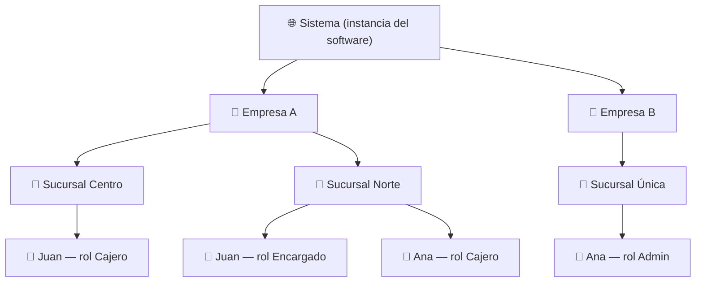

Puntos clave del diagrama:

- **Juan** tiene **dos roles distintos en dos sucursales** de la Empresa A. Esto es válido y esperado.
- **Ana** pertenece a **dos empresas distintas** con la misma cuenta. También es válido.
- Los roles "Cajero" y "Encargado" de la Empresa A **no existen** en la Empresa B; cada empresa define los suyos (excepto `admin`, que existe en todas).

> 💡 **Ejemplo práctico — multi-rol y multi-empresa**
> María es contadora. El estudio contable donde trabaja usa un sistema de Eurekant, y además dos de sus clientes (una pizzería y una farmacia) usan el mismo software. María tiene **una sola cuenta** con su email. Dentro del sistema: en "Estudio Contable Pérez" es *Admin*; en "Pizzería Don Carlo" tiene el rol *Contador externo* en la sucursal Centro; y en "Farmacia Vital" tiene el rol *Auditor* en las 3 sucursales. Cuando entra al sistema, elige en qué empresa, sucursal y rol va a trabajar (ver §8, contexto activo).

### 4.1 Reglas del modelo de tenancy

- Toda empresa nace con **exactamente una sucursal** (creada por el *initial setup*). Aunque el negocio no use el concepto de "sucursal", existe una llamada "Principal" (u otro nombre por defecto definido por el sistema).
- Una sucursal pertenece a **una y solo una** empresa. No hay sucursales compartidas.
- Los datos operativos del sistema (productos, ventas, turnos, etc.) siempre cuelgan de la empresa, y cuando aplica, también de la sucursal.

---

## 5. Modelo de roles y permisos

### 5.1 Cómo se compone el acceso

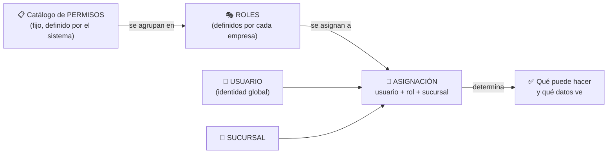

**Catálogo de permisos.** Cada sistema define su catálogo de permisos atómicos con un código estandarizado `modulo.accion`. Por ejemplo: `products.create`, `products.read`, `products.update`, `products.delete`, `users.invite`, `roles.manage`, `reports.view`, `sales.refund`. El catálogo **no es editable por las empresas**: lo define el equipo de desarrollo y se carga como dato semilla. Es la frontera entre lo que el software *puede* hacer y lo que cada rol *permite* hacer.

**Por qué el formato `modulo.accion`.** Es la convención de la industria (los *scopes* de OAuth, los permisos de Google Cloud IAM como `storage.objects.create`) y aporta cuatro ventajas concretas:
1. **Namespacing** — `create` solo no dice nada, `products.create` es inequívoco y evita colisiones entre módulos;
2. **Agrupación automática** — la pantalla de edición de roles agrupa los checkboxes por módulo (todo lo que empieza con `sales.` va junto) sin necesidad de estructura extra;
3. **Legibilidad en código y logs** — un error `permission denied: sales.refund` se entiende al instante;
4. **Consistencia entre proyectos** — las acciones usan siempre el mismo vocabulario (`create`, `read`, `update`, `delete`, más verbos específicos como `refund` o `invite`), así el catálogo de cualquier sistema Eurekant se lee igual.

**Roles.** Un rol pertenece a una empresa y agrupa N permisos del catálogo. El usuario con permiso `roles.manage` (típicamente el admin) puede crear, modificar y eliminar roles de su empresa marcando/desmarcando permisos.

**Asignación.** La unidad central del modelo: `usuario + rol + sucursal`. Reglas:

- Un usuario puede tener **distintos roles en distintas sucursales** de la misma empresa.
- Un usuario también puede tener **más de un rol en la misma sucursal**; en ese caso los permisos **no se combinan**: el usuario opera con un rol a la vez según su contexto activo (ver §8 y RN-15).
- La sucursal de la asignación **debe pertenecer a la misma empresa** que el rol (regla de integridad obligatoria, ver §11).
- Para dar acceso a todas las sucursales, se crea una asignación por sucursal (la UI puede ofrecer un atajo "aplicar a todas las sucursales", pero internamente son N asignaciones).

> 💡 **Ejemplo práctico — armado de un rol**
> La Pizzería Don Carlo crea el rol **"Cajero"** con los permisos: `sales.create`, `sales.read`, `products.read`. Luego crea **"Encargado"** con todo lo del cajero más `sales.refund`, `products.update` y `reports.view`. Cuando contratan a Juan para la sucursal Centro, le asignan *Cajero en Centro*. Seis meses después lo ascienden en la sucursal Norte: se agrega la asignación *Encargado en Norte*, sin tocar la de Centro. Si la pizzería abre una tercera sucursal, los roles "Cajero" y "Encargado" **ya existen** y están listos para usarse: no hay que recrearlos.

### 5.2 Roles por defecto: `admin` y el concepto de Owner

- Al crear una empresa, el *initial setup* crea automáticamente el rol **`admin`**, marcado como rol por defecto (`is_default = true`).
- El rol `admin` **no se puede modificar ni eliminar**: siempre tiene todos los permisos del catálogo, incluidos los permisos nuevos que se agreguen en futuras versiones del software (regla: admin = unión de todo el catálogo, evaluada dinámicamente, no una lista congelada).
- Puede haber **varios usuarios admin** en una empresa: el admin puede asignar el rol admin a otros.
- El usuario que creó la empresa queda marcado como **Owner** (campo en la empresa que apunta a su usuario). El Owner es único, es admin como cualquier otro, pero:
  - No puede ser desactivado ni removido de la empresa por otros admins.
  - Es el único que puede transferir la propiedad (cambiar el Owner a otro usuario admin).
- **Regla Owner-admin:** el Owner siempre tiene el rol admin y nadie —**ni él mismo**— puede quitárselo; la única forma de que deje de ser admin es transferir el ownership a otro admin. Como consecuencia, una empresa **nunca puede quedar sin administrador** (siempre está el Owner como respaldo), y los demás admins sí pueden renunciar a su rol o ser removidos sin restricción.
- Cada sistema puede definir **roles plantilla adicionales** en su *initial setup* (ej: "Vendedor", "Supervisor") que, a diferencia de `admin`, **sí** son editables y eliminables por la empresa. Nacen como sugerencia, no como imposición.

> 💡 **Ejemplo práctico — owner vs admin**
> Carlos crea la cuenta de "Pizzería Don Carlo" → es Owner y admin. Luego le da rol admin a su socio Diego. Diego puede hacer todo lo que hace Carlos (crear roles, invitar gente, ver reportes), pero **no puede** sacarle el acceso a Carlos ni transferir la empresa. Si Carlos vende el negocio, él mismo transfiere el ownership a Diego desde la configuración.

### 5.3 Ciclo de vida de los roles

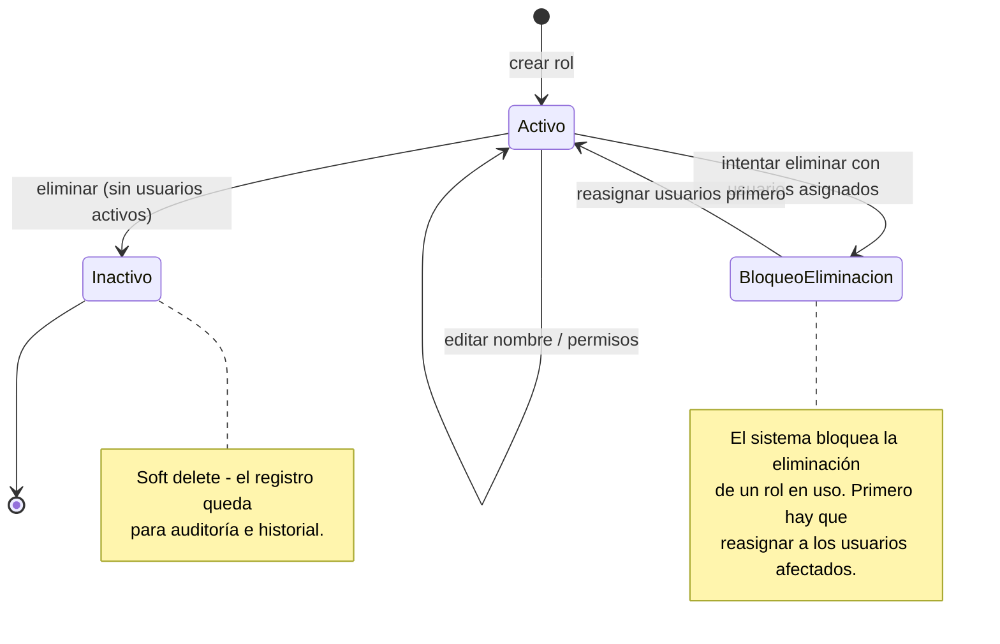

- **No se puede eliminar un rol con usuarios activos asignados.** El sistema informa cuántos usuarios lo usan y exige reasignarlos primero. Esto evita usuarios "huérfanos" sin acceso de un día para el otro.
- La eliminación es siempre **soft delete**: el rol queda inactivo pero su registro persiste (los reportes históricos pueden seguir mostrando "venta cargada por Juan, rol Cajero" aunque el rol ya no exista).
- El rol `admin` nunca entra en este flujo: no es editable ni eliminable.

---

## 6. Modelo de entidades (conceptual)

Entidades nombradas según la [Naming Convention Guide](https://app.clickup.com/9002039309/v/dc/8c90e0d-10194/8c90e0d-6114): tablas en `UPPERCASE`, columnas en `lowercase` con prefijo descriptivo de su tabla, FKs con el mismo nombre que la PK referenciada.

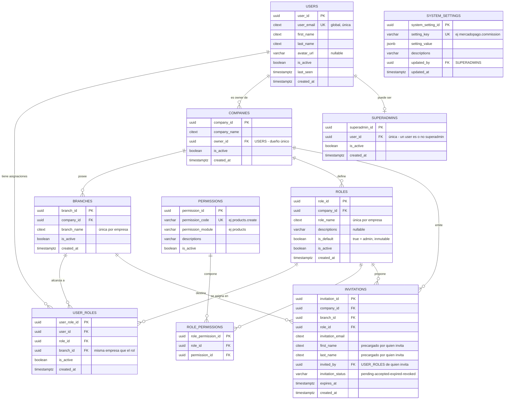

### 6.1 Notas por entidad

**`USERS`** — Identidad global. Una fila por persona, vinculada al sistema de autenticación (en Supabase, referencia a `auth.users`). No contiene información de empresa: la pertenencia se expresa solo a través de `USER_ROLES`. El email es único y case-insensitive (`CITEXT`).

**`COMPANIES`** — El tenant. `owner_id` marca al dueño único (ver §5.2). Todas las tablas operativas de cada sistema (productos, ventas, etc.) llevan `company_id` (RN-11, ver §9.3), porque es la columna sobre la que pivota el RLS.

**`BRANCHES`** — Siempre existe al menos una por empresa. Las tablas operativas que tienen alcance de sucursal (ej: stock, cajas) referencian `branch_id`.

**`ROLES`** — Pertenecen a la empresa, no a la sucursal: se definen una vez y se usan en todas las sucursales. `is_default = true` identifica al rol `admin` (protegido contra edición/eliminación). `role_name` es único dentro de cada empresa (dos empresas distintas pueden tener cada una su rol "Cajero").

**`PERMISSIONS`** — Catálogo global del sistema (sin `company_id`). Se carga como dato semilla en cada deploy/migración. `permission_code` sigue el formato `modulo.accion`.

**`ROLE_PERMISSIONS`** — Tabla puente rol ↔ permiso. Única por combinación (un rol no puede tener el mismo permiso dos veces). El rol `admin` no necesita filas aquí: sus permisos son "todo el catálogo" por definición (evita tener que actualizarlo cuando se agregan permisos nuevos).

> **¿Por qué una tabla puente y no columnas booleanas en `ROLES`?** La relación rol ↔ permiso es muchos-a-muchos: un rol tiene N permisos y un mismo permiso está en N roles. Modelarlo como columnas (`order_c`, `order_u`, `menu_d`, …) implica que agregar un permiso nuevo requiere un `ALTER TABLE` + migración + tocar la UI, que la tabla `ROLES` sea estructuralmente distinta en cada proyecto (se rompe el estándar) y que la verificación de permisos no pueda ser una función genérica reutilizable. Con la tabla puente, agregar un permiso es un INSERT en el catálogo (la UI de roles lo muestra sola), las tablas son **idénticas en todos los proyectos** (solo cambia el contenido del catálogo) y `fn_has_permission('orders.create')` sirve igual en todos los sistemas. El costo de los joins se absorbe materializando los permisos del rol activo en los claims del JWT al armar el contexto activo (§8): se calculan al establecer o cambiar el contexto, no en cada query.

**`USER_ROLES`** — El corazón del modelo. Combinación única de `user_id + role_id + branch_id`. Regla de integridad crítica: **la sucursal y el rol deben pertenecer a la misma empresa** (se validará con trigger/función en la v2). Es también la tabla que otras tablas referencian en campos de auditoría como `created_by` (según la convención de nombres, apuntando a `user_role_id`, lo que registra no solo *quién* sino *con qué rol y en qué sucursal* hizo la acción).

**`INVITATIONS`** — Registro completo del flujo de invitación (ver §7.4). Guarda el rol y la sucursal propuestos, los datos precargados de la persona y el estado del ciclo de vida.

**`SUPERADMINS`** — Lista blanca de usuarios con acceso global (ver §10). Deliberadamente fuera del modelo de roles de empresa.

**`SYSTEM_SETTINGS`** — Parametrización global del software, editable solo desde el panel superadmin (ver §10.2).

> 💡 **Ejemplo práctico — `created_by` apuntando a `USER_ROLES`**
> En el sistema de la pizzería, la tabla `ORDERS` tiene `created_by` → `USER_ROLES.user_role_id`. Cuando se audita una venta sospechosa, no solo se sabe que la hizo Juan: se sabe que la hizo **Juan actuando como Cajero en la sucursal Centro**, aunque hoy Juan ya sea Encargado. El contexto histórico queda congelado.

---

## 7. Flujos de incorporación de usuarios

Toda persona entra al sistema por **uno de tres caminos**: se registra por cuenta propia (y crea su propia empresa), o es invitada a una empresa existente — con o sin cuenta previa. Los tres caminos comparten los mismos bloques (verificación de email, creación de cuenta, creación de asignación), por eso se documentan juntos: primero la visión global y los bloques comunes, después cada camino en detalle.

### 7.1 Visión global: los tres caminos de entrada

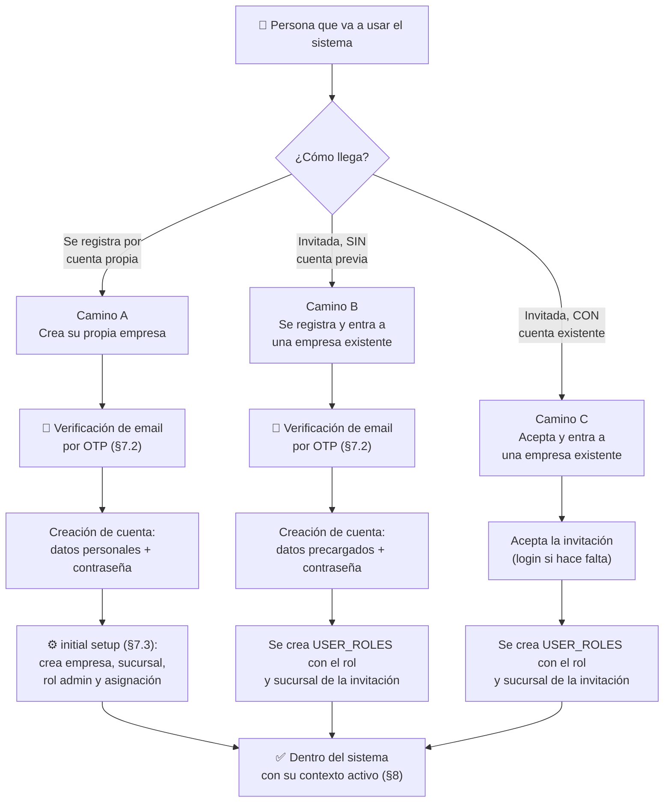

Qué bloques usa cada camino:

| Bloque | Camino A — Registro propio | Camino B — Invitación (sin cuenta) | Camino C — Invitación (con cuenta) |
|---|---|---|---|
| Invitación previa (§7.4) | — | ✔ | ✔ |
| Verificación de email por OTP (§7.2) | ✔ | ✔ | — (ya verificó su email al crear su cuenta) |
| Creación de cuenta (datos + contraseña) | ✔ | ✔ (datos precargados por el invitador) | — |
| *Initial setup* (§7.3) | ✔ | — | — |
| Creación de asignación (`USER_ROLES`) | ✔ (rol `admin`) | ✔ (rol de la invitación) | ✔ (rol de la invitación) |

La clave para entender los tres caminos: **el camino A es el único que crea una empresa**; B y C entran a una existente. Y el camino B es, en esencia, "el camino A sin *initial setup* y con los datos precargados por quien invitó".

### 7.2 Bloque común: verificación de email por OTP

En los caminos A y B, antes de crear la cuenta, el sistema envía un **OTP** (*One-Time Password*, contraseña de un solo uso): un código numérico de **6 dígitos** que llega al email ingresado y que la persona debe tipear en la pantalla de registro.

Para evitar confusiones, conviene ser explícito sobre qué es y qué no es:

- ✅ **Es** una prueba de propiedad de la casilla: tipear el código demuestra que la persona puede leer ese email, y nada más.
- ❌ **No es** un código de referido, de descuento ni de activación comercial.
- ❌ **No es** la contraseña de la cuenta: la contraseña se crea después, en un paso separado del registro.
- ❌ **No es** un segundo factor de autenticación (2FA): no se vuelve a pedir en los logins futuros.

Reglas del bloque:

- El código tiene **vencimiento corto** y puede reenviarse (cada reenvío invalida el anterior).
- Los **intentos son limitados** (protección contra fuerza bruta y contra enumeración de cuentas).
- Es **exactamente el mismo bloque** en los caminos A y B; en el camino B se agrega una validación extra: el email verificado debe **coincidir con el email de la invitación** (ver §7.5).
- El camino C no lo necesita: ese usuario ya verificó su email cuando creó su cuenta.

### 7.3 Camino A — Registro por cuenta propia e *initial setup*

Cuando una persona se registra **por cuenta propia** (sin invitación), se asume que está creando una empresa nueva y será su administrador y owner.

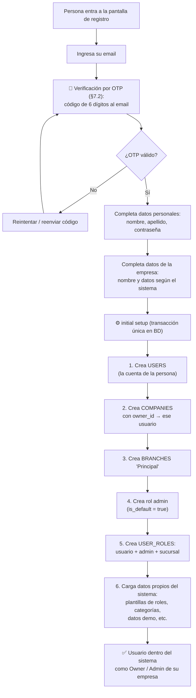

Características del *initial setup*:

- Los pasos se ejecutan **en ese orden** porque cada uno depende del anterior: la empresa necesita al usuario para `owner_id`, la sucursal y el rol necesitan a la empresa, la asignación necesita usuario + rol + sucursal, y los datos propios del sistema (categorías, plantillas, demos) necesitan que la empresa y la sucursal **ya existan**.
- Es una **función única en la base de datos** que se ejecuta como transacción: o se crea todo, o no se crea nada. Nunca puede quedar una empresa sin sucursal, sin rol admin o sin asignación.
- Su **núcleo es estándar** en todos los proyectos (pasos 1–5: usuario, empresa, sucursal, admin, asignación). Su **cola es específica** de cada sistema (paso 6): cada software agrega ahí su carga inicial (categorías de ejemplo, configuración por defecto, datos de demo, roles plantilla).
- La verificación del email por OTP (§7.2) es **obligatoria también en el registro propio**, no solo en el flujo de invitación.

> 💡 **Ejemplo práctico — initial setup específico por sistema**
> En el sistema de turnos para clínicas, el *initial setup* además crea: los roles plantilla "Recepcionista" y "Profesional", una agenda de ejemplo y los horarios de atención por defecto. En el sistema de stock, crea: el rol plantilla "Depósito", una categoría "General" y un producto de ejemplo. El núcleo (empresa, sucursal, admin) es idéntico en ambos.

### 7.4 Caminos B y C — Invitación: creación y envío

Quien tenga el permiso `users.invite` puede invitar personas a una sucursal de su empresa. El sistema distingue los dos escenarios **al inicio**, según el email ingresado, y cada uno sigue su propio carril hasta el final:

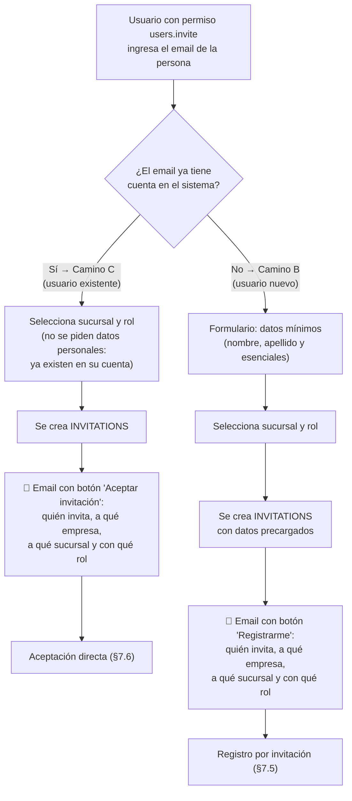

Notas:

- En ambos escenarios el resultado intermedio es el mismo: una fila en `INVITATIONS` con empresa, sucursal, rol, email y quién invita. Lo que cambia es lo que pasa cuando la persona abre el email: registro completo (camino B) o aceptación directa (camino C).
- La **verificación de existencia** del email debe hacerse de forma segura: el sistema responde internamente si existe o no para ajustar el formulario, pero **no debe exponer** a cualquier usuario una API que permita enumerar qué emails tienen cuenta (punto de fuga clásico, ver §12).
- Para el usuario existente **no se piden datos personales** porque ya existen en su cuenta; solo se elige sucursal y rol.

### 7.5 Camino B — Registro por invitación (usuario nuevo)

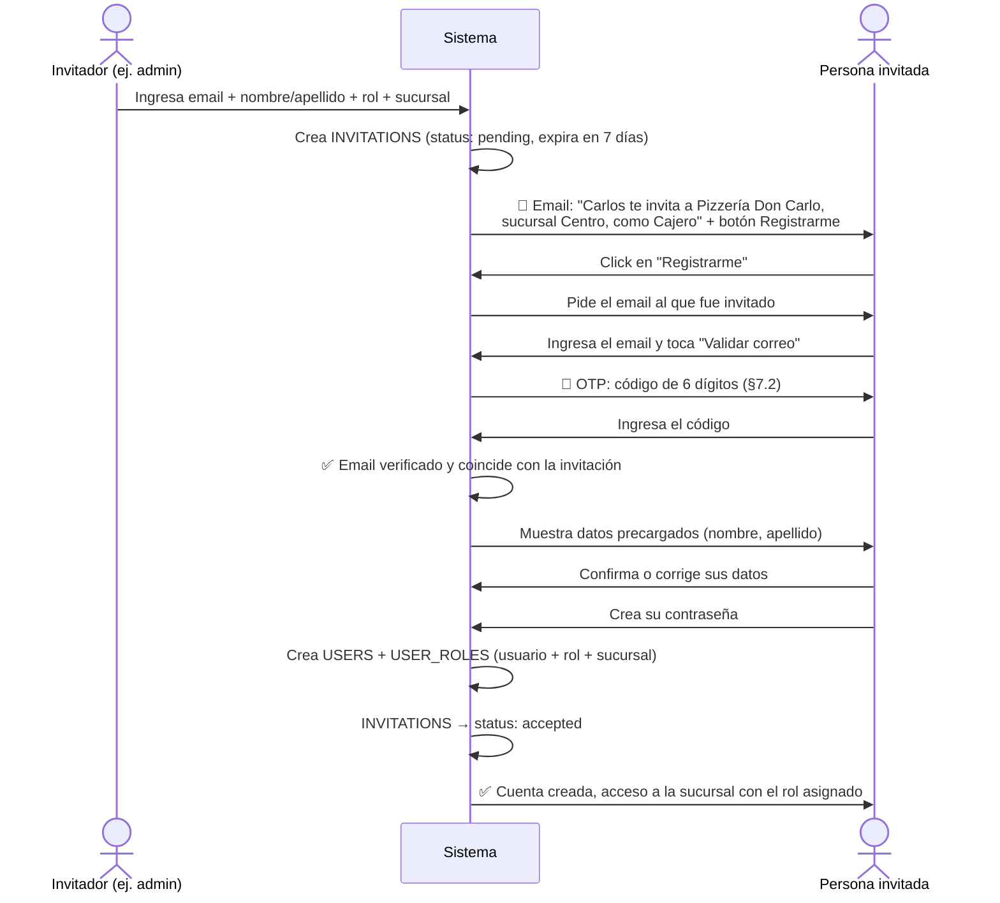

Detalles importantes:

- El registro por invitación es **el mismo flujo** que el registro por cuenta propia (camino A), con tres diferencias: (a) llega por email en vez de iniciarse solo, (b) los datos personales vienen **precargados** por quien invitó y la persona puede corregirlos, y (c) **no se ejecuta el initial setup** ni se piden datos de empresa — la persona entra a una empresa existente, no crea una.
- El email que la persona verifica con el OTP **debe coincidir** con el email de la invitación. Si no coincide, no se vincula la invitación.
- La persona invitada es la dueña final de sus datos: lo que el invitador escribió (nombre, apellido) es solo una sugerencia editable.

### 7.6 Camino C — Aceptación directa (usuario existente)

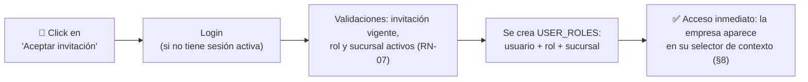

- No hay OTP ni formulario de datos: la persona ya verificó su email al crear su cuenta y sus datos personales ya existen. Solo acepta (con login de por medio si no tenía sesión abierta).
- Antes de crear la asignación, el sistema valida que la invitación siga vigente y que el rol y la sucursal sigan activos (RN-07). Si algo fue desactivado en el medio, la invitación se invalida y se notifica a ambas partes.
- Al aceptar, la nueva empresa/sucursal aparece de inmediato en el selector de contexto del usuario (§8), sin necesidad de cerrar sesión.

### 7.7 Ciclo de vida de una invitación

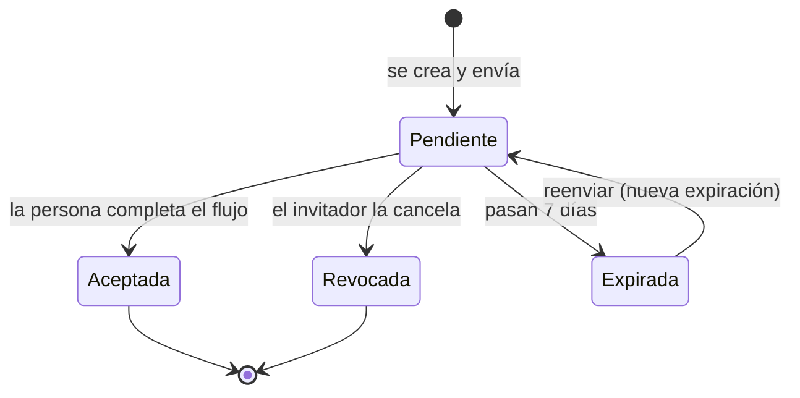

Reglas:

- **Expiración:** 7 días (valor parametrizable desde `SYSTEM_SETTINGS`). Una invitación expirada puede reenviarse, lo que renueva la fecha.
- **Revocación:** quien tenga `users.invite` puede revocar una invitación pendiente (ej: se equivocó de email o la persona ya no se incorpora). Una invitación revocada o aceptada no puede reutilizarse.
- **Unicidad:** solo puede existir **una invitación pendiente por email + empresa**. Si se quiere cambiar el rol o la sucursal antes de que la acepte, se revoca y se crea una nueva.
- **Validaciones al crear:** no se puede invitar a un email que ya tiene asignación activa en esa misma sucursal con ese mismo rol; y el rol y la sucursal de la invitación deben pertenecer a la empresa del invitador.
- **Validaciones al aceptar:** si entre el envío y la aceptación el rol o la sucursal fueron desactivados, la invitación se considera inválida y se informa a la persona (y al invitador) para que se genere una nueva.

> 💡 **Ejemplo práctico — invitación con typo**
> El admin invita a `jaun@gmail.com` en lugar de `juan@gmail.com`. Se da cuenta al día siguiente: revoca la invitación pendiente y crea una nueva con el email correcto. Si el dueño real de `jaun@gmail.com` intentara usar el link viejo, vería "invitación revocada" y no podría acceder a nada.

---

## 8. Contexto activo: en qué empresa, sucursal y rol estoy parado

Como un usuario puede tener N asignaciones, el sistema necesita saber **cuál está usando ahora**. Ese es el **contexto activo**: la asignación con la que el usuario está operando — `empresa + sucursal + rol`.

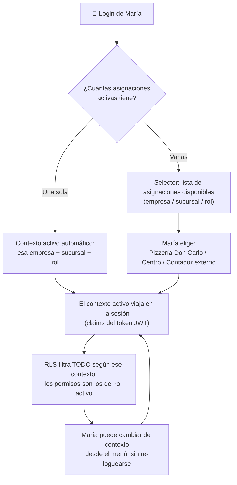

Reglas:

- Si el usuario tiene **una sola** asignación activa, el contexto se establece solo, sin pantalla intermedia (el caso más común: empleados de una sola empresa no deben enterarse de que el sistema es multi-tenant).
- El selector muestra cada asignación como `empresa / sucursal / rol`. Si el usuario tiene **más de un rol en la misma sucursal**, cada uno aparece como una entrada separada: **los permisos no se combinan** — el usuario opera con un rol a la vez y sus permisos efectivos son exactamente los del rol activo (RN-15). Para usar otro de sus roles, cambia de contexto.
- El contexto activo (y los permisos del rol activo) se materializa en los **claims del token de sesión (JWT)**, para que el RLS pueda evaluarlo sin subconsultas costosas. Este es el patrón recomendado por Supabase y la industria.
- Cambiar de contexto refresca el token con los nuevos claims. No requiere cerrar sesión.
- El sistema recuerda el último contexto usado para preseleccionarlo en el próximo login.

> 💡 **Ejemplo práctico — multi-rol sin combinación de permisos**
> En la sucursal Centro, Laura es *Cajera* y también *Responsable de caja fuerte*. Operando como Cajera **no puede** abrir la caja fuerte, aunque "tenga" el otro rol: para eso cambia su contexto al rol Responsable. Esto mantiene la coherencia con la auditoría (RN-14): como `created_by` apunta a la asignación (`USER_ROLES`), cada acción queda registrada sin ambigüedad con el rol exacto con el que se hizo.

---

## 9. RLS: aislamiento de datos sin filtros en el código

### 9.1 El principio

**El código de aplicación nunca filtra por empresa o sucursal.** Cuando el frontend o el backend consulta una tabla, escribe la query "ingenua" (`select * from PRODUCTS`) y la base de datos, mediante Row Level Security, devuelve **solo** las filas que el contexto activo del usuario puede ver.

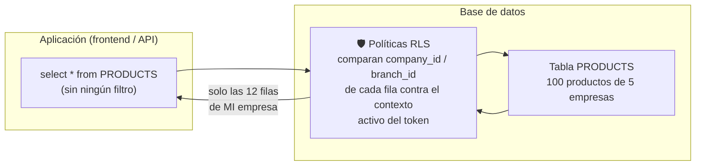

> 💡 **Ejemplo práctico — el caso de los 100 productos**
> En la tabla `PRODUCTS` hay 100 productos de 5 empresas distintas. Juan (Cajero de la Pizzería, sucursal Centro) consulta la tabla **sin ningún filtro** y recibe exactamente los 12 productos de la pizzería. No hay forma de que reciba otros: aunque un desarrollador se olvide de todo, aunque la query venga de un script externo con el token de Juan, el RLS está en la base y es la última línea de defensa. El clásico bug de "me olvidé el `where company_id = ...`" **deja de existir como categoría de bug**.

### 9.2 Cómo funcionará (conceptual, el detalle va en la v2)

- Toda tabla operativa lleva `company_id` (y `branch_id` cuando su alcance es por sucursal). Estas columnas estarán **indexadas** siempre — es el principal factor de performance del RLS. (Qué es una tabla operativa y por qué lleva estas columnas: ver §9.3.)
- Las políticas comparan esas columnas contra el **contexto activo en los claims del JWT** (empresa, sucursal, rol y sus permisos), evitando subconsultas pesadas en cada fila.
- El RLS cubre los cuatro verbos: lectura (qué filas veo), inserción (no puedo insertar filas de otra empresa — cláusula de verificación), actualización y borrado.
- Los **permisos** también se evalúan en la base cuando corresponde: por ejemplo, insertar en `PRODUCTS` exige el permiso `products.create` en el contexto activo, no solo pertenecer a la empresa. Habrá funciones auxiliares estándar (`fn_has_permission`, etc.) reutilizables en todos los proyectos.
- **Alcance empresa vs. sucursal según la tabla:** hay tablas donde todos los miembros de la empresa ven lo mismo (ej: catálogo de productos) y tablas donde solo se ve lo de la propia sucursal (ej: cajas, stock). Cada sistema define el alcance de cada tabla; el estándar provee ambos patrones de política.
- **Trade-off conocido:** como los permisos viajan en el JWT, un cambio de rol/permisos tarda hasta la expiración del token en aplicarse (minutos). Para acciones críticas (desactivar un usuario) se complementa con verificación en base, que es inmediata. Este trade-off es estándar en la industria.

### 9.3 Tablas operativas y la columna de tenant: análisis de normalización

**Qué es una tabla operativa.** Toda tabla que guarda datos del dominio de negocio de cada sistema: productos, ventas, turnos, stock, cajas, pacientes, etc. Es la tercera categoría de tablas del estándar:

| Grupo | Ejemplos | ¿Lleva columna de tenant? |
|---|---|---|
| Tablas del modelo estándar | `USERS`, `COMPANIES`, `BRANCHES`, `ROLES`, `USER_ROLES`, `INVITATIONS` | Según su rol en el modelo (definido en §6) |
| Catálogos globales | `PERMISSIONS`, `SYSTEM_SETTINGS` | No: son datos del sistema, no de las empresas |
| **Tablas operativas** | `PRODUCTS`, `ORDERS`, turnos, stock, cajas… | **Sí, siempre** (RN-11): `company_id`, más `branch_id` si su alcance es por sucursal |

**La decisión de diseño.** RN-11 exige `company_id` en toda tabla operativa **incluso cuando el tenant es derivable transitivamente** a través de sus relaciones (ej: una row de la tabla de ventas podría llegar a la empresa vía `ORDER_ITEMS` → `ORDERS` → `company_id`). Esto es **desnormalización deliberada**, y el análisis que la justifica queda documentado acá.

*A favor de la columna redundante:*

- **RLS directo y rápido.** La política compara una columna de la propia fila contra los claims del JWT. Sin la columna, la política necesita joins o subconsultas **por cada fila evaluada** — el principal asesino de performance del RLS en Postgres — y además cada tabla termina con una política distinta según su distancia a `COMPANIES`.
- **Estándar uniforme.** Misma política, mismo índice y mismo patrón en todas las tablas de todos los proyectos, que es justamente el objetivo de este documento. Las políticas heterogéneas son más difíciles de auditar.
- **Queries y código más simples.** Sin cadenas de 2, 3 o 4 joins solo para saber a qué empresa o sucursal pertenece una fila.
- **Defensa en profundidad.** Cada fila se autodescribe: un bug en un join nunca puede "filtrar" datos de otro tenant.

*En contra:*

- **Espacio:** un UUID son 16 bytes por fila, más su índice. Real pero despreciable frente al costo de las alternativas.
- **Riesgo de inconsistencia:** una fila podría quedar marcada con una empresa mientras sus relaciones apuntan a datos de otra. Es la única contra seria, y se elimina de forma declarativa (ver más abajo, RN-16).

**Por qué la objeción de normalización pesa menos acá.** Las anomalías que la normalización previene son de **actualización**: datos redundantes que divergen cuando uno cambia y el otro no. Pero el `company_id` de una fila operativa es **inmutable** — una venta jamás se muda de empresa. Lo mismo aplica a `branch_id`: en las filas operativas también se trata como inmutable; un traslado entre sucursales (ej: stock) se modela como un movimiento nuevo — baja en una, alta en la otra — y no como un UPDATE de la columna, lo que además preserva el historial (principio 6). Eliminado el riesgo de actualización, lo único que queda es el riesgo de **inserción incorrecta**, que se resuelve con constraints:

**Prevención de inconsistencias (RN-16).** La consistencia del tenant no depende de la disciplina del programador sino de tres capas que la base de datos impone sola:

1. **FKs compuestas.** La tabla padre declara una unicidad que incluye el tenant (ej: `UNIQUE (company_id, order_id)` en `ORDERS`) y la tabla hija referencia con FK compuesta: `FOREIGN KEY (company_id, order_id) REFERENCES ORDERS (company_id, order_id)`. Con esto es **estructuralmente imposible** insertar una fila que mezcle tenants: si el `company_id` de la hija no coincide con el del padre, la FK no matchea y Postgres rechaza la operación.
2. **La columna nunca la escribe la aplicación.** `company_id` (y `branch_id`) se completan con un `DEFAULT` que lee el contexto activo de los claims del JWT. El código de aplicación no pasa el valor, igual que no filtra por él (principio 2).
3. **RLS en escritura (`WITH CHECK`).** Aunque alguien intentara forzar el valor, la política de inserción/actualización rechaza cualquier fila cuyo tenant no coincida con el contexto activo del token.

> 💡 **Ejemplo práctico — el INSERT imposible**
> Un desarrollador comete el error que más preocupa: estando en el contexto de la Empresa A, arma un renglón de venta que referencia un producto de la Empresa B. Capa 1: la FK compuesta `(company_id, product_id)` no encuentra ese producto en la Empresa A → INSERT rechazado. Y aunque esa FK no existiera, la capa 2 hace que el `company_id` salga del token (no del código), y la capa 3 rechaza cualquier fila que no sea del contexto activo. El error pasa de ser "un bug silencioso que mezcla datos de clientes" a ser **un error de constraint visible en desarrollo**.

### 9.4 Qué ve cada capa

| Capa | Responsabilidad sobre el acceso |
|---|---|
| **Frontend** | Solo UX: oculta botones que el rol no puede usar. **Nunca** es seguridad. |
| **API / backend** | Lógica de negocio (validaciones, flujos). No filtra por tenant. |
| **Base de datos (RLS)** | Fuente única de verdad del aislamiento. Filtra y bloquea siempre. |

---

## 10. Superadmin: la capa del dueño del software

### 10.1 Concepto

El **superadmin** no es un rol de empresa: es una capa completamente separada para los dueños del software (Eurekant o el cliente que comercializa el sistema). Vive en su propia tabla (`SUPERADMINS`), tiene su propio panel (back-office) y **no aparece como miembro de ninguna empresa**.

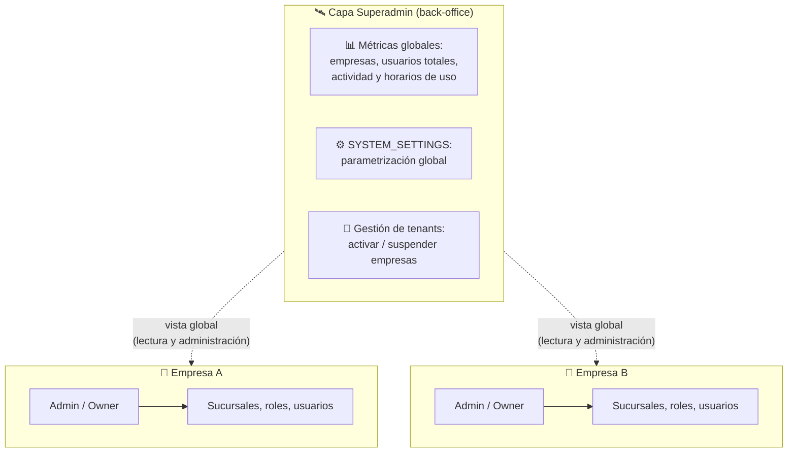

Capacidades del superadmin (lista inicial, ampliable por sistema):

- **Métricas y monitoreo:** cantidad de empresas y su estado, usuarios totales y activos, métricas de uso, horarios de mayor actividad, crecimiento.
- **Gestión de tenants:** ver, activar y suspender empresas (ej: por falta de pago).
- **Parametrización global:** todo lo configurable del software se configura acá (ver §10.2).
- El RLS lo trata con **políticas especiales explícitas**: el superadmin ve los datos globales y agregados que su panel necesita. Importante: el acceso superadmin **no es un bypass silencioso**, sino políticas deliberadas y auditables.

### 10.2 Parametrización global (`SYSTEM_SETTINGS`)

Todo valor del sistema que pueda cambiar sin redeploy se guarda como parámetro clave-valor, editable solo desde el panel superadmin: comisiones (ej: `mercadopago.commission`), días de expiración de invitaciones (`invitations.expiration_days`), límites, textos legales, banderas de funcionalidades, etc.

> 💡 **Ejemplo práctico — comisiones de Mercado Pago**
> El sistema de la pizzería cobra las ventas online con Mercado Pago. MP cambia su comisión del 6,4% al 6,8%. Sin este modelo, habría que tocar código y redeployar. Con `SYSTEM_SETTINGS`, el superadmin entra al back-office, edita `mercadopago.commission` y el cambio aplica al instante en todos los cálculos. Queda registrado quién lo cambió y cuándo.

> 💡 **Ejemplo práctico — métricas de uso**
> Eurekant quiere saber si conviene programar los mantenimientos a la madrugada. El panel superadmin muestra que el 80% de la actividad ocurre entre 9 y 21 hs, y que los domingos el uso cae al 5%. Decisión tomada con datos, sin tocar la base a mano.

---

## 11. Reglas de negocio e integridad (resumen normativo)

Estas reglas son **obligatorias** en todos los proyectos. En la v2, cada una se implementará con constraints, triggers o funciones.

| # | Regla |
|---|---|
| RN-01 | Toda empresa tiene al menos una sucursal, siempre (la crea el *initial setup*). |
| RN-02 | El rol `admin` existe en toda empresa, tiene todos los permisos del catálogo (evaluación dinámica) y no puede modificarse ni eliminarse. |
| RN-03 | **Regla Owner-admin:** toda empresa tiene exactamente un Owner, que siempre tiene el rol admin. Nadie —ni él mismo— puede quitarle el rol ni desactivarlo; la única forma de dejar de ser admin es transferir la propiedad (a otro admin). Como consecuencia, una empresa nunca queda sin administrador; los demás admins sí pueden renunciar o ser removidos. |
| RN-04 | En `USER_ROLES`, la sucursal y el rol deben pertenecer a la **misma empresa**. |
| RN-05 | La combinación `usuario + rol + sucursal` es única (no se duplica una asignación). |
| RN-06 | No se puede eliminar un rol con asignaciones activas; primero se reasignan los usuarios. Toda eliminación es soft delete. |
| RN-07 | Una invitación pendiente es única por `email + empresa`; expira (parametrizable, default 7 días); es revocable; y al aceptarse valida que el rol y la sucursal sigan activos. |
| RN-08 | La baja de un usuario de una empresa es soft delete: pierde acceso de inmediato, el historial queda intacto y puede reactivarse. |
| RN-09 | El email de un usuario es único y case-insensitive a nivel global del sistema. |
| RN-10 | Los nombres de rol y de sucursal son únicos **dentro de su empresa** (case-insensitive). |
| RN-11 | Toda tabla operativa lleva `company_id` (y `branch_id` si su alcance es por sucursal), con RLS activo e índices sobre esas columnas. Sin excepciones (análisis y justificación en §9.3). |
| RN-12 | El catálogo `PERMISSIONS` solo lo modifica el equipo de desarrollo (datos semilla); las empresas no lo editan. |
| RN-13 | El acceso superadmin se define en políticas explícitas y auditables, nunca como bypass genérico. |
| RN-14 | Los campos de auditoría (`created_by`, `updated_by`) referencian `USER_ROLES`, no `USERS`, para congelar el contexto (quién, con qué rol, en qué sucursal). |
| RN-15 | Un usuario puede tener varios roles en la misma sucursal, pero los permisos **nunca se combinan**: se opera bajo un único rol a la vez — el contexto activo incluye el rol (ver §8). |
| RN-16 | **Prevención de inconsistencia de tenant:** las relaciones entre tablas operativas usan FKs compuestas que incluyen el tenant; `company_id`/`branch_id` nunca los escribe la aplicación (se completan por defecto desde los claims del contexto activo); y toda política RLS de inserción/actualización incluye `WITH CHECK` contra el contexto activo (ver §9.3). |

---

## 12. Casos borde y puntos de fuga analizados

Análisis de escenarios problemáticos y cómo el modelo los resuelve:

| Escenario | Riesgo | Resolución en el modelo |
|---|---|---|
| Verificar si un email existe al invitar | Enumeración de cuentas: cualquiera podría descubrir qué emails usan el sistema | La verificación ocurre del lado del servidor solo para usuarios con `users.invite`, con límite de intentos. La respuesta pública nunca confirma existencia de cuentas. |
| Invitación aceptada después de que el rol/sucursal fue eliminado | Asignación rota o acceso a algo inexistente | Validación al aceptar (RN-07): la invitación se invalida y se notifica para regenerarla. |
| Todos los admins se van de la empresa | Empresa inaccesible para siempre | RN-03 (regla Owner-admin): el Owner siempre es admin y nadie puede quitarle el rol, así que siempre hay al menos un admin. |
| Eliminar un rol en uso | Usuarios sin acceso de un día para el otro | RN-06: eliminación bloqueada hasta reasignar. |
| Usuario desvinculado conserva token JWT vigente | Acceso residual por minutos | Trade-off conocido (§9.2): tokens de vida corta + verificación en base para acciones críticas. |
| Dos roles distintos del mismo usuario en la misma sucursal | Ambigüedad de permisos | Permitido, **sin combinar permisos**: el usuario opera con un rol a la vez; el contexto activo incluye el rol (§8, RN-15). |
| Sistemas "chicos" que no usan sucursales | Tentación de simplificar el modelo y romper el estándar | Prohibido por principio 1: siempre existen `COMPANIES` y `BRANCHES`, aunque tengan una fila. La UI puede ocultar el concepto. |
| Empresa suspendida (ej: falta de pago) | Usuarios siguen operando | `COMPANIES.is_active = false` corta el acceso vía RLS a todos sus miembros de inmediato, sin tocar sus asignaciones. |
| Invitador escribe mal los datos del invitado | Datos incorrectos permanentes | La persona invitada revisa y corrige sus datos al registrarse (§7.5). |
| Sucursal desactivada con usuarios asignados | Asignaciones colgando de algo inactivo | Las asignaciones de esa sucursal quedan inactivas en cascada lógica; si un usuario queda sin ninguna asignación activa, no puede ingresar a esa empresa. |
| Borrado físico de usuarios | Historial y auditoría rotos | RN-08 y RN-14: soft delete + auditoría sobre `USER_ROLES`. |
| Mismo nombre de rol en empresas distintas | Colisión de nombres | No hay colisión: la unicidad es por empresa (RN-10). |
| Fila operativa que referencia datos de otra empresa (mezcla de tenants por bug) | Inconsistencia de datos y fuga entre tenants | RN-16: FKs compuestas + tenant desde los claims + `WITH CHECK` hacen el INSERT/UPDATE inconsistente estructuralmente imposible (§9.3). |

---

## 13. Decisiones de diseño y preguntas abiertas

### 13.1 Decisiones confirmadas

Decisiones 1–8 validadas con Franco el 09/06/2026; decisiones 9 y 10, el 10/06/2026.

1. **Permisos granulares** con catálogo por sistema; los roles agrupan permisos.
2. **Contexto activo seleccionable**: una cuenta global, selector de asignaciones (empresa/sucursal/rol), cambio sin re-login.
3. **Eliminación de roles bloqueada** si hay usuarios asignados; todo soft delete.
4. **Superadmin como modelo separado** (tabla y panel propios, fuera del modelo de empresas).
5. **Multi-admin con Owner**: varios admins posibles; el creador queda marcado como Owner único.
6. **Asignación solo por sucursal** (la UI puede ofrecer "aplicar a todas").
7. **Invitaciones que expiran (7 días) y son revocables**, con estados auditables.
8. **Baja de usuarios por desactivación** (soft delete) con historial intacto.
9. **Multi-rol en la misma sucursal, sin combinación de permisos**: un usuario puede tener varios roles en la misma sucursal, pero cada rol mantiene sus propios permisos; se opera con un rol a la vez vía contexto activo (RN-15, §8).
10. **Columna de tenant en toda tabla operativa** (ratifica RN-11): desnormalización deliberada a favor de RLS directo, estándar uniforme y defensa en profundidad; la consistencia se garantiza declarativamente con FKs compuestas, tenant desde los claims y `WITH CHECK` (RN-16, análisis en §9.3).

### 13.2 Preguntas abiertas (a definir antes de la v2)

1. **Transferencia de ownership:** ¿hace falta un flujo con confirmación del receptor (acepta ser Owner) o alcanza con la acción unilateral del Owner actual?
2. **Permisos a nivel empresa vs. sucursal en `SYSTEM_SETTINGS`:** ¿algunos parámetros podrán tener override por empresa (ej: comisión especial negociada con un cliente grande)? Propuesta: contemplar un alcance opcional por empresa en la v2.
3. **Auditoría formal:** ¿incluimos en el estándar una tabla de log de eventos sensibles (cambios de roles, invitaciones, transferencias de ownership)? Propuesta: sí, como entidad estándar en la v2.
4. **Invitaciones masivas:** ¿se necesita invitar por lote (CSV / múltiples emails)? Puede diseñarse después sin tocar el modelo.

---

## 14. Inspiración y referencias

El modelo sigue los patrones de la industria para SaaS multi-tenant:

- Organización → espacios → roles con permisos granulares y miembros multi-organización: patrón de **Slack, Notion y Google Workspace**.
- RBAC multi-tenant con roles tenant-scoped y catálogo de permisos atómicos expuesto como "bundles": [WorkOS — How to design multi-tenant RBAC for SaaS](https://workos.com/blog/how-to-design-multi-tenant-rbac-saas), [Aserto — Multi-tenant RBAC](https://www.aserto.com/blog/authorization-101-multi-tenant-rbac), [AWS Prescriptive Guidance — Multi-tenant access control](https://docs.aws.amazon.com/prescriptive-guidance/latest/saas-multitenant-api-access-authorization/avp-mt-abac-examples.html).
- Aislamiento por columna de tenant + RLS como última línea de defensa, con claims en JWT e índices sobre las columnas de tenant: [Permit.io — Best practices for multi-tenant authorization](https://www.permit.io/blog/best-practices-for-multi-tenant-authorization), [Clerk — Multi-tenant SaaS architecture](https://clerk.com/blog/how-to-design-multitenant-saas-architecture), [Supabase — Custom claims & RLS](https://github.com/orgs/supabase/discussions/1148).
- Nomenclatura de base de datos: [Eurekant Naming Convention Guide](https://app.clickup.com/9002039309/v/dc/8c90e0d-10194/8c90e0d-6114).

---

## 15. Próximos pasos

1. Validar este documento con el equipo (especialmente §13.2).
2. **v2:** DDL completo en SQL — tablas, constraints, índices, funciones (`fn_initial_setup`, `fn_has_permission`), triggers de integridad (RN-03, RN-04), FKs compuestas y defaults desde claims con `WITH CHECK` (RN-16), y políticas RLS, todo según la Naming Convention Guide.
3. **v3:** kit reutilizable (migraciones base + seeds del catálogo de permisos) para iniciar cualquier proyecto nuevo de Eurekant con este cimiento ya instalado.

---

## 16. Historial de cambios

| Versión | Fecha | Cambios |
|---|---|---|
| 1.0.0 | 09/06/2026 | Versión inicial. |
| 1.1.0 | 10/06/2026 | Aclaración del término RBAC; referencias cruzadas y sinónimos en el glosario; fusión de RN-03 y RN-04 (numeración de la v1.0.0) en la regla Owner-admin, con renumeración de las siguientes; justificación del formato de permisos `modulo.accion` y de la tabla `ROLE_PERMISSIONS`. |
| 1.2.0 | 10/06/2026 | Índice del documento; unificación de los flujos de registro e invitación en una sola sección (§7) con visión global, bloques comunes y un camino por subsección; aclaración del OTP de verificación de email (no es código de referido); orden secuencial del *initial setup* según dependencias; corrección del diagrama de invitaciones (carriles separados por escenario); el contexto activo pasa a incluir el rol — multi-rol en la misma sucursal sin combinación de permisos (nueva RN-15); historial de cambios, aprobaciones y auditorías al final del documento. |
| 1.3.0 | 10/06/2026 | Resolución de la pregunta abierta sobre tablas operativas: definición formal en el glosario y nueva §9.3 con el análisis de normalización de la columna de tenant (pros/contras de la desnormalización deliberada); nueva RN-16 (FKs compuestas, tenant desde los claims, `WITH CHECK`); caso borde de mezcla de tenants; decisión confirmada 10. |

---

## 17. Aprobaciones y auditorías

### 17.1 Aprobaciones

Una fila por aprobador de la versión en circulación (los borradores superados antes de circular no se registran). El documento pasa de "Borrador" a "Vigente" cuando todas las aprobaciones de la versión están en estado *Aprobado*.

| Versión | Rol | Nombre | Fecha | Estado |
|---|---|---|---|---|
| 1.3.0 | CEO | — | — | Pendiente |
| 1.3.0 | CTO | — | — | Pendiente |
| 1.3.0 | Líder técnico | — | — | Pendiente |

### 17.2 Auditorías y revisiones

Registro de cada revisión del documento, haya derivado o no en un cambio de versión.

| Fecha | Revisor | Alcance | Resultado | Observaciones |
|---|---|---|---|---|
| 09/06/2026 | Franco Cruz | Documento completo (v1.0.0) | Cambios solicitados | Feedback que originó la v1.1.0. |
| 10/06/2026 | Franco Cruz | Documento completo (v1.1.0) | Cambios solicitados | 8 puntos de revisión que originaron la v1.2.0. El análisis de tablas operativas/normalización quedó pendiente. |
| 10/06/2026 | Franco Cruz | Tablas operativas y desnormalización del tenant (v1.2.0) | Decisión adoptada | Se ratifica RN-11 (columna de tenant en toda tabla operativa) con prevención declarativa de inconsistencias (nueva RN-16). Origen de la v1.3.0. |
